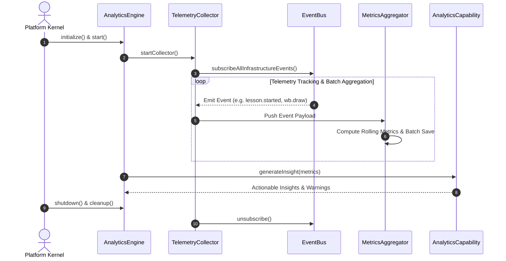

# OpenLearn Analytics Lifecycle Analysis (分析运行时生命周期分析报告)

## 1. Executive Summary (概述)

本报告详细分析 Analytics Runtime 的完整生命周期：初始化 (Initialization)、收集器启动 (Collector Startup)、指标注册 (Metric Registration)、数据聚合 (Aggregation)、洞察报告生成 (Reporting)、关闭 (Shutdown) 与资源清理 (Cleanup)。

---

## 2. Sequence Diagram (生命周期时序图)

---

## 3. Lifecycle Stages (生命周期各阶段详解)

1. **Initialization (初始化)**: 实例化分析引擎，准备基于滚动的指标流管道。
2. **Collector Startup (收集器启动)**: 向 `EventBus` 注册全域基础设施事件监听。
3. **Metric Registration & Aggregation (指标注册与聚合)**: 实时对采集事件进行脱敏、频次统计与时间序列汇总。
4. **Reporting & AI Insights (报告与 AI 洞察)**: 触发 AI 诊断分析，输出可视化学情报告与教师教研建议。
5. **Shutdown & Cleanup (关闭清理)**: 刷盘写出残余 Buffer 队列，注销监听句柄。
