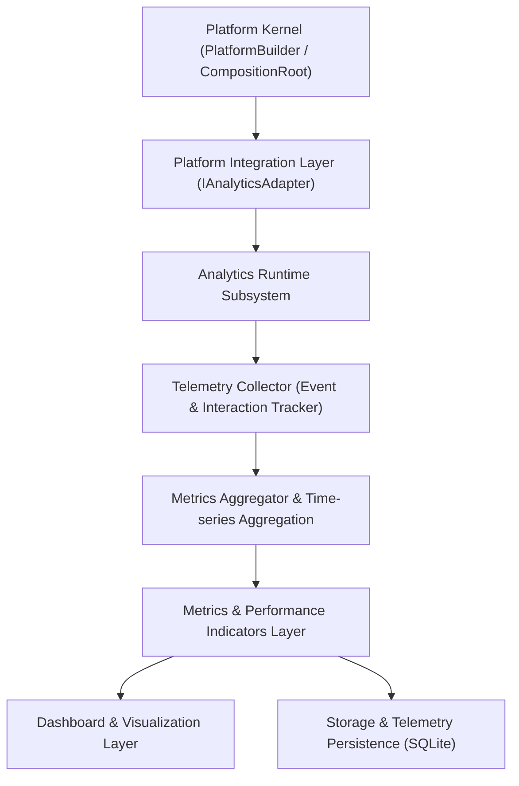

# OpenLearn Analytics Runtime Architecture Audit (分析运行时架构审计)

## 1. Executive Summary (概述)

本报告是对 OpenLearn V2 项目中现存学习分析与遥测运行时（Analytics Runtime，包含 `packages/core/ai-capability/capabilities/analytics-capability.ts` 及 `server.ts` 中的遥测收集回路）的完整架构审计。

系统目前拥有基于事件监听（Event Observer）的遥测收集器、聚合器（Aggregator）、AI 教学洞察引擎（Analytics AI Capability）与仪表盘数据面板。

---

## 2. Layered Architecture Topology (分层架构拓扑图)

---

## 3. Layer Responsibilities (各层核心职责分析)

1. **Integration Layer (`IAnalyticsAdapter`)**:
   - 暴露给 Platform Kernel 的解耦接口，提供 `trackEvent()`, `aggregateMetrics()`, `generateReport()`, `health()`, `metadata()`。

2. **Analytics Runtime (`AnalyticsEngine`)**:
   - 分析引擎中心控制器，维持事件订阅与数据管道分发。

3. **Collector (遥测收集器)**:
   - 监听白板画笔次数、课堂测验作答、AI 交互对话与插件调用频次。

4. **Aggregator (指标聚合器)**:
   - 对遥测原始 Event 进行滚动窗口（Sliding Window）汇总求和、均值与异常离群值计算。

5. **Metrics & AI Analytics (`AnalyticsCapability`)**:
   - 调用 LLM 模型对课堂分析指标生成 actionable 教学建议与三级告警提示（`generateInsight`）。

6. **Dashboard & Storage (仪表盘与持久化存储)**:
   - 存储遥测指标至数据库，并向教师端 Dashboard 渲染可视化的学习曲线图表。
