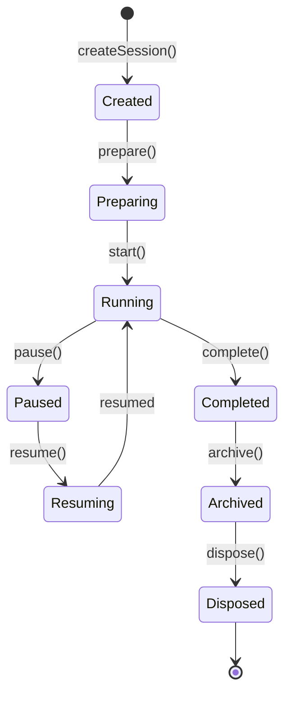

# OpenLearn Lesson Lifecycle Analysis (课程生命周期分析报告)

## 1. Executive Summary (概述)

本报告详细分析 Lesson Engine 的 8 阶段生命周期：创建 (Creation)、准备 (Preparing)、运行中 (Running)、暂停 (Paused)、恢复 (Resuming)、完成 (Completed)、归档 (Archived) 以及销毁 (Disposed)。

---

## 2. State Machine Sequence Diagram (8 阶段状态机时序图)

---

## 3. Lifecycle Stages (生命周期各阶段详解)

1. **Created (已创建)**: 实例化 `LessonSession`，分配唯一 `sessionId` 与课件元数据。
2. **Preparing (准备中)**: 加载课程大纲、预装载白板画布与挂载插件上下文。
3. **Running (上课中)**: 教师与学生建立 Socket 链接，启用 AI 实时助教与随堂测验。
4. **Paused (已暂停)**: 暂时挂起课堂倒计时与互动，冻结画布操作。
5. **Resuming (恢复中)**: 恢复课堂状态与视口矩阵。
6. **Completed (已下课)**: 总结课堂教学学情数据，保存笔记与白板 Snapshot。
7. **Archived (已归档)**: 导出课堂持久化文件至 VFS 与数据库。
8. **Disposed (已销毁)**: 释放句柄与事件监听器。
