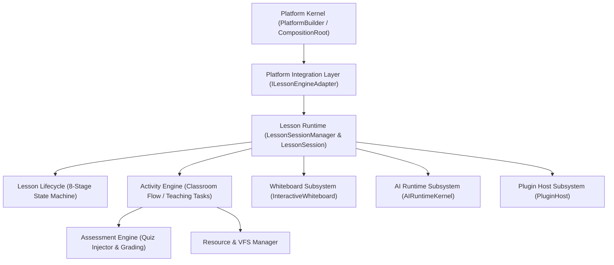

# OpenLearn Lesson Runtime Architecture Audit (课程引擎架构审计)

## 1. Executive Summary (概述)

本报告是对 OpenLearn V2 项目中现存课程引擎（Lesson Engine & Lesson Session Runtime，位于 `packages/core/bootstrap/lesson-session/` 及 `server.ts`）的完整架构审计。

课程运行时是平台的核心业务载体，已完成基于 8 阶段状态机（`Created` → `Preparing` → `Running` → `Paused` → `Resuming` → `Completed` → `Archived` → `Disposed`）的领域模型设计，并能智能附加 AI Context、Whiteboard、Plugin Context 与 Analytics Context。

---

## 2. Layered Architecture Topology (分层架构拓扑图)

---

## 3. Layer Responsibilities (各层核心职责分析)

1. **Integration Layer (`ILessonEngineAdapter`)**:
   - 暴露给 Platform Kernel 的解耦接口，提供 `createSession()`, `startSession()`, `endSession()`, `health()`, `metadata()` 等抽象方法。

2. **Lesson Runtime (`LessonSessionManager & LessonSession`)**:
   - 托管单次互动课堂会话句柄（`LessonSession`），提供安全的状态切换与子系统上下文绑定挂载（`attachAIContext`, `attachWhiteboard`, `attachPluginContext`, `attachAnalyticsContext`）。

3. **Lesson Lifecycle (8-Stage State Machine)**:
   - 严格维护会话状态转移规则，防止非法的跨阶段状态跃迁。

4. **Activity & Assessment Engine**:
   - 负责课堂互动流程、随堂测验发卷、AI 分批批改（Quiz Injector Plugin）与成绩汇总。

5. **Subsystem Context Bindings (AI, Whiteboard, Plugin Host)**:
   - 关联并聚合底层 2D 白板、AI Agent OS 调度与插件 UI Slot。
