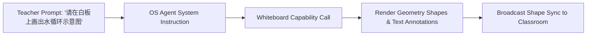

# OpenLearn Whiteboard AI Integration Analysis (白板 AI 交互分析报告)

## 1. Executive Summary (概述)

本报告审查 AI 代理在白板上的自动绘图、图表生成与教学内容批注机制。

---

## 2. AI Drawing & Tool Calling Mechanism (AI 自动绘图与工具调用回路)

---

## 3. Supported AI Whiteboard Actions (支持的 AI 白板动作)

- **Shape Generation**: 自动画出矩形、圆形、箭头与流程图连线。
- **Diagram Generation**: 生成思维导图、概念树与分类表格。
- **Annotation & Highlight**: 自动在已有学生绘图旁标注修改意见与语法纠错。
