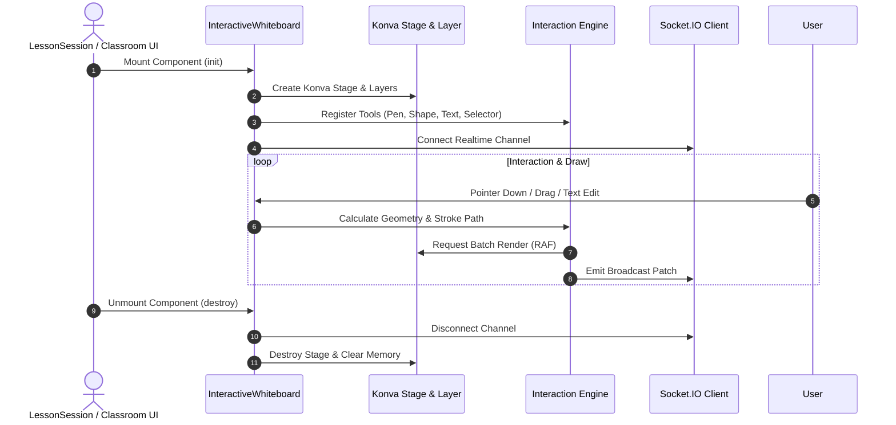

# OpenLearn Whiteboard Lifecycle Analysis (白板生命周期分析报告)

## 1. Executive Summary (概述)

本报告详细分析 Whiteboard Runtime 的完整生命周期：初始化 (Initialize)、Stage 画布创建 (Canvas Creation)、工具与插件注册 (Tool Registration)、用户交互 (Interaction)、矢量渲染 (Render)、协同同步 (Sync) 与卸载销毁 (Destroy)。

---

## 2. Sequence Diagram (生命周期时序图)

---

## 3. Lifecycle Stages (生命周期各阶段详解)

1. **Initialize & Canvas Creation (初始化与画布创建)**: 挂载 DOM 容器，初始化 2D Canvas Stage 视口与逻辑分层（Background, Drawing, Annotation, Selection Layer）。
2. **Tool Registration (工具注册)**: 加载内置画笔、橡皮擦、形状绘制工具以及第三方插件画板扩展。
3. **Interaction & Render (交互与渲染)**: 捕获 Pointer 事件，基于 RequestAnimationFrame (RAF) 进行高效图形渲染。
4. **Sync (协同广播)**: 序列化变更 Delta 并通过 Socket.IO 发送至同一 Classroom 实例中的其它 Client。
5. **Destroy (销毁)**: 清理 Canvas 上下文，释放 WebSocket 监听与 Node/GPU 内存。
