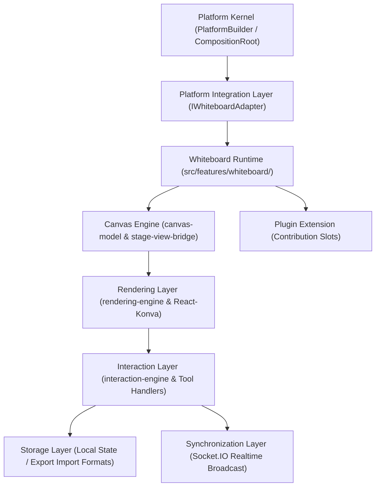

# OpenLearn Whiteboard Runtime Architecture Audit (白板运行时架构审计)

## 1. Executive Summary (概述)

本报告是对 OpenLearn V2 项目中现存白板运行时（Whiteboard Runtime，位于 `src/features/whiteboard/` 及 `packages/core/ai-capability/capabilities/whiteboard-capability.ts`）的完整架构审计。

系统目前拥有基于 Konva.js 2D 绘图引擎的高性能矢量白板，支持多图层渲染 (Layer Rendering)、选择与形变转换器 (Transformer)、历史记录 (Undo/Redo)、协同广播与 AI 图表标绘能力。

---

## 2. Layered Architecture Topology (分层架构拓扑图)

---

## 3. Layer Responsibilities (各层核心职责分析)

1. **Integration Layer (`IWhiteboardAdapter`)**:
   - 暴露给 Platform Kernel 的解耦接口，包括 `initialize()`, `clear()`, `exportJSON()`, `importJSON()`, `health()`, `metadata()`。

2. **Whiteboard Runtime (`InteractiveWhiteboard.tsx`)**:
   - 白板最高层级的主容器组件与控制门面，维持 Stage 视口尺寸、绑定协同 Socket 事件与工具面板。

3. **Canvas Engine (`canvas-model/ & stage-view-bridge.ts`)**:
   - 管理 Stage、Layer、Shape 模型节点（Text, Image, Pen, Arrow, Connector, Geometric Shapes）。

4. **Rendering Layer (`rendering-engine/ & React-Konva`)**:
   - 使用 React-Konva 进行 HTML5 Canvas 双缓冲区硬件加速渲染。

5. **Interaction Layer (`interaction-engine/`)**:
   - 负责 Mouse/Touch 交互事件捕获、Selection 选中、Transformer 拖拽放缩与 Pencil 画笔打点轨迹计算。

6. **Synchronization & Storage (`Socket.IO & Local State`)**:
   - 负责点对点矢量增量同步广播、Undo/Redo 历史栈压栈与 JSON/PNG 导出导入。

7. **Plugin Extension & AI Integration**:
   - 挂载自定义绘图工具槽位，并接收 AI 引擎下发的绘图指令（画图、标注文明、制作思维导图）。
