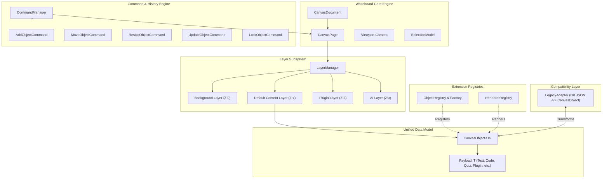
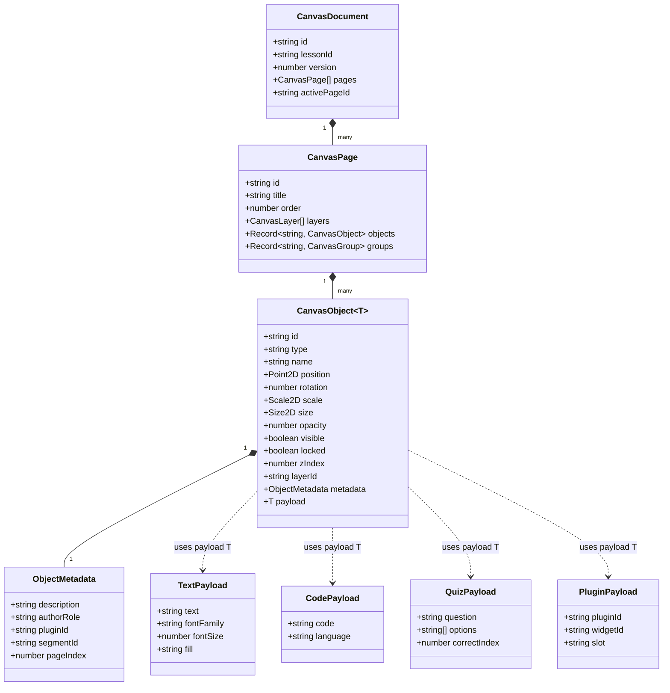

# OpenLearn Canvas Object Model Design Specification

> **Architecture Standard**: Object-Oriented Canvas Architecture (OOCA)  
> **Target Subsystem**: `src/features/whiteboard/canvas-model/`  
> **Status**: Approved & Integrated

---

## 1. Executive Design Goals

The **Canvas Object Model** replaces ad-hoc, type-specific whiteboard structures with a unified, extensible Object Collection paradigm:

$$\text{Canvas Document} = \sum \text{Canvas Pages} \quad \text{where} \quad \text{Canvas Page} = \sum \text{Canvas Object<T>}$$

### Core Architecture Principles:
1. **Unified Base Object Model (`CanvasObject<T>`)**: Every content type (Text, Image, Shape, Code, Quiz, Presentation, Math Graph, Roll Call, Plugin Widget) inherits from a common `CanvasObject<T>` base with standardized spatial, z-index, visibility, and metadata attributes.
2. **Payload Separation**: Object-specific parameters are stored strictly in `payload: T` rather than polluting `BaseObject`.
3. **Decoupled Object & Renderer Registries**: `ObjectRegistry` and `RendererRegistry` allow core developers and third-party plugins to register new object types and renderers dynamically without mutating Whiteboard Core source code.
4. **Transactional Command System**: All mutations are executed via `ICanvasCommand` with built-in Undo/Redo stacks and event logging.
5. **Layer & Selection Systems**: Decoupled multi-layer hierarchy and bounding-box selection model.
6. **Bidirectional Migration Adapter**: `LegacyAdapter` provides zero-downtime conversion to/from legacy database JSON elements.

---

## 2. Mermaid System Architecture Diagram



---

## 3. Object Relationship Diagram



---

## 4. Subsystem Specifications

### 4.1 Base Canvas Object Interface
```ts
export interface CanvasObject<T = Record<string, unknown>> {
  readonly id: string;
  type: string;
  name: string;
  position: { x: number; y: number };
  rotation: number;
  scale: { x: number; y: number };
  size: { width: number; height: number };
  opacity: number;
  visible: boolean;
  locked: boolean;
  zIndex: number;
  parentId?: string | null;
  groupId?: string | null;
  layerId: string;
  createdAt: number;
  updatedAt: number;
  createdBy: string;
  metadata: ObjectMetadata;
  payload: T;
}
```

### 4.2 Command System & Undo/Redo
All whiteboard mutations MUST execute via `commandManager.executeCommand(command, currentPage)`:
- `AddObjectCommand`: Instantiates and appends a new object.
- `DeleteObjectCommand`: Removes an object while keeping a reference for instant undo.
- `MoveObjectCommand`: Updates `{ x, y }` positioning transactional state.
- `ResizeObjectCommand`: Updates `{ width, height }` boundaries.
- `UpdateObjectCommand`: Applies atomic payload or metadata patches.

### 4.3 Legacy Adapter Compatibility
`LegacyAdapter` ensures 100% backward compatibility:
- `toCanvasObject(legacyElement)`: Parses old raw JSON string `data` into a validated `CanvasObject<T>`.
- `toLegacyElement(canvasObject)`: Packs object properties back into legacy `{ id, type, data: JSON.stringify({...}) }` for SQLite database persistence.
