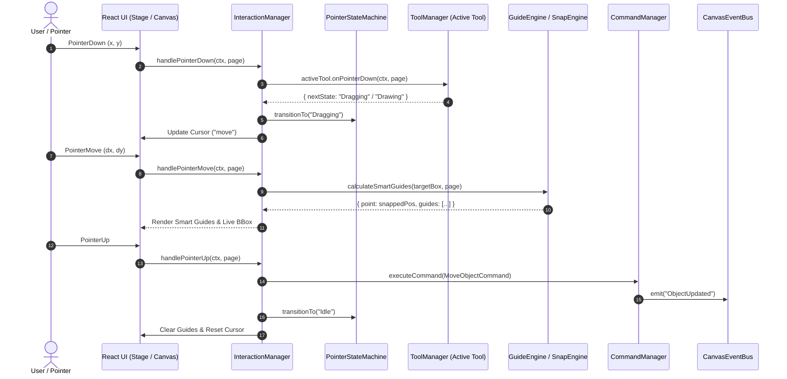
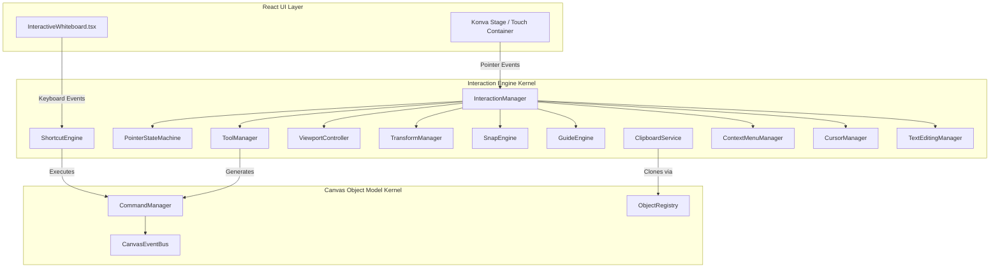

# OpenLearn Whiteboard Interaction Engine Architecture

> **Architecture Standard**: Decoupled Event-Driven Interaction Pipeline  
> **Target Subsystem**: `src/features/whiteboard/interaction-engine/`  
> **Status**: Approved & Integrated

---

## 1. System Architecture Overview

The **Interaction Engine** cleanly decouples React UI components from complex pointer, keyboard, gesture, transformation, snapping, and clipboard handling.

$$\text{React UI / Event Handler} \longrightarrow \text{InteractionManager} \longrightarrow \text{Tool / Pipeline} \longrightarrow \text{CommandManager} \longrightarrow \text{Canvas State}$$

### Core Subsystems:
1. **`InteractionManager`**: Central entry point coordinating all interaction managers.
2. **`PointerStateMachine`**: Enforces strict pointer states (`Idle`, `Selecting`, `Dragging`, `Drawing`, `Resizing`, `Rotating`, `Editing`, `Panning`, `Zooming`, etc.), replacing raw boolean flags.
3. **`ToolManager`**: Pluggable Tool System (`PointerTool`, `HandTool`, `PenTool`, `ShapeTool`, `TextTool`, and third-party plugin tools).
4. **`ViewportController`**: Manages infinite canvas pan, zoom, fit-to-screen, and zoom-to-selection camera transformations.
5. **`TransformManager`**: 8-handle resizing, ratio locking (Shift), center scaling (Alt), and 15° rotation snapping.
6. **`SnapEngine` & `GuideEngine`**: Grid snapping and smart alignment guidelines (horizontal/vertical align).
7. **`ShortcutEngine` & `ClipboardService`**: Centralized keybindings (Undo, Redo, Copy, Paste, Duplicate, Delete) and in-memory object clipboard.

---

## 2. Pointer Event Pipeline Mermaid Diagram

---

## 3. Subsystem Interconnection Architecture

