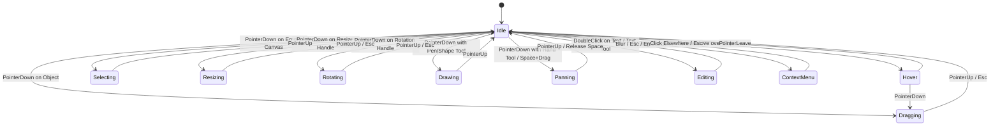

# OpenLearn Whiteboard Pointer State Machine Specification

> **Target Module**: `src/features/whiteboard/interaction-engine/state-machine/pointer-state-machine.ts`  
> **Status**: Approved & Integrated

---

## 1. Overview

The **Pointer State Machine** enforces explicit, deterministic pointer states across the whiteboard. It completely eliminates conflicting boolean state flags (e.g. `isDragging`, `isDrawing`, `isEditing`, `isMoving`).

```ts
export type PointerState =
  | 'Idle'
  | 'Hover'
  | 'Selecting'
  | 'Dragging'
  | 'Drawing'
  | 'Resizing'
  | 'Rotating'
  | 'Editing'
  | 'Panning'
  | 'Zooming'
  | 'ContextMenu'
  | 'PluginInteraction';
```

---

## 2. State Transition Diagram (Mermaid)



---

## 3. State Descriptions & Cursor Mapping

| Pointer State | Trigger Condition | System Cursor | Allowed Next States |
|---|---|---|---|
| **`Idle`** | Default state when no gesture active | `default` | Hover, Selecting, Dragging, Drawing, Panning, Editing, ContextMenu |
| **`Hover`** | Pointer moving over object / handle | `pointer` / `move` | Idle, Dragging, Resizing, Rotating |
| **`Selecting`** | Box selection active on canvas | `default` | Idle |
| **`Dragging`** | Moving object(s) across canvas | `move` | Idle |
| **`Drawing`** | Freehand pen / shape drawing active | `crosshair` | Idle |
| **`Resizing`** | Dragging 1 of 8 resize handles | `nwse-resize` / `nesw-resize` | Idle |
| **`Rotating`** | Dragging rotation handle | `grab` | Idle |
| **`Panning`** | Canvas camera panning via Hand tool | `grabbing` | Idle |
| **`Editing`** | Inline text / code editor focused | `text` | Idle |
| **`ContextMenu`** | Floating right-click context menu open | `default` | Idle |
