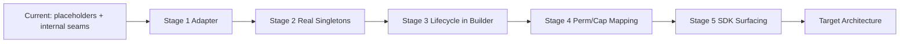

# Plugin Migration Strategy (Sprint P7-A2)

> Defines the **5-stage incremental migration** from the current audited state to the target architecture. Each stage is independently shippable, testable, and reversible. **Design-only** — no code is implemented here.

---

## 0. Migration Principles

- **Zero breaking changes per stage.** Existing plugins load and run unmodified at every stage boundary.
- **Reversible.** Every stage can be rolled back via the `PluginCompositionModule` registration points or a feature flag.
- **Verifiable.** Each stage has explicit exit criteria (tests + manual verification).
- **No fork of platform systems.** Permission/Capability/Config are *mapped*, never duplicated.

---

## Stage 1 — Adapter Binding

**Goal:** Ensure the `PluginHost` is reachable only through `IPluginHostAdapter` (`loadPlugin`, `unloadPlugin`, `health`, `metadata`), with **no external API change**.

- Introduce / confirm `IPluginHostAdapter` as the single external contact surface.
- Internal `PluginHost` methods are wrapped; signatures unchanged for callers.
- No manifest, lifecycle, or permission change.

**Compatibility:** 100% — purely internal indirection.
**Rollback:** Remove adapter layer; call `PluginHost` directly (already the case today).
**Verification:**
- All existing plugin tests pass (`plugin-host.test.ts`, `plugin-hardening.test.ts`, `plugin-namespace.test.ts`, `plugin-platform-integration.test.ts`).
- Adapter unit tests for the 4 contract methods.

---

## Stage 2 — Service Registration (replace placeholders)

**Goal:** Replace the **placeholder** service instances in `PluginCompositionModule` with the **real** `PluginHost` and `ContributionRegistry` singletons, registered into `PlatformServiceRegistry`.

- `srv_plugin_host` → real `PluginHost` instance (count, health, metadata live).
- `srv_plugin_contribution_registry` → real `ContributionRegistry` (live slot count).
- No behavioral change; only the registered *objects* become real.

**Compatibility:** 100% — registration IDs (`srv_plugin_host`, `srv_plugin_contribution_registry`) unchanged.
**Rollback:** Revert to placeholder registrations (functionality-neutral for consumers today).
**Verification:**
- Post-compose inspection shows non-placeholder instances.
- `PlatformServiceRegistry.get('srv_plugin_host')` returns the live host.

---

## Stage 3 — Lifecycle Integration

**Goal:** Mount Plugin **Discovery + Initial-Active scheduling** into the `PlatformBuilder` pipeline stages (no change to the lifecycle state machine itself).

- Discovery scans `storage/plugins/` + built-in ZIPs during `PlatformBuilder` bootstrap.
- `resolveLoadOrder` (topological) runs before initial activation.
- Initial-active scheduling triggered by a `PlatformBuilder` pipeline hook.

**Compatibility:** 100% — same states, same ordering, just orchestrated by the builder.
**Rollback:** Move discovery/activation back to lazy on-first-use.
**Verification:**
- Bootstrap sequence diagram matches `Plugin Host Lifecycle.md`.
- Hot Reload (`HotReloadController` + chokidar, 300ms debounce, `NODE_ENV=development`) still functions.

---

## Stage 4 — Permission & Capability Mapping

**Goal:** Map plugin-declared capabilities (`capabilitiesProposed`, e.g. `lesson:write`, `vfs:read`, `ai:invoke`) into `PermissionManager` (Infrastructure category) at install time, and reconcile capability IDs.

**Mapping table (canonical):**

| Manifest declaration | PermissionManager (Infrastructure) | Policy |
|----------------------|-----------------------------------|--------|
| `vfs:read` | `perm_plugin_vfs_read` | Allow |
| `vfs:write` | `perm_plugin_vfs_write` | Deny (explicit grant) |
| `network:fetch` | `perm_plugin_network` | Allow |
| `command:execute` | `perm_plugin_command` | Controlled |
| `ai:invoke` | `perm_plugin_ai` | Controlled |

- Reconcile terminology: `cap_plugin_management` (Capability Mapping doc) ≡ `capability_plugin` (Platform Integration doc) → standardize on **`cap_plugin_management`**.
- **Hard boundary:** plugin permissions stay Infrastructure-only; never enter business RBAC (per PI-012).

**Compatibility:** Additive — new Infrastructure permissions; existing plugins gain explicit, default-Allow grants.
**Rollback:** Disable mapping; fall back to legacy internal enforcement.
**Verification:**
- Install-time review rejects unsupported capabilities.
- Runtime `CapabilityGuard` denies an ungranted `vfs:write`.

---

## Stage 5 — SDK Surfacing & Deprecation

**Goal:** Surface previously-internal seams through `@openlearn/plugin-sdk` (additive type/token re-exports) and sunset legacy terminology.

**Surface:**
- AI Skill / AI Prompt contribution types (reuse `actionRegistry` + `capabilityRequired: ai:invoke`).
- Resource contribution type + `IResourceServiceToken`.
- `ActivityRegistry` (`IActivityRegistryToken`) documented as the official activity seam (already exported from P7-01).
- `IConfigService` bound to `PlatformConfigurationSystem` (config mapping).

**Deprecate (docs-only, sunset over 2 minors):**
- Audit-doc terms `permissions` / `contributions` (in `plugin.json`) → align to SDK `Manifest` (`capabilitiesProposed`, `requires`/`provides`/`configuration`).
- `onActivate` hook name → canonical `activate()` in code docs.

**Compatibility:** 100% — SDK additions are purely additive; internal registries unchanged.
**Rollback:** Remove the new SDK re-exports; internal features unaffected.
**Verification:**
- `tsc --noEmit` clean; SDK dist builds.
- A third-party plugin using the surfaced AI/Resource/Activity seams compiles and runs against the host unchanged.

---

## Migration Flow

Each arrow is a separately committable, reversible step. See `Plugin Refactor Roadmap.md` for sequencing and `Plugin Compatibility Matrix.md` for the guarantees backing each stage.
