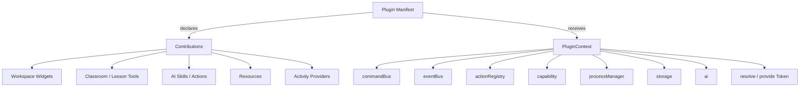
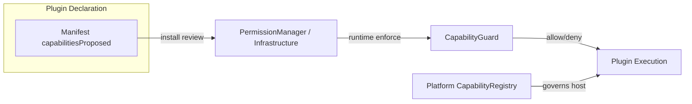
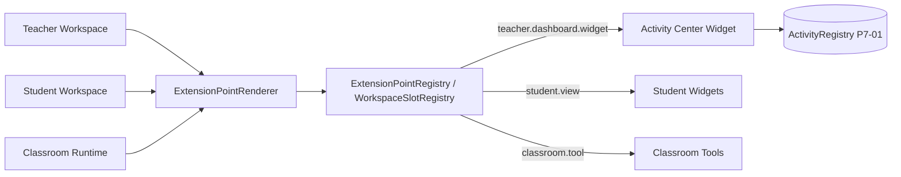
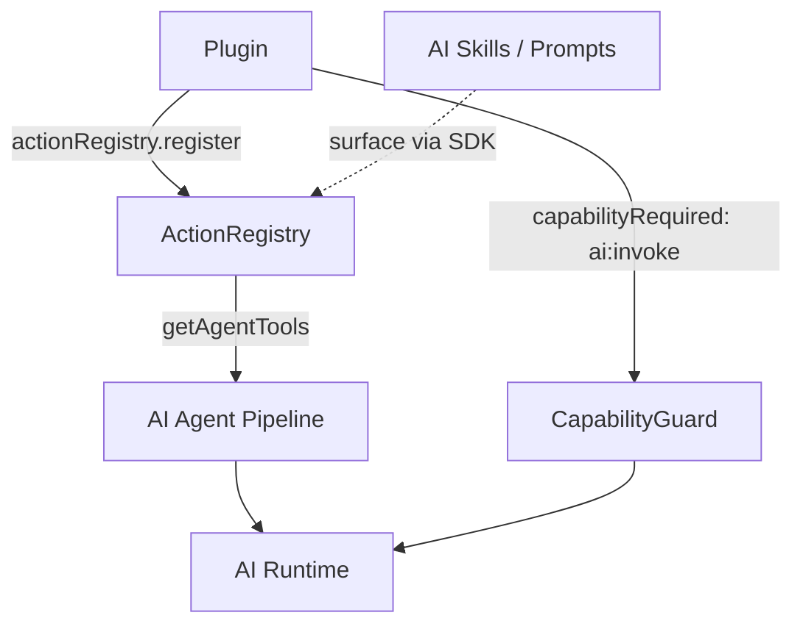
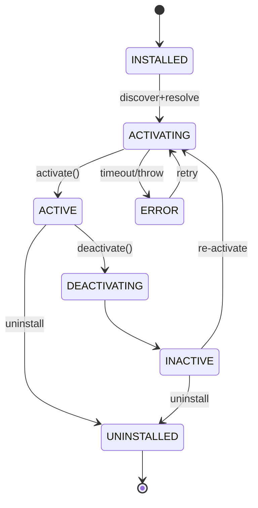

# Plugin System Refactor Proposal (Sprint P7-A2)

> **Status:** Architecture Design — Draft for Architecture Review
> **Scope:** Architecture & design ONLY. No source code is modified, no runtime is implemented, no TypeScript is generated by this document set.
> **Author:** Chief Software Architect
> **Baseline:** Platform Kernel v1.0 (PI-001 … PI-012 frozen), Plugin Host (existing), `@openlearn/plugin-sdk` (V2.5/V3.2), Activity Ecosystem (P7-01).

---

## 1. Purpose & Scope

This proposal defines an **incremental, backward-compatible evolution path** for the OpenLearn V2 Plugin System. It is grounded in the completed plugin architecture audit (`Plugin Host Architecture.md`, `Plugin Host Dependency Analysis.md`, `Plugin Host Lifecycle.md`, `Plugin Host Service Mapping.md`, `Plugin Host Capability Mapping.md`, `Plugin Host Permission Analysis.md`, `Plugin Host Configuration Analysis.md`, `Plugin Host Integration Plan.md`, `Plugin SDK.md`, `Plugin Compatibility Report.md`, `Plugin Platform Integration.md`).

The audit reached a single, unambiguous conclusion:

> The existing Plugin Host is **architecture-sound** and is already integrated into Platform Kernel (A2 Step 2). There is **zero** breaking risk and **zero** circular dependencies. The refactor must therefore be **KEEP + ADAPTER**, *not* a rewrite.

**In scope:**
- Defining the target architecture and the integration/mapping layer.
- Classifying every subsystem as KEEP / REFACTOR / MERGE / MOVE / SPLIT / DEPRECATE / REMOVE.
- Designing the extension model, capability strategy, workspace integration, AI integration, manifest strategy, and lifecycle strategy.
- A 5-stage migration plan with risk assessment and compatibility guarantees.

**Out of scope (explicitly forbidden for this Sprint):**
- Modifying any source file.
- Implementing any runtime, host, loader, or registry.
- Generating TypeScript / production code.

---

## 2. Guiding Principles

| # | Principle | Rationale |
|---|-----------|-----------|
| P1 | **Maximize reuse** | Audit confirms Plugin Host, Worker Sandbox, Contribution Registry, Dependency Resolver are sound. Reuse them verbatim. |
| P2 | **Backward compatibility is mandatory** | Existing plugins (Quiz, Vote, Assignment Evaluator, etc.) and the SDK contract must keep loading and running unmodified. |
| P3 | **Adapter over rewrite** | Wrap the host behind `IPluginHostAdapter` so external APIs stay stable while internal structure can evolve. |
| P4 | **Map, don't duplicate** | Permission / capability / config concerns already exist at the platform level — *map* plugin declarations into them rather than building parallel systems. |
| P5 | **Surface, don't fork** | Internal feature registries (AI Skills, AI Prompts, Resources, Activity Registry) should be *surfaced* through the public SDK, not re-implemented per plugin. |
| P6 | **Incremental & verifiable** | Each of the 5 stages is independently shippable, testable, and reversible. |

---

## 3. Audit Findings — Summary

| Area | Finding | Verdict |
|------|---------|---------|
| Architecture | 6-layer topology, Worker Thread isolation, CommandBus middleware, namespacing, contribution registry — all sound. | KEEP |
| Dependencies | 0 circular dependencies; all inbound/outbound couplings loose or OS-native. | KEEP |
| Lifecycle | Discovery → Manifest → Resolve → Init → Activate → Deactivate → HotReload → Shutdown. | KEEP |
| Service mapping | `PluginHost` + `ContributionRegistry` should be platform singletons. | KEEP + REGISTER |
| Capability | `cap_plugin_management`, `cap_plugin_slot_render`, `cap_plugin_sandbox_execute` already governable. | KEEP |
| Permission | Plugin `permissions` are *isolation-scoped*, must map to `PermissionManager` (Infrastructure), **not** business RBAC. | MOVE/MAP |
| Config | `PluginConfigService` should bind to `PlatformConfigurationSystem`. | MOVE/MAP |
| Compatibility | 100% forward/backward compatible with Kernel v1.0. | KEEP |
| Integration | A2 Step 2 done, but registers **placeholder** service instances. | REFACTOR (real wiring) |
| SDK coverage | AI Skills, AI Prompts, Resources, `ActivityRegistry` not in `@openlearn/plugin-sdk`. | SURFACE (MOVE) |
| Terminology | `permissions` vs `capabilitiesProposed`; `cap_plugin_management` vs `capability_plugin`; `onActivate` vs `activate()`. | RECONCILE |

---

## 4. Subsystem Classification

> Legend: **KEEP** reuse as-is · **REFACTOR** improve internals, API stable · **MERGE** fold into another subsystem · **MOVE** relocate/map to platform layer · **SPLIT** separate concerns · **DEPRECATE** retain with sunset plan · **REMOVE** delete.

| Subsystem | Package / File | Decision | Justification |
|-----------|----------------|----------|---------------|
| Plugin Host core scheduler | `packages/core/plugin-host/plugin-host.ts` | **KEEP** | Sound; 0 circular deps; no rewrite needed. |
| Worker Sandbox | `packages/core/plugin-host/...worker...` | **KEEP** | Process isolation validated; reuse verbatim. |
| Contribution Registry | `packages/core/plugin-host/contribution-registry.ts` | **KEEP** + **REGISTER** | Keep internal, register into `PlatformServiceRegistry` as `srv_plugin_contribution_registry`. |
| Dependency Resolver | `packages/core/plugin-host/dependency-resolver.ts` | **KEEP** | Pure DAG topo-sort; transient helper. |
| Plugin Namespace | `packages/core/plugin-host/plugin-namespace.ts` | **KEEP** | Anti-spoofing UUID check retained. |
| Plugin Context / SDK | `@openlearn/plugin-sdk` | **KEEP** + **EXTEND** | Stable contract; surface missing seams (P5). |
| Manifest Parser | `packages/core/esm-loader/manifest-schema.ts` | **KEEP** + **RECONCILE** | Schema drift vs audit docs (`permissions` vs `capabilitiesProposed`) must be normalized. |
| Plugin Host → Service Registry wiring | `packages/core/bootstrap/composition/plugin-composition-module.ts` | **REFACTOR** | Replace placeholder instances with the real `PluginHost` / `ContributionRegistry` singletons. |
| Plugin → Permission mapping | manifest `permissions` / `capabilitiesProposed` | **MOVE** | Map into `PermissionManager` (Infrastructure category). |
| Plugin → Config mapping | `PluginConfigService` | **MOVE** | Bind to `PlatformConfigurationSystem`. |
| AI Skill / Prompt surfacing | internal AI registries | **MOVE/SURFACE** | Expose via `@openlearn/plugin-sdk`. |
| Resource surfacing | internal resource registry | **MOVE/SURFACE** | Expose via `@openlearn/plugin-sdk`. |
| Activity Registry surfacing | `packages/activity-ecosystem` (P7-01) | **MOVE/SURFACE** | Already exported token `IActivityRegistryToken`; document as official SDK seam. |
| Legacy `activity-workflow` | (already removed in P7-01) | **REMOVE** (done) | Eliminated duplication. |

---

## 5. Target Extension Model

Plugins extend the platform through **one unified seam** — the `PluginContext` service bundle — plus **declarative contributions** in the manifest. The refactor consolidates all extension types under this single model:

**Extension points (stable IDs, reused by official + third-party alike):**
`teacher.tab`, `teacher.dashboard.widget`, `teacher.panel`, `student.view`, `student.lesson.tool`, `student.fullscreen`, `classroom.tool`, `global.setting`.

Principle (from `Plugin SDK.md`): *Student Workspace + Teacher Workspace are composed from the same infrastructure; a plugin that works for one works for the other via the same seam.* This is preserved and made explicit.

---

## 6. Capability Strategy

Plugin capabilities flow through **two distinct, non-overlapping channels** that the refactor must keep strictly separated:

1. **Platform Capability Registry** (`cap_plugin_management`, `cap_plugin_slot_render`, `cap_plugin_sandbox_execute`) — governs *whether the plugin subsystem itself* may run/render/execute. KEEP.
2. **Plugin-declared capabilities** (`capabilitiesProposed`, e.g. `lesson:write`, `vfs:read`, `ai:invoke`) — govern *what a specific plugin may do at runtime*, enforced by `CapabilityGuard`. MAP into `PermissionManager` Infrastructure namespace at install time.

> **Boundary rule (P4 + audit Permission Analysis):** Plugin permissions are **isolation-scoped only** and MUST NOT be merged into business RBAC. The refactor preserves this boundary.

---

## 7. Workspace Integration

Official features and plugins render through the **same** `ExtensionPointRenderer` + `ExtensionPointRegistry` + `WorkspaceSlotRegistry` machinery. The refactor's only job here is to **document and guarantee** that every workspace surface is plugin-reachable, and to surface the `ActivityRegistry` widget as a first-class SDK contribution.

Role-aware, single-implementation widgets (teacher = Start, student = Open) — as delivered in P7-01 — remain the canonical pattern and are codified here as the reference implementation for plugin widgets.

---

## 8. AI Integration

AI contribution is unified through the **Action Registry** (`actionRegistry.register({...})` with `capabilityRequired: 'ai:invoke'`). The refactor surfaces AI Skills, AI Prompts, and AI Actions through the public SDK so third-party plugins contribute AI the *same* way official features do — reusing the existing AI Runtime, never forking it.

---

## 9. Manifest Strategy

- **Single source of truth:** `Manifest` interface in `packages/core/esm-loader/manifest-schema.ts`, re-exported by `@openlearn/plugin-sdk`.
- **Versioning:** SemVer in `version`; engine gate in `engines.openlearn`. New optional fields (`provides`, `configuration`, `contributions`) are additive — old manifests keep loading.
- **Reconciliation:** align audit-doc terminology (`permissions`, `contributions` in `plugin.json`) with the SDK `Manifest` (`capabilitiesProposed`, `requires`/`provides`/`configuration`). The canonical field set is `capabilitiesProposed` + `requires` + `optional` + `provides` + `configuration`; audit docs are updated to match (docs-only change).
- **Namespace anti-spoofing:** `@openlearn/`-prefixed plugins keep global command names; third-party commands auto-prefixed `{manifest.id}.`; kernel UUID strong-check retained.

---

## 10. Lifecycle Strategy

Preserve the existing state machine:
`INSTALLED → ACTIVATING → ACTIVE → DEACTIVATING → INACTIVE`, with `ERROR` (retry) and `UNINSTALLED` branches. `ACTIVATING` transient ≤10s.

The refactor **does not change** the state machine. It **mounts** host Discovery + Initial-Active scheduling into the `PlatformBuilder` pipeline stages (Migration Stage 3) and **reconciles** hook naming (`onActivate` in audit docs vs `activate()` in code) by documenting `activate()`/`deactivate()` as the canonical code hooks.

---

## 11. Migration Strategy (5 Stages — Summary)

Full detail in `Plugin Migration Strategy.md`. Each stage is independently shippable and reversible.

| Stage | Name | Goal | Risk |
|-------|------|------|------|
| 1 | Adapter Binding | Wrap `PluginHost` behind `IPluginHostAdapter`; zero external API change. | Low |
| 2 | Service Registration | Register real `PluginHost` + `ContributionRegistry` into `PlatformServiceRegistry` (replace placeholders). | Low |
| 3 | Lifecycle Integration | Mount Discovery + Initial-Active into `PlatformBuilder` pipeline. | Low |
| 4 | Permission & Capability Mapping | Map `capabilitiesProposed` → `PermissionManager`; reconcile capability IDs. | Low-Med |
| 5 | SDK Surfacing & Deprecation | Surface AI Skills/Prompts/Resources/ActivityRegistry in SDK; sunset legacy terms. | Med |

---

## 12. Risk Assessment

| Risk | Likelihood | Impact | Mitigation |
|------|-----------|--------|------------|
| Breaking existing plugin contract | Very Low | High | KEEP + ADAPTER; Compatibility Report confirms 100% compat. |
| Permission scope creep into RBAC | Low | High | Hard boundary rule; plugin perms stay Infrastructure-only. |
| Placeholder services mask real host | Medium | Med | Stage 2 replaces placeholders with real singletons. |
| Terminology drift causes doc/code mismatch | Medium | Low | Stage 5 reconciliation + single Manifest source of truth. |
| SDK surfacing regresses internal features | Low | Med | Additive exports only; internal registries unchanged. |
| Circular dependency introduced | Very Low | High | DependencyResolver DAG + CI topo check retained. |

**Overall assessment:** Low risk. The refactor is an *integration & surfacing* effort, not a rewrite. All stages are reversible via the Composition Module's registration points.

---

## 13. Decision Requested

This document, together with `Plugin Target Architecture.md`, `Plugin Migration Strategy.md`, `Plugin Compatibility Matrix.md`, `Plugin Refactor Roadmap.md`, and `Technical Debt Resolution.md`, is submitted for **Architecture Review**.

**Recommended approval:** Approve the KEEP + ADAPTER direction and the 5-stage incremental plan, contingent on the compatibility guarantees in `Plugin Compatibility Matrix.md`.

> **STOP — Do NOT begin implementation until Architecture Review approves.**
