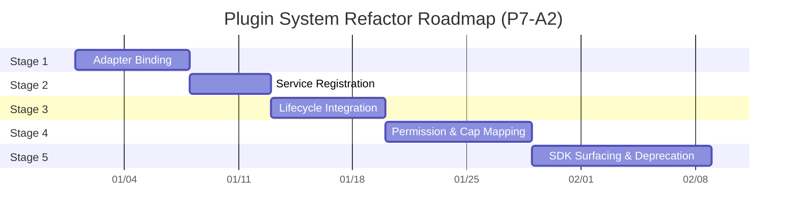

# Plugin Refactor Roadmap (Sprint P7-A2)

> Sequencing of the 5 migration stages with milestones, exit criteria, and dependencies. **Design-only** — dates are relative phases, not calendar commitments.

---

## 1. Roadmap Overview



Dependencies: strictly linear (`s1 → s2 → s3 → s4 → s5`). Each stage gates the next on its exit criteria.

---

## 2. Milestones

| Milestone | Stage | Exit Criteria | Gate |
|-----------|-------|---------------|------|
| M1 Adapter Contract Frozen | 1 | `IPluginHostAdapter` 4 methods tested; zero external API change. | ✅ tests green |
| M2 Live Singletons | 2 | `PlatformServiceRegistry` returns real `PluginHost` / `ContributionRegistry`. | ✅ inspection + tests |
| M3 Builder-Orchestrated Lifecycle | 3 | Discovery + initial-active run in `PlatformBuilder` pipeline. | ✅ bootstrap seq verified |
| M4 Mapped Permissions | 4 | `capabilitiesProposed` → `PermissionManager` (Infrastructure); boundary enforced. | ✅ deny test passes |
| M5 Public SDK Complete | 5 | AI/Prompt/Resource/Activity seams surfaced; legacy terms deprecated (docs). | ✅ tsc + third-party build |

---

## 3. Stage Detail (owners & effort)

| Stage | Effort (rel.) | Primary Owner | Dependencies | Reversible? |
|-------|---------------|---------------|--------------|-------------|
| 1 Adapter Binding | S | Kernel Team | none | Yes |
| 2 Service Registration | S | Kernel Team | M1 | Yes |
| 3 Lifecycle Integration | M | Kernel Team | M2 | Yes |
| 4 Permission & Cap Mapping | M | Security + Kernel | M3 | Yes (flag) |
| 5 SDK Surfacing & Deprecation | L | SDK + Product | M4 | Yes |

---

## 4. Critical Path

```
M1 ──▶ M2 ──▶ M3 ──▶ M4 ──▶ M5
```

The critical path is the linear stage chain. Stage 4 carries the only Medium risk (permission boundary), so it has the longest buffer.

---

## 5. Sequencing Rationale

1. **Adapter first** — establishes the stable external contact point so all later stages never touch callers.
2. **Real singletons next** — fixes the placeholder defect with zero behavioral change.
3. **Lifecycle in builder** — orchestration change only; state machine untouched.
4. **Permission mapping** — only after the host is live and orchestrated, so grants are meaningful.
5. **SDK surfacing last** — depends on all runtime seams being stable before they are published.

This ordering guarantees that at **every** intermediate commit, existing plugins still load and run — satisfying the mandatory backward-compatibility constraint.

---

## 6. Definition of Done (Roadmap-level)

- [ ] All 5 milestones reached.
- [ ] `Plugin Compatibility Matrix.md` guarantees verified at each gate.
- [ ] `tsc --noEmit` + `pnpm test` green end-to-end.
- [ ] Third-party plugin (public SDK only) loads on target architecture.
- [ ] Legacy terminology reconciled in docs; sunset plan published.

---

## 7. Post-Roadmap (out of scope for P7-A2)

- Hot Reload hardening beyond existing `HotReloadController`.
- New extension-point IDs (only existing IDs are in scope).
- New built-in plugins.

These are explicitly deferred and require separate sprints/approvals.
