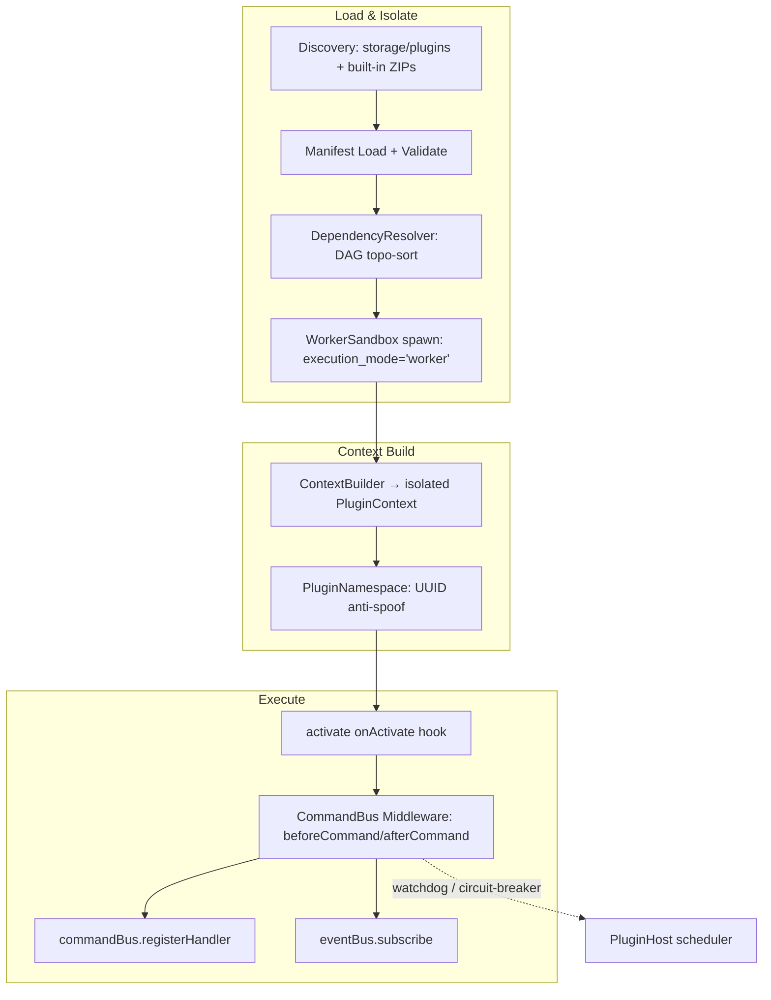
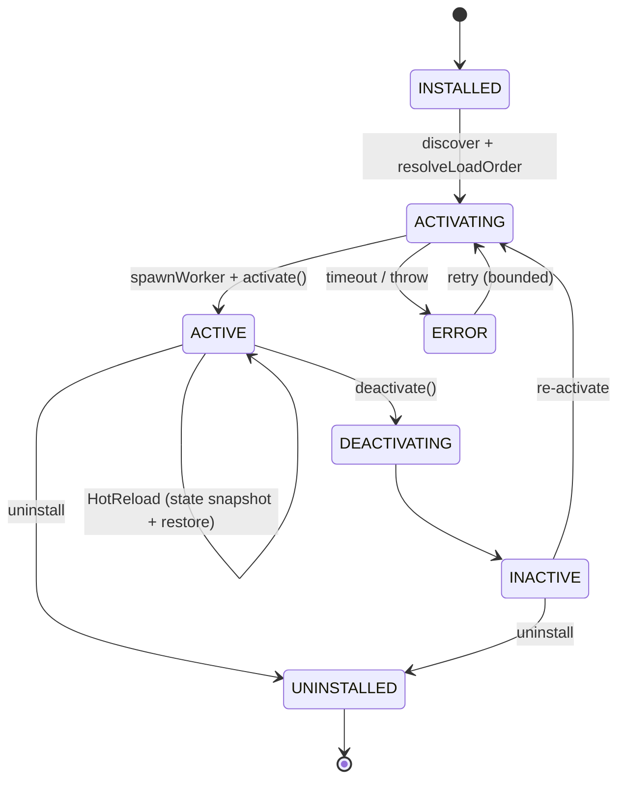
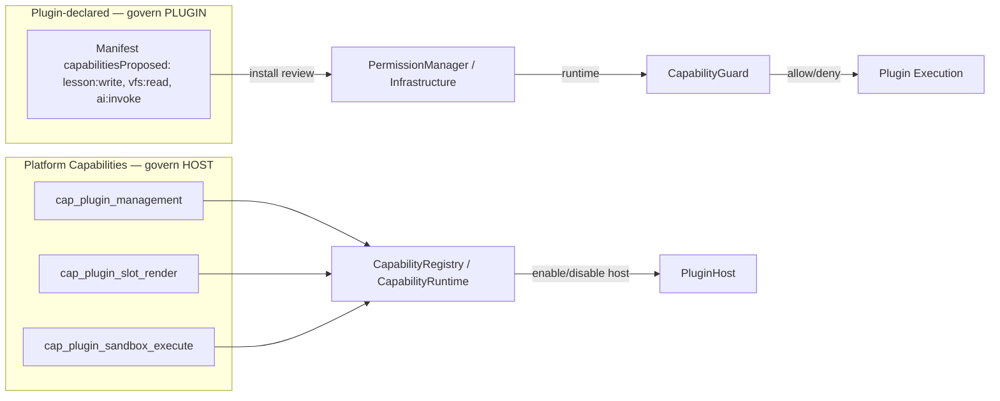
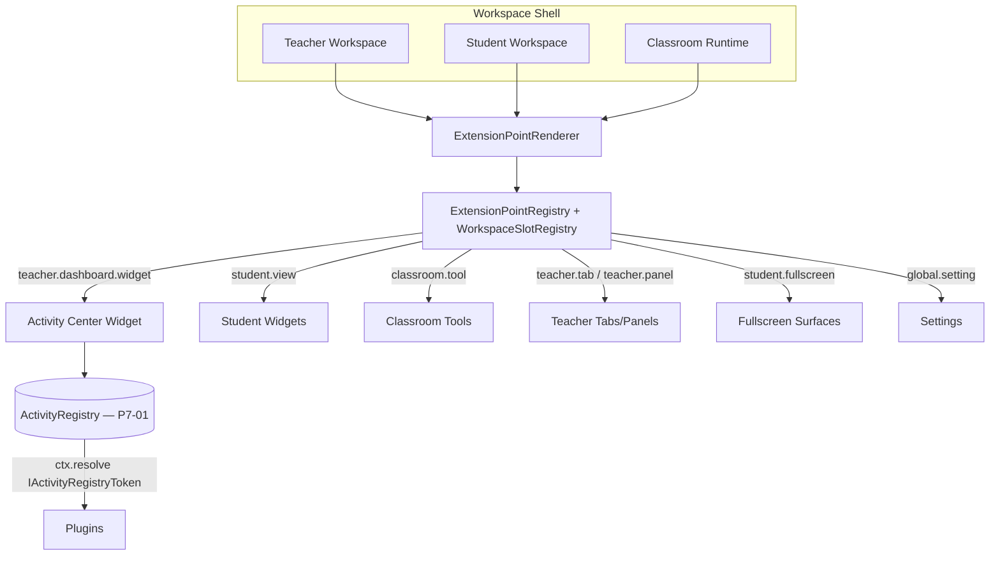
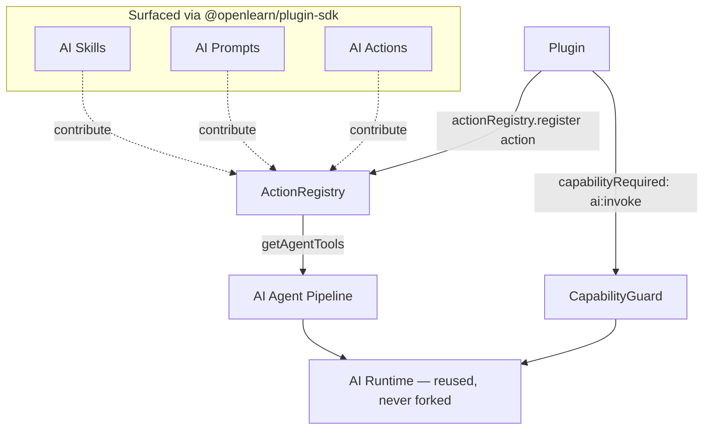

# Plugin Target Architecture (Sprint P7-A2)

> Companion to `Plugin Refactor Proposal.md`. Defines the target topology and the canonical diagrams for the refactor. **Design-only** — no code.

---

## 1. Current vs Target Topology

### 1.1 Current (audited, sound)

```mermaid
graph TD
  subgraph Kernel[Platform Kernel v1.0]
    PB[PlatformBuilder / CompositionRoot]
    PSR[PlatformServiceRegistry]
    CR[CapabilityRegistry]
    PM[PermissionManager]
    EB[PlatformEventBus]
  end
  PB --> PCM[PluginCompositionModule]
  PCM -. placeholder instances .-> PSR
  PCM --> CR
  PCM --> PM
  PCM --> EB
  subgraph Host[Plugin Host]
    PH[PluginHost]
    PR[PluginRuntime + WorkerSandbox]
    PL[PluginLoader + DependencyResolver]
    CR2[ContributionRegistry]
    NS[PluginNamespace]
  end
  PH --> PR
  PH --> PL
  PH --> CR2
  PH --> NS
  subgraph SDK[@openlearn/plugin-sdk]
    PC[PluginContext / ContextBuilder]
  end
  PL --> PC
  subgraph Plugins[Installed Plugins]
    Q[Quiz] V[Vote] A[Assignment Evaluator]
  end
  PC --> Plugins
```

The audit confirms this topology is correct. The **only** defect is that `PluginCompositionModule` registers *placeholder* service instances (`{ name:'PluginHostService', isReady:true }`) rather than binding the real `PluginHost` / `ContributionRegistry` singletons.

### 1.2 Target (refactor complete)

```mermaid
graph TD
  subgraph Kernel[Platform Kernel v1.0]
    PB[PlatformBuilder / CompositionRoot]
    PSR[PlatformServiceRegistry]
    CR[CapabilityRegistry]
    PM[PermissionManager / Infrastructure]
    EB[PlatformEventBus]
    PCS[PlatformConfigurationSystem]
  end
  PB --> PCM[PluginCompositionModule]
  PCM -->|real singletons| PSR
  PCM --> CR
  PCM --> PM
  PCM --> EB
  PCM --> PCS
  subgraph Adapter[IPluginHostAdapter]
    AD[loadPlugin / unloadPlugin / health / metadata]
  end
  PSR -->|srv_plugin_host| AD
  AD --> PH[PluginHost]
  subgraph Host[Plugin Host internals — KEEP]
    PR[PluginRuntime + WorkerSandbox]
    PL[PluginLoader + DependencyResolver]
    CR2[ContributionRegistry]
    NS[PluginNamespace]
  end
  PH --> PR & PL & CR2 & NS
  subgraph SDK[@openlearn/plugin-sdk — EXTENDED]
    PC[PluginContext]
    SE[Surfaced: AI Skills / Prompts / Resources / ActivityRegistry]
  end
  PL --> PC
  PC --> SE
  subgraph Plugins[Official + Third-Party Plugins]
    Q[Quiz] V[Vote] A[Assignment Evaluator] X[Third-Party]
  end
  PC --> Plugins
```

**Diff vs current:** (a) placeholders → real singletons; (b) `IPluginHostAdapter` is the sole external contact point; (c) SDK surface extended (P5).

---

## 2. Plugin Runtime Diagram



Notes:
- `sandboxTimeoutMs` default **10000ms**, `maxMemoryMb` default **128MB**.
- Errors typed in `packages/core/worker-runtime/errors.ts`: `WorkerActivateError`, `WorkerTimeoutError`, `WorkerTransportError`, `WorkerCapabilityError`, `WorkerNotSupportedError`.
- Frontend Worker via `BrowserWorkerManager` (`executionMode:'worker'`).

---

## 3. Plugin Lifecycle Diagram



Lifecycle middleware (onion model): `beforeActivate`, `afterActivate`, `beforeDeactivate`, `afterDeactivate`, `beforeCommand`, `afterCommand`.

---

## 4. Capability Flow Diagram



**Hard boundary:** plugin-declared capabilities are *isolation-scoped* and never enter business RBAC. `PermissionManager` category = `Infrastructure`.

---

## 5. Workspace Integration Diagram



Canonical widget pattern (from P7-01): one `ActivityWorkspaceWidget` implementation, `role`-aware (teacher = Start, student = Open).

---

## 6. AI Integration Diagram



AI integration principle: official features and plugins contribute AI through the **same** `actionRegistry` + `capabilityRequired` mechanism. No second AI logic is introduced.

---

## 7. SDK Surfacing Strategy (target exports)

The public SDK (`@openlearn/plugin-sdk`) is extended **additively** — existing exports unchanged:

| Seam | Already in SDK | To surface (Stage 5) |
|------|----------------|----------------------|
| Command/Event | ✅ `ICommandBusServiceToken`, `IEventBusServiceToken` | — |
| Action/AI | ✅ `IActionRegistryServiceToken`, `IAIServiceToken` | AI Skill / Prompt contribution types |
| Capability | ✅ `ICapabilityServiceToken` | — |
| Storage/Process/DB | ✅ `IStorageServiceToken`, `IProcessServiceToken`, `IDatabaseToken` | — |
| Activity | ✅ `IActivityRegistryToken` (P7-01) | Document as official seam |
| Resources | ❌ internal | `IResourceServiceToken` + contribution type |
| Config | ✅ `IConfigService` (V3.2) | Bind to `PlatformConfigurationSystem` |

All additions are **type-only** re-exports from `packages/core/*` (the SDK contains no runtime), preserving the "types + tokens only" contract.

---

## 8. Composition Module Target (pseudo-structure, design only)

The `PluginCompositionModule` evolves from registering placeholders to binding real singletons:

```
PluginCompositionModule.compose():
  host        = resolve real PluginHost singleton        // was placeholder
  contribReg  = resolve real ContributionRegistry        // was placeholder
  serviceRegistry.register(srv_plugin_host, host)
  serviceRegistry.register(srv_plugin_contribution_registry, contribReg)
  capabilityRegistry.registerCapability(PluginCapability)   // cap_plugin_management
  permissionManager.register(perm_plugin_execute / perm_plugin_install)  // Infrastructure
  configurationSystem.bindNode('plugin', PluginConfigService)            // Stage 4
  eventBus.publish(PluginHostInitialized / PluginLoaded / PluginActivated)
```

> This is a design sketch. Implementation is explicitly deferred to post-Review execution and is **not** part of this Sprint.
