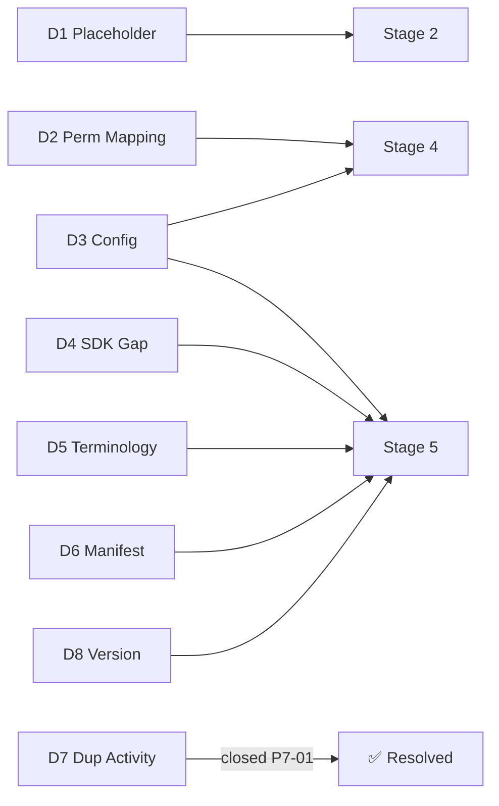

# Technical Debt Resolution (Sprint P7-A2)

> Catalogues the technical debt identified across the plugin audit and the P7-01 activity work, with resolution plans mapped to the 5 migration stages. **Design-only** — no code.

---

## Debt Inventory

| ID | Debt | Location | Severity | Stage |
|----|------|----------|----------|-------|
| D1 | Placeholder service instances instead of real singletons | `packages/core/bootstrap/composition/plugin-composition-module.ts` | Medium | 2 |
| D2 | Plugin `permissions` / `capabilitiesProposed` not mapped to `PermissionManager` | manifest → `PermissionManager` | Medium | 4 |
| D3 | `PluginConfigService` not bound to `PlatformConfigurationSystem` | `PluginConfigService` | Low | 4/5 |
| D4 | SDK coverage gap: AI Skills / Prompts / Resources / ActivityRegistry internal | `@openlearn/plugin-sdk` vs internal registries | Medium | 5 |
| D5 | Terminology drift (`permissions` vs `capabilitiesProposed`; `cap_plugin_management` vs `capability_plugin`; `onActivate` vs `activate()`) | audit docs vs SDK/code | Low | 5 |
| D6 | Manifest schema drift (audit `plugin.json` `permissions`/`contributions` vs SDK `Manifest`) | `manifest-schema.ts` vs docs | Low | 5 |
| D7 | Duplicated activity implementation (dormant `activity-workflow`) | `src/features/activity-workflow/` | Resolved | — (P7-01) |
| D8 | Version label mismatch (`V2.5`/`V3.2` vs `engines.openlearn`) | SDK/docs | Low | 5 |

---

## D1 — Placeholder Service Instances

- **Description:** `PluginCompositionModule` registers `{ name:'PluginHostService', isReady:true, pluginsCount:0 }` and `{ name:'ContributionRegistry', slotsCount:0 }` as *placeholders*, not the real `PluginHost` / `ContributionRegistry` singletons. Consumers cannot observe live host state.
- **Impact:** Service-registry introspection is non-functional; future capabilities (health, live counts) cannot rely on it.
- **Resolution:** In Stage 2, bind the real singletons into `PlatformServiceRegistry` under the same IDs (`srv_plugin_host`, `srv_plugin_contribution_registry`). No ID change → zero consumer impact.
- **Effort:** S. **Risk:** Low.

---

## D2 — Permission / Capability Mapping

- **Description:** Plugin-declared capabilities (`capabilitiesProposed`: `vfs:read`, `vfs:write`, `network:fetch`, `command:execute`, `ai:invoke`) are validated loosely at load and enforced internally, not centralized in `PermissionManager`.
- **Impact:** Inconsistent enforcement; no unified grant/deny audit; risk of scope creep into business RBAC.
- **Resolution:** Stage 4 maps each declared capability to an `Infrastructure`-category permission (see `Plugin Compatibility Matrix.md` §5). Default policies: `vfs:read`/`network:fetch` Allow; `vfs:write` Deny (explicit grant); `command:execute`/`ai:invoke` Controlled. **Hard boundary:** never enters business RBAC (PI-012).
- **Effort:** M. **Risk:** Low-Med (boundary enforcement must be tested).

---

## D3 — Config Service Binding

- **Description:** `PluginConfigService` options (`autoActivate`, `sandboxTimeoutMs`=10000, `maxMemoryMb`=128) are local; no dynamic config listening or read-only protection.
- **Resolution:** Stage 4/5 bind `PluginConfigService` to `PlatformConfigurationSystem` node `plugin`, gaining change-listen + read-only protection. Additive.
- **Effort:** S. **Risk:** Low.

---

## D4 — SDK Coverage Gap (primary extensibility debt)

- **Description:** `Plugin SDK.md` states AI Skills, AI Prompts, Resources, and the frontend `ActivityRegistry` are "currently wired through internal feature registries rather than the public SDK." Plugins must ride on `student.view` / `classroom.tool` / command-action services until these are surfaced.
- **Impact:** Third-party plugins cannot contribute AI Skills/Prompts/Resources/Activities through the *official* typed seam; inconsistent extension ergonomics.
- **Resolution:** Stage 5 surfaces these as **additive** type/token re-exports from `@openlearn/plugin-sdk`:
  - AI Skill / Prompt contribution types (built on `actionRegistry.register` + `capabilityRequired: ai:invoke`).
  - Resource contribution type + `IResourceServiceToken`.
  - `ActivityRegistry` (`IActivityRegistryToken`) — already exported from P7-01 — documented as the canonical activity seam (`ctx.resolve(IActivityRegistryToken)`).
  - SDK remains types+tokens only (no runtime).
- **Effort:** L. **Risk:** Low (additive; internal registries unchanged).

---

## D5 — Terminology Drift

- **Description:** Audit docs use `permissions` / `contributions` / `onActivate` / `capability_plugin`; SDK/code use `capabilitiesProposed` / `classroomTools`+`provides` / `activate()` / `cap_plugin_management`.
- **Resolution:** Stage 5 reconciles in **docs only** (no code change): canonicalize on SDK terms. Update audit docs to match `Manifest`. No runtime impact.
- **Effort:** S. **Risk:** Low.

---

## D6 — Manifest Schema Drift

- **Description:** Audit `Plugin Host Lifecycle.md` / `Configuration Analysis.md` validate `plugin.json` fields `permissions` + `contributions`; SDK `Manifest` uses `capabilitiesProposed` + `requires`/`provides`/`configuration`.
- **Resolution:** Make `packages/core/esm-loader/manifest-schema.ts` the single source of truth; audit docs updated to reference it. No field removal — additive.
- **Effort:** S. **Risk:** Low.

---

## D7 — Duplicated Activity Implementation (RESOLVED in P7-01)

- **Description:** `src/features/activity-workflow/` was a dormant, self-referenced subsystem duplicating activity logic.
- **Resolution:** Consolidated into `packages/activity-ecosystem` (backend package) during P7-01; the dormant folder was removed. No duplication remains.
- **Status:** ✅ Closed.

---

## D8 — Version Label Mismatch

- **Description:** SDK/docs use `V2.5` / `V3.2` feature labels while `engines.openlearn` gates on `^0.1.10`.
- **Resolution:** Normalize feature-version references to the `engines.openlearn` gate in Stage 5 docs. Additive.
- **Effort:** S. **Risk:** Low.

---

## Debt → Stage Traceability

---

## Resolution Summary

| Severity | Count | Resolved in |
|----------|-------|-------------|
| Medium | 3 (D1, D2, D4) | Stages 2, 4, 5 |
| Low | 5 (D3, D5, D6, D8) + D7 closed | Stages 4/5 |
| **Total open** | **7** (D7 already closed) | All mapped to stages |

No debt requires a rewrite or breaking change. Every item is addressed by an additive or mapping action within the 5-stage plan.
