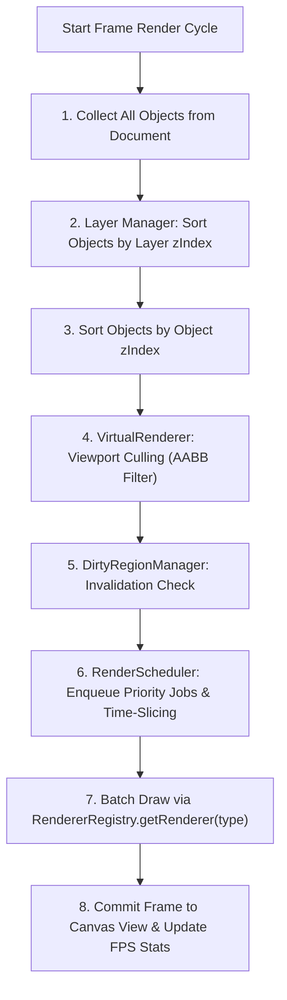
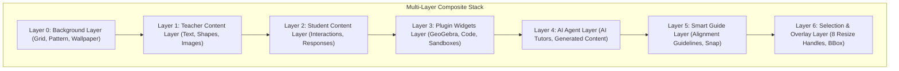

# OpenLearn Whiteboard Rendering Engine Design Specification

> **Architecture Standard**: High-Performance Viewport-Culled Pipeline  
> **Target Subsystem**: `src/features/whiteboard/rendering-engine/`  
> **Status**: Approved & Integrated

---

## 1. System Architecture Overview

The **Rendering Engine** abstracts rendering from React view components into a high-performance pipeline capable of rendering **10,000+ Canvas Objects** smoothly.

$$\text{Canvas Document} \longrightarrow \text{Layer Manager} \longrightarrow \text{RendererRegistry} \longrightarrow \text{RenderScheduler} \longrightarrow \text{Canvas Renderer} \longrightarrow \text{React View}$$

---

## 2. Render Pipeline Mermaid Diagram

---

## 3. Layer Architecture Diagram (Mermaid)

---

## 4. Key Subsystems & Responsibilities

| Subsystem | Responsibilities |
|---|---|
| **`RendererRegistry`** | Pluggable Object Renderer registry. Supports `registerRenderer()`, `overrideRenderer()`. |
| **`VirtualRenderer`** | Viewport Culling. Filters out canvas objects outside current viewport to sustain 60 FPS for 10,000+ objects. |
| **`RenderScheduler`** | Time-sliced priority queue (`Immediate`, `AnimationFrame`, `Idle`, `Background`) preventing UI jank. |
| **`DirtyRegionManager`** | Partial invalidation engine to avoid full canvas re-renders on minor drag/resize actions. |
| **`HighDPIController`** | `devicePixelRatio` scaling controller ensuring sharp rendering across Mac Retina, Windows & Linux. |
| **`PerformanceMonitor`** | Real-time FPS, draw calls, visible/culled object counts, and memory monitoring. |
