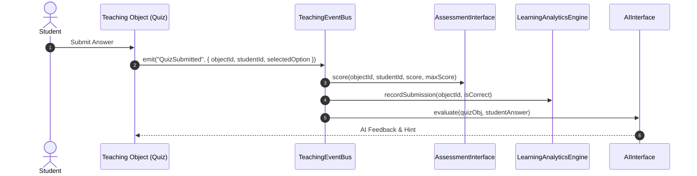

# OpenLearn Teaching Event Bus Specification

> **Target Module**: `src/features/whiteboard/teaching-object/event/teaching-event-bus.ts`  
> **Status**: Approved & Integrated

---

## 1. Teaching Event Flow Diagram (Mermaid)

---

## 2. Event Types & Payloads

| Event Type | Payload Attributes | Description |
|---|---|---|
| **`ObjectStarted`** | `{ objectId, timestamp }` | Triggered when a teaching object begins runtime execution |
| **`ObjectFinished`** | `{ objectId, timestamp }` | Triggered when object execution finishes |
| **`QuizSubmitted`** | `{ objectId, studentId, selectedOption }` | Student submits a quiz response |
| **`QuizGraded`** | `{ objectId, studentId, score, isPassed }` | Teacher or system scores a submission |
| **`CodeExecuted`** | `{ objectId, code, output, executionTimeMs }` | Code sandbox finishes execution |
| **`StudentAnswered`** | `{ objectId, studentId, answerPayload }` | Student completes a worksheet/assignment task |
| **`TeacherReviewed`** | `{ objectId, teacherId, feedback }` | Teacher provides feedback on work |
| **`AIFinished`** | `{ objectId, prompt, result }` | AI assistant completes response generation |
| **`PluginUpdated`** | `{ objectId, pluginId, state }` | Third-party plugin updates its internal state |
