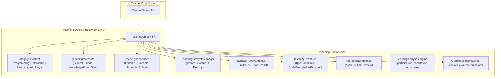
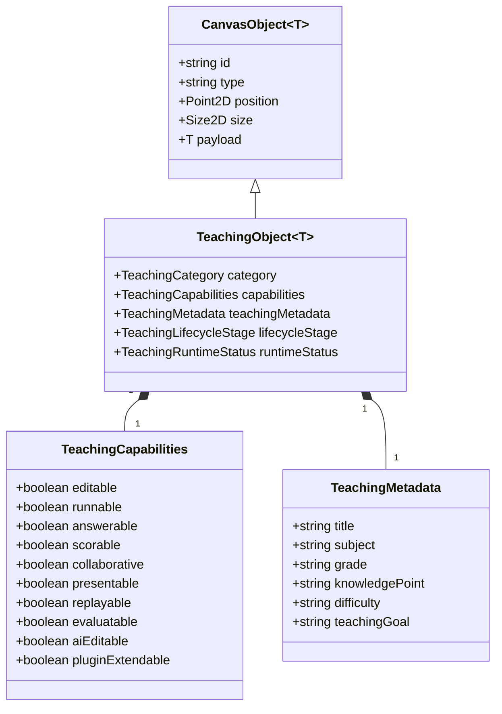

# OpenLearn Teaching Object Framework Design Specification

> **Architecture Standard**: Semantic Teaching Object Subsystem  
> **Target Subsystem**: `src/features/whiteboard/teaching-object/`  
> **Status**: Approved & Integrated

---

## 1. System Architecture Overview

The **Teaching Object Framework** wraps standard low-level `CanvasObject<T>` entities with rich **Teaching Semantics**, declaratively exposed capabilities, unified lifecycles, assessment scoring interfaces, learning analytics tracking, and universal AI prompts.

$$\text{Canvas Document} \longrightarrow \text{Canvas Object<T>} \longrightarrow \text{Teaching Object<T>} \longrightarrow \text{Teaching Engine}$$

---

## 2. Architecture Mermaid Diagram

---

## 3. Teaching Object Class Diagram (Mermaid)

---

## 4. 6 Teaching Object Categories

| Category | Typical Object Types |
|---|---|
| **Content Object** | Markdown, Rich Text, Formula, Image, Video, Audio, PDF, Slide, Document, Website |
| **Programming Object** | Code Sandbox, Python, JavaScript, Blockly, Jupyter Notebook, Terminal |
| **Interactive Object** | Quiz, Poll, Vote, Question, Discussion, Brainstorm, Random Picker, Timer |
| **Learning Object** | Assignment, Worksheet, Scratch Area, MindMap, Knowledge Card, Flash Card |
| **AI Object** | AI Chat, AI Tutor, AI Hint, AI Question, AI Summary, AI Translation, AI Evaluation |
| **Plugin Object** | Third-Party Teaching Plugins (GeoGebra, ChemDraw, Simulation) |
