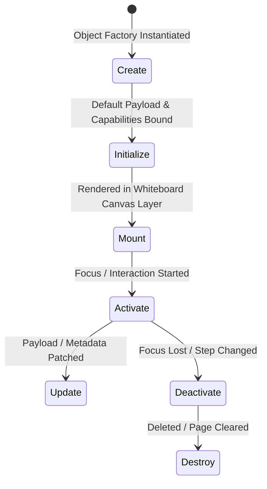

# OpenLearn Teaching Lifecycle & Runtime Specification

> **Target Subsystem**: `src/features/whiteboard/teaching-object/lifecycle/` & `runtime/`  
> **Status**: Approved & Integrated

---

## 1. Teaching Object Lifecycle Stages



---

## 2. Runtime Execution Control

Teaching Objects (e.g. Python Code Sandbox, Timer, Video, Quiz) maintain unified runtime execution states:

- **`idle`**: Ready for execution
- **`running`**: Currently executing / counting down
- **`paused`**: Execution suspended
- **`stopped`**: Execution ended by teacher
- **`finished`**: Execution completed successfully
- **`error`**: Runtime error encountered

```ts
import { teachingRuntimeManager } from '../features/whiteboard/teaching-object';

teachingRuntimeManager.run(objectId);
teachingRuntimeManager.pause(objectId);
teachingRuntimeManager.stop(objectId);
teachingRuntimeManager.reset(objectId);
```
