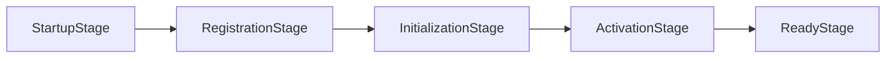

# Bootstrap Pipeline 引导流水线

实现位于 `packages/core/bootstrap/pipeline/`，驱动平台从环境检查到服务启动的 5 阶段状态流转。

---

## 5 阶段模型

- **StartupStageImpl**: SQLite 数据库连接与初始日志环境准备。
- **RegistrationStageImpl**: 注册核心 DI Tokens (`IStorageServiceToken` 等)。
- **InitializationStageImpl**: 异步初始化与 Schema 迁移。
- **ActivationStageImpl**: 加载 Worker Thread 宿主并激活内置插件。
- **ReadyStageImpl**: 完成健康检查并开启端口监听。
