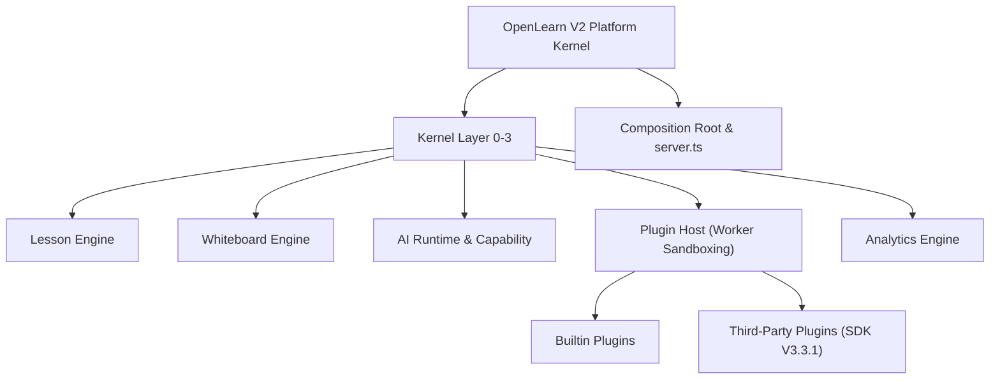

# OpenLearn V2 平台概述

OpenLearn V2 是一套全栈、分布式、基于插件化微前端架构的智能教育操作系统（Educational OS）。平台旨在为现代化智慧课堂、混合式教学、互动白板协同以及 AI 助教集成提供坚实的底层内核与扩展生态。

---

## 核心设计理念

### 1. 架构分层 (Layered Architecture)
OpenLearn V2 采用分层解耦的模块化设计，平台内核（Kernel）清晰地划分为 4 个初始化层级（Layer 0 ~ Layer 3）：

- **Layer 0（基础设施）**: 提供零依赖的 EventBus 事件总线、CapabilityGuard 权限防护、ServiceRegistry 服务容器、StorageService 存储服务以及 AIService 基础服务。
- **Layer 1（能力与 AI 内核）**: 包含 AIRuntimeKernel（模型与 Prompt 管理）、AICapabilityKernel、CapabilityRuntimeKernel（能力网关）及 ServiceRegistryKernel。
- **Layer 2（领域引擎与运行时）**: 引入 CommandBus 指令总线、ActionRegistry 动作注册表、ProcessManager 进程管理器、LessonRuntime（课程引擎）、ClassroomRuntimeKernel（课堂运行时）、PresenceEngineKernel（在线感知引擎）、CollaborationEngineKernel（协同引擎）与 AnalyticsEngineKernel（学习分析引擎）。
- **Layer 3（宿主与协同）**: 包含 PluginHost（Worker Thread 隔离宿主）、WorkerManager（线程池管理器）与 HotReloadController（热重载控制器）。

### 2. 组合根与依赖注入 (Composition Root & Dependency Injection)
平台通过统一的 DI Container (`ServiceRegistry`) 和类型安全的 `Token<T>` 实现零硬编码耦合：
- 所有底层服务和高层引擎均显式注册至 DI 容器。
- 宿主与插件之间通过类型安全的 Token 进行依赖解算（Dependency Resolution）与服务共享。

### 3. 引导流水线 (Bootstrap Pipeline)
系统启动遵循严格的 5 阶段引导流水线：
1. **Startup**: 初始化基础基础设施与环境变量。
2. **Registration**: 注册系统核心服务 Token 与扩展点。
3. **Initialization**: 执行各子系统与引擎的异步初始化。
4. **Activation**: 激活插件宿主与内置插件（Builtin, VFS, Process, Management, AI-Planner 等）。
5. **Ready**: 完成健康检查并开启 Socket.IO / Express HTTP 服务。

### 4. 沙箱隔离的插件生态 (Plugin Ecosystem)
- 插件以 Web Worker / Worker Thread 沙箱模式独立运行，主线程与插件进程安全隔离。
- 插件通过 `@openlearn/plugin-sdk` 提供的 `PluginContext` 交互，无法直接触碰全局 DOM 或私有 Core API。

---

## 平台技术栈

| 模块 | 选型与技术 |
|---|---|
| **后端运行时** | Node.js (ESM), Express, Socket.IO, SQLite (`better-sqlite3`) |
| **前端框架** | React 19, TypeScript, Vite |
| **核心内核** | Custom Micro-kernel (`packages/core`) with DI Container |
| **插件 SDK** | `@openlearn/plugin-sdk` (v3.3.1) |
| **测试框架** | Vitest with jsdom environment |
| **文档引擎** | Sphinx with MyST Parser, Mermaid, RTD Theme |

---

## 核心功能模块

