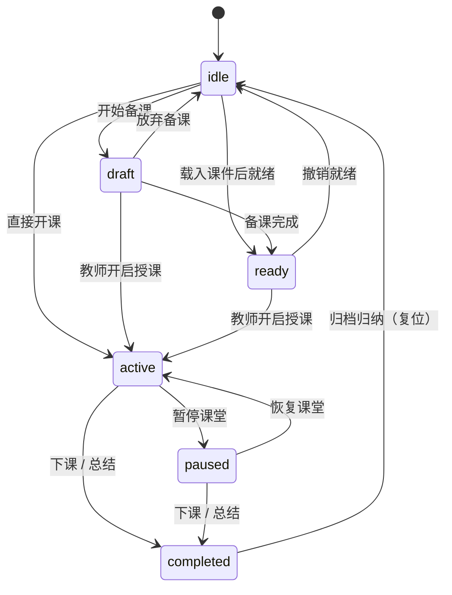

# Lesson Lifecycle 课程生命周期状态机

状态取值与转换规则以代码为唯一真源：

- 状态枚举 `LessonStatus` —— `packages/core/lesson-engine/types.ts`
- 转换表 `VALID_LESSON_TRANSITIONS` 与状态机类 `LessonStateMachine` —— `packages/core/lesson-engine/state-machine.ts`
- 运行时初态 —— `LessonRuntime` 构造函数中的 `new LessonStateMachine('idle')`（`packages/core/lesson-engine/lesson-runtime.ts`）

---

## 状态取值

`LessonStatus` 共 **6** 个值，全部为小写字符串字面量：

```typescript
export type LessonStatus = 'idle' | 'draft' | 'ready' | 'active' | 'paused' | 'completed';
```

> 注意：代码中**不存在** `Preparing`、`InProgress`、`Archived` 等大写或 `Preparing` 类状态名。
> 语义对应关系：备课中 = `draft`，已就绪待开课 = `ready`，授课中 = `active`，暂停 = `paused`，已下课 = `completed`，未开始 = `idle`。

---

## 转换规则

```typescript
export const VALID_LESSON_TRANSITIONS: Record<LessonStatus, readonly LessonStatus[]> = {
  idle: ['draft', 'ready', 'active'],
  draft: ['ready', 'active', 'idle'],
  ready: ['active', 'idle'],
  active: ['paused', 'completed'],
  paused: ['active', 'completed'],
  completed: ['idle'],
};
```

状态链（`completed` 并非终态，可回到 `idle`）：



---

## 关键行为

- **初态为 `idle`**：`LessonRuntime` 构造时即以 `new LessonStateMachine('idle')` 建机，尚未开课的课程停留在 `idle`。
- **`completed` 可复位到 `idle`**：下课归档不是单向终态，`LessonStateMachine.reset()` 也会把状态强制重置为 `idle`。
- **同态跃迁的处理**：`transitionTo` 对相同目标状态直接返回当前态，**唯一例外**是 `active → active`（重复开课）会抛 `InvalidLessonStateTransitionError`。
- **非法转换抛错**：目标状态不在 `VALID_LESSON_TRANSITIONS` 允许列表时，`transitionTo` 抛 `InvalidLessonStateTransitionError`，异常携带 `lessonId` / `fromStatus` / `toStatus` / `allowedTransitions` 四个只读字段。
- **转换监听**：`onTransition(listener)` 注册回调，返回取消订阅函数；监听器抛错只 `console.error`，不影响转换结果。
- **默认 actorId 兜底不在此处**：`LessonRuntime` 的状态跃迁全部经由本地 `stateMachine`，与 `CommandBus` 的 `actorId` 机制无关。

> 上一次跃迁会由 `LessonRuntime` 注册的监听器发布为 `LessonStateChanged` 事件（payload 含 `lessonId` / `previousStatus` / `currentStatus` / `timestamp`）。
