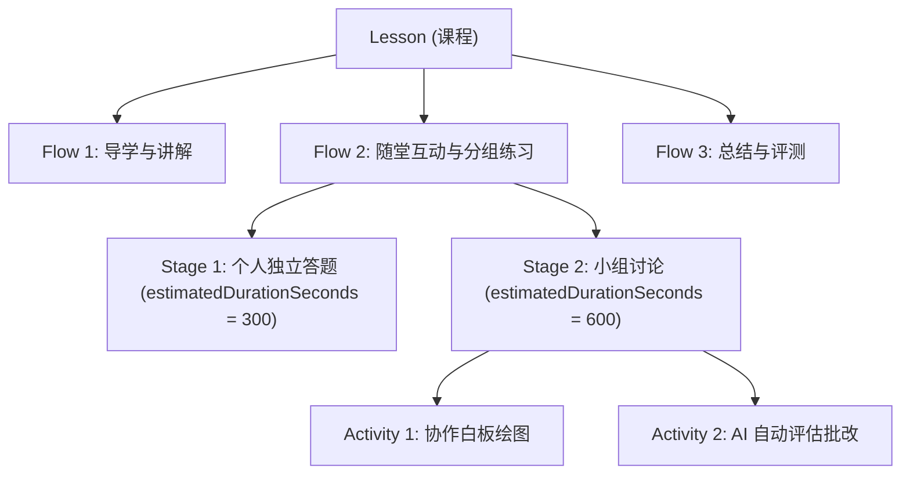
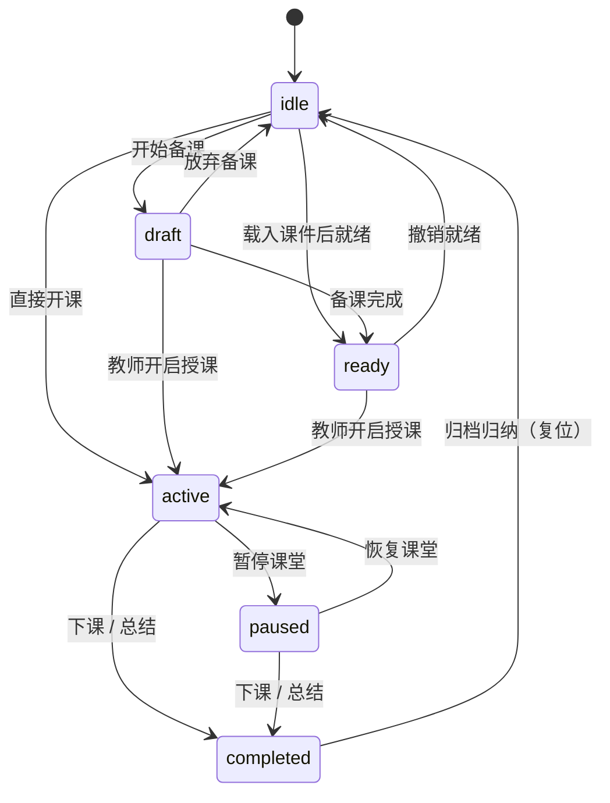

# Lesson Runtime 课程引擎

Lesson Runtime（`packages/core/lesson-engine/`）是 OpenLearn V2 教学流程编排的核心引擎，管理从备课、授课到课后分析的全生命周期状态流转。

---

## 领域模型与层级关系

课程（Lesson）遵循四层分层结构：

```
Lesson (课程)
 └── Flow (教学流)
      └── Stage (教学阶段 / 环节)
           └── Activity (教学活动)
```



---

## 核心类型定义 (`lesson-engine/types.ts`)

领域类型全部定义在 `packages/core/lesson-engine/types.ts`；`index.ts` 只是 `export *` 的 barrel，**不重复定义**。

```typescript
export type LessonStatus = 'idle' | 'draft' | 'ready' | 'active' | 'paused' | 'completed';
export type StageCompletionStatus = 'pending' | 'in_progress' | 'completed' | 'skipped';
export type ActivityStatus = 'idle' | 'active' | 'paused' | 'completed' | 'skipped';
export type UserRole = 'teacher' | 'student' | 'administrator' | 'assistant';

export interface UserRef {
  id: string;
  name: string;
  role: UserRole;
  avatar?: string;
}

export interface Lesson {
  id: string;
  title: string;
  subject: string;
  grade: string;
  teacher: UserRef;
  durationMinutes: number;
  status: LessonStatus;
  flows: Flow[];
  activeFlowId?: string;
  createdAt: number;
  updatedAt: number;
  metadata?: Record<string, unknown>;
}

export interface Flow {
  id: string;
  name: string;
  description: string;
  version: number;
  stages: Stage[];
  isCurrent?: boolean;
  createdAt: number;
  updatedAt: number;
}

export interface Stage {
  id: string;
  title: string;
  estimatedDurationSeconds: number;
  teachingGoals: string[];
  knowledgePoints: string[];
  completionStatus: StageCompletionStatus;
  assignee: 'teacher' | 'student' | 'group' | string;
  activities: Activity[];
  locked?: boolean;
  metadata?: Record<string, unknown>;
  analytics?: StageAnalytics;
}

export interface Activity {
  id: string;
  type: string;
  title: string;
  config: ActivityConfig;
  status: ActivityStatus;
  teachingObjects: TeachingObject[];
  metadata?: Record<string, unknown>;
}
```

> ⚠️ 常见误写：`Stage` 的时长字段是 `estimatedDurationSeconds`（**秒**），
> 不是 `durationMinutes`；`durationMinutes` 属于 `Lesson`（课程整体时长，单位为分钟）。
> 另注意 `Stage` 还带 `teachingGoals` / `knowledgePoints` / `assignee` / `locked` / `analytics` 等字段。

---

## 课程生命周期状态机

状态机类 `LessonStateMachine` 与转换表 `VALID_LESSON_TRANSITIONS` 定义在
`packages/core/lesson-engine/state-machine.ts`，非法转换抛 `InvalidLessonStateTransitionError`。

```typescript
export const VALID_LESSON_TRANSITIONS: Record<LessonStatus, readonly LessonStatus[]> = {
  idle: ['draft', 'ready', 'active'],
  draft: ['ready', 'active', 'idle'],
  ready: ['active', 'idle'],
  active: ['paused', 'completed'],
  paused: ['active', 'completed'],
  completed: ['idle'],
};
```



- `LessonRuntime` 构造时以 `new LessonStateMachine('idle')` 建机，未开课课程停留在 `idle`。
- `completed` **不是**终态，可回到 `idle`；`reset()` 也强制回到 `idle`。
- `active → active`（重复开课）被显式拒绝并抛 `InvalidLessonStateTransitionError`。
- 每次跃迁由 `LessonRuntime` 注册的监听器发布 `LessonStateChanged` 事件。

> 完整状态语义、监听器与异常字段见 [课程生命周期状态机](lesson-lifecycle)。

