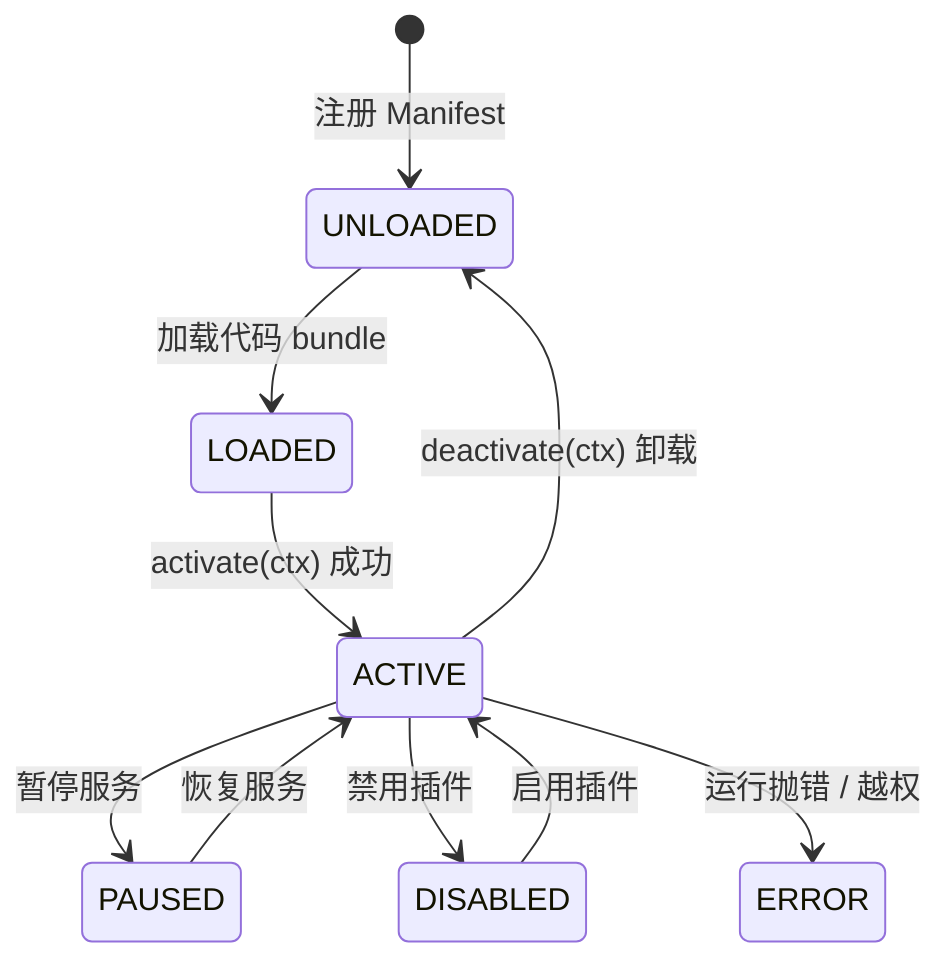

# Plugin Architecture 插件架构与沙箱隔离

OpenLearn V2 的插件架构由 `packages/core/plugin-host/` 实现，提供高可用、多沙箱隔离、动态加载与热重载的第三方插件基础设施。

---

## 插件生命周期状态机

每一个插件实例在 `PluginHost` 中均拥有清晰的状态转移路径：

### 状态枚举定义 (`PluginState`)
- `UNLOADED`: 未加载。
- `LOADED`: 模块成功解析。
- `ACTIVE`: 插件激活成功，已注册命令与扩展。
- `PAUSED`: 暂时停止处理指令与事件。
- `DISABLED`: 插件被管理员显式禁用。
- `ERROR`: 发生了未捕获的运行时异常。

---

## Worker Thread 沙箱隔离

为防止恶意插件卡死主线程或读取隐私数据，插件在独立 Worker 进程中运行：

1. **`WorkerManager`**: 管理沙箱线程池。
2. **`NodeEsmLoader`**: 安全导入 ESM 代码包。
3. **`PluginContext` 桥接**: 插件只能使用入参 `PluginContext` 中暴露的方法。

---

## 内置插件包 (Builtin Plugins)

平台自带 7 个内置核心插件，随 Kernel 自动加载：
- `BuiltinPlugin`: 提供系统默认指令与状态基础包。
- `VfsPlugin`: 虚拟文件系统插件。
- `ProcessPlugin`: 进程控制插件。
- `ManagementPlugin`: 平台后台管理插件。
- `AiPlannerPlugin`: AI 教学计划编排插件。
- `AiSubmitInjectorPlugin`: AI 提交与打分注入插件。
- `AssignmentEvalPlugin`: 作业自动评估插件。
