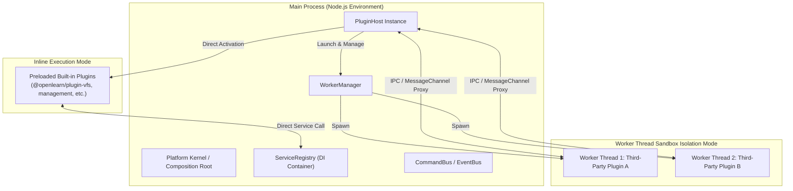
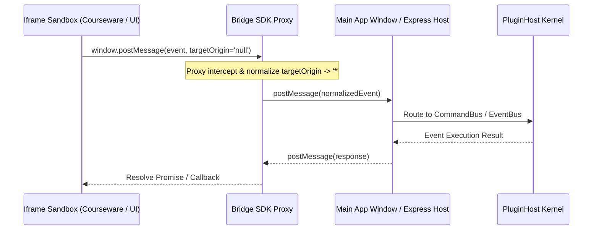
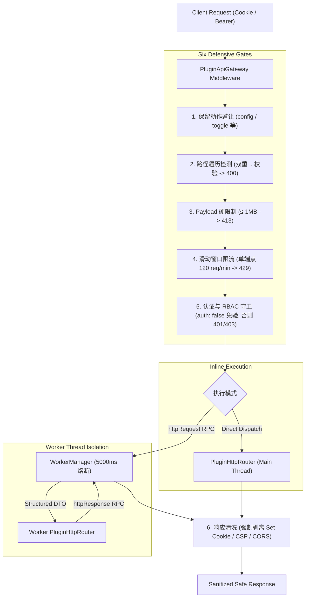

# 插件宿主架构与沙箱隔离机制 (Plugin Architecture)

OpenLearn V2 的插件系统为全栈、可伸缩、多租户隔离的微前端与 Worker 进程隔离架构。本文档详细解析插件宿主的物理结构、模块职责、沙箱机制、组件通信与服务代理模型。

---

## 1. 架构总览与核心设计哲学

### 什么是插件宿主 (PluginHost)？
`PluginHost` 是 OpenLearn V2 智能教育操作系统的核心子系统之一。它负责插件的生命周期管理（安装、校验、激活、停用、卸载、热重载）、物理隔离沙箱调度、依赖注入（DI）容器代理、声明式 UI 贡献点注册以及权限能力（Capabilities）管控。

### 为什么需要插件宿主？
1. **模块化扩展**：允许第三方开发者或内置功能扩展课程引擎、白板工具、学习分析与 AI 智能体能力。
2. **多重安全隔离**：防止恶意代码或崩溃的第三方插件直接影响操作系统内核主线程。
3. **资源生命周期自治**：通过自动资源追踪机制（`ResourceTracker`），确保插件停用或卸载时能够无残留地清理已注册的命令、事件监听器、定时器与数据库链接。

### 核心实现位置
- **插件宿主主逻辑**: [`packages/core/plugin-host/index.ts`](file:///home/wuxf/Develop/openlearnv2/packages/core/plugin-host/index.ts#L105)
- **生命周期管理器**: [`packages/core/plugin-host/plugin-lifecycle-manager.ts`](file:///home/wuxf/Develop/openlearnv2/packages/core/plugin-host/plugin-lifecycle-manager.ts#L26)
- **环境上下文构建器**: [`packages/core/plugin-host/context-builder.ts`](file:///home/wuxf/Develop/openlearnv2/packages/core/plugin-host/context-builder.ts#L36)
- **资源追踪器**: [`packages/core/plugin-host/resource-tracker.ts`](file:///home/wuxf/Develop/openlearnv2/packages/core/plugin-host/resource-tracker.ts#L15)
- **声明式贡献注册表**: [`packages/core/plugin-host/contribution-registry.ts`](file:///home/wuxf/Develop/openlearnv2/packages/core/plugin-host/contribution-registry.ts#L54)
- **能力关卡网关**: [`packages/core/plugin-host/plugin-capability-gateway.ts`](file:///home/wuxf/Develop/openlearnv2/packages/core/plugin-host/plugin-capability-gateway.ts#L20)
- **Worker 线程池管理器**: [`packages/core/worker-runtime/worker-manager.ts`](file:///home/wuxf/Develop/openlearnv2/packages/core/worker-runtime/worker-manager.ts#L35)
- **ESM 模块动态加载器**: [`packages/core/esm-loader/esm-loader.ts`](file:///home/wuxf/Develop/openlearnv2/packages/core/esm-loader/esm-loader.ts#L24)

---

## 2. 双重物理运行模式 (Dual Execution Modes)

OpenLearn V2 插件系统支持两种互补充的物理执行模式：



### A. 内联模式 (Inline Mode)
- **运行位置**：主进程内存中。
- **适用场景**：内核级系统插件（如 `@openlearn/plugin-vfs`、`management`、`ai-planner`）。
- **特点**：高吞吐量、低延迟通信，可通过内存闭包直接调用内核 API。

### B. Worker 线程隔离沙箱模式 (Worker Sandbox Mode)
- **运行位置**：独立的 `worker_threads.Worker` 线程。
- **适用场景**：第三方未信任插件、高 CPU 密集或不稳定插件。
- **特点**：
  - **内存隔离**：无法访问主进程全局变量或未授权文件句柄。
  - **RPC 消息转发**：通过 `WorkerTransport` 与 `MessageChannel` 传输 JSON/Structured-Clone 消息。
  - **崩溃容错**：Worker 崩溃不影响主进程或其他插件。

---

## 3. 沙箱 IPC 与 Bridge SDK 代理机制

交互式课件和插件前端部分运行在严格限制的 `<iframe>` 沙箱中（安全属性 `sandbox="allow-scripts allow-forms allow-downloads"`），无法共享同源 `window` 对象。平台使用 **Bridge SDK Proxy** 穿透沙箱：



实现文件：
- [`server/utils/bridge-sdk.ts`](file:///home/wuxf/Develop/openlearnv2/server/utils/bridge-sdk.ts#L10)

---

## 4. 上下文与依赖注入 (PluginContext & DI Architecture)

插件在激活时被传入一个专用的上下文对象 `PluginContext`。

```typescript
export interface PluginContext {
  // 7 大核心服务代理
  services: {
    commandBus: ICommandBusService;
    eventBus: IEventBusService;
    actionRegistry: IActionRegistryService;
    capability: ICapabilityService;
    processManager: IProcessService;
    storage: IStorageService;
    ai: IAIService;
  };
  pluginId: string;
  manifest: Manifest;
  resolve<T>(token: Token<T>): Promise<T>;
  provide<T>(token: Token<T>, instance: T): Promise<void>;
  db: PluginDatabaseAPI;
  log: IPluginLogger;
  contributions: ContributionAccessor;
  config: IConfigService;
  require(moduleName: string): any;
}
```

### 上下文包装器与代理拦截 (`buildContext`)
位于 [`packages/core/plugin-host/context-builder.ts`](file:///home/wuxf/Develop/openlearnv2/packages/core/plugin-host/context-builder.ts#L36)：
1. **自动资源接管**：所有注册到 `commandBus` 或 `eventBus` 的处理器与订阅会被自动包装并注册到 `ResourceTracker` 中。
2. **能力约束检查**：在调用敏感能力时自动透传插件 actor ID (`plugin:${manifest.id}`) 进行权限过滤。
3. **依赖校验 (`skipTokens`)**：在激活前若检测到 manifest 中声明的 `optional` 依赖不满足 SemVer 兼容版本，`buildContext` 会自动将该服务在 `services` 对象中置为 `null`，防止非法的 API 调用。

---

## 5. 自动资源管理与清理机制 (ResourceTracker)

实现位置：[`packages/core/plugin-host/resource-tracker.ts`](file:///home/wuxf/Develop/openlearnv2/packages/core/plugin-host/resource-tracker.ts#L15)

插件在运行期间创建的所有资源（如注册的命令 Handler、事件 Subscription、定时器与网络连接）必须实现 `Disposable` 接口：

```typescript
export interface Disposable {
  dispose(): void;
}
```

当插件触发停用（`deactivatePlugin`）或卸载（`uninstallPlugin`）时，`PluginHost` 自动调用：
```typescript
resourceTracker.disposeAll(pluginId);
```
该操作会反向顺序执行该插件登记的所有 `dispose()` 方法，即使插件在 `deactivate()` 回调中发生超时或崩溃，`finally` 块也能保证 100% 强力清理，防止内存泄漏。

---

## 6. 声明式贡献注册表 (ContributionRegistry)

实现位置：[`packages/core/plugin-host/contribution-registry.ts`](file:///home/wuxf/Develop/openlearnv2/packages/core/plugin-host/contribution-registry.ts#L54)

插件可在其 `manifest.json` 中声明 UI 贡献点（如教师端 Tab 页面、学生端工具箱组件、课堂微应用）。`ContributionRegistry` 在插件安装时无须激活代码即可解析并建立索引：

```json
{
  "contributes": {
    "classroom.tool": [
      {
        "id": "quiz-tool",
        "name": "互动答题卡",
        "commandType": "quiz.open"
      }
    ],
    "teacher.tab": [
      {
        "id": "homework-tab",
        "label": "作业批改中心",
        "position": 10
      }
    ]
  }
}
```

管理面板与主应用可通过 `ctx.contributions.list()` 或 `pluginHost.getContributionRegistry()` 实时检索已配置的 UI 插槽元数据。

---

## 7. 共享模块安全白名单

为平衡安全性与 CJS/ESM Bundle 大小，插件在 Node.js 环境下通过 `ctx.require(moduleName)` 引用共享模块时，`PluginHost` 强行校验白名单（定义于 [`packages/core/plugin-host/types.ts`](file:///home/wuxf/Develop/openlearnv2/packages/core/plugin-host/types.ts#L73)）：

- `recharts`
- `react-markdown`
- `jspdf`
- `jspdf-autotable`
- `xlsx`
- `lucide-react`
- `uuid`

引用不在白名单中的第三方 Node 模块将强行抛出 `Error: Module ${moduleName} is not in the plugin shared modules whitelist.`。

---

## 8. 插件统一安全网关与 RESTful API 隔离机制 (PluginApiGateway)（v0.3.11 新增）

实现位置：
- **安全网关中间件**: [`server/routes/plugin-api-gateway.ts`](file:///home/wuxf/Develop/openlearnv2/server/routes/plugin-api-gateway.ts)
- **路由分发总线**: [`packages/core/plugin-host/http-router.ts`](file:///home/wuxf/Develop/openlearnv2/packages/core/plugin-host/http-router.ts)
- **挂载入口**: [`server/routes/plugins.ts`](file:///home/wuxf/Develop/openlearnv2/server/routes/plugins.ts)

OpenLearn V2 允许插件通过 `ctx.http` 导出轻量 RESTful API。为确保系统安全性，所有外部 HTTP 流量均被收敛至统一入口 `/api/plugins/:pluginId/*`，并在派发前强制穿透六道纵深安全防御：



### 核心安全防线说明：
1. **系统保留动作避让**：核心动作（如 `config`, `toggle`, `contributions`）无缝放行至系统管理控制器，避免路由被恶意劫持。
2. **路径遍历防护 (Path Traversal)**：对原始子路径及规范化路径执行双重检测，识别包含 `..` 或 `%2e%2e` 的路径遍历尝试，直接拒绝并返回 `400 Bad Request`。
3. **Payload 体积硬限制**：请求体上限严格限制为 **1MB**（超限返回 `413 Payload Too Large`），大文件上传强制引导至平台统一 `IStorageService` 存储通道，防止 Node.js 主线程或 Worker 线程 OOM。
4. **IP + 插件级内存滑动窗口限流器**：单端点默认 120 req/min，超限返回 `429 Too Many Requests` 及 `Retry-After` 标头，防御 DoS 与频繁刷接口。
5. **前置认证与细粒度 RBAC 守卫**：解析 Cookie 会话（`edu_os_token`）与 Bearer Token。未登录拦截（401），角色不符拦截（403），仅显式声明 `auth: false` 的公开路由直接放行。
6. **响应头安全脱敏清洗**：出站前强制剥离 `Set-Cookie`、`Content-Security-Policy`、`Access-Control-Allow-Origin` 等高危标头，从根本上防止插件窃取客户端会话或削弱全站安全策略。
7. **Worker 跨线程纯 DTO 隔离**：Worker 沙箱插件通过只读 `PluginApiRequest` DTO 接收参数，绝不持有或访问原生 Express `req`/`res` 实例，并享有 5000ms 超时熔断保护（超时返回 `504 Gateway Timeout`）。

