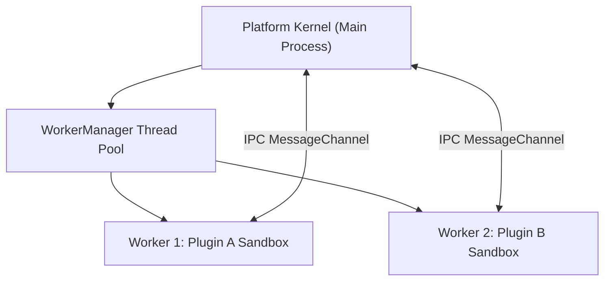

# 插件宿主架构与 Worker 沙箱 (Plugin Architecture)

插件宿主实现在 `packages/core/plugin-host/`。

---

## 沙箱运行模式

```mermaid
graph TD
    Host["Platform Kernel (Main Process)"] --> WM["WorkerManager Thread Pool"]
    WM --> W1["Worker 1: Plugin A Sandbox"]
    WM --> W2["Worker 2: Plugin B Sandbox"]
    
    W1 <-->|IPC MessageChannel| Host
    W2 <-->|IPC MessageChannel| Host
```

插件被隔离在独立的 Worker Thread 中，只能通过代理入参 `PluginContext` 执行受控 API 操作。
