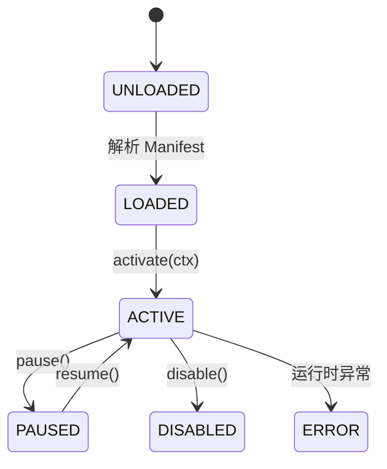

# 插件生命周期 (Plugin Lifecycle)

状态转移：`UNLOADED` -> `LOADED` -> `ACTIVE` <-> `PAUSED` -> `DISABLED` / `ERROR`.

```mermaid
stateDiagram-v2
    [*] --> UNLOADED
    UNLOADED --> LOADED: 解析 Manifest
    LOADED --> ACTIVE: activate(ctx)
    ACTIVE --> PAUSED: pause()
    PAUSED --> ACTIVE: resume()
    ACTIVE --> DISABLED: disable()
    ACTIVE --> ERROR: 运行时异常
```
