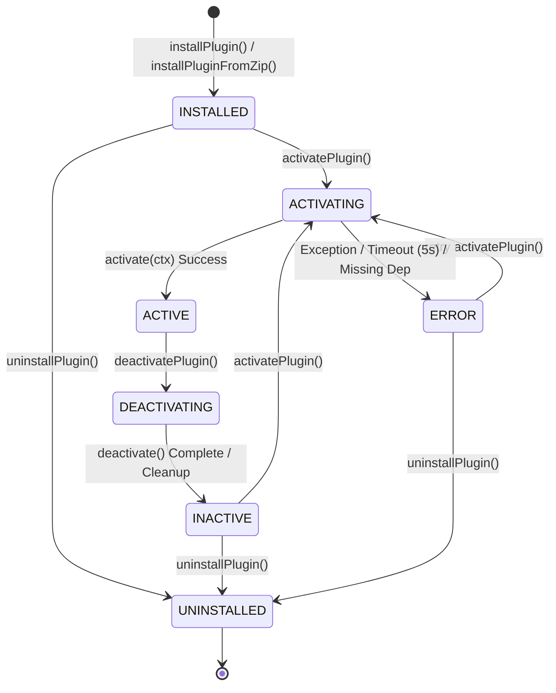

# 插件生命周期状态机与执行流程 (Plugin Lifecycle)

OpenLearn V2 插件系统使用严密的 7 状态确定性有限状态机（Deterministic Finite State Machine）管理插件从安装到卸载的全生命周期。本文档详细记录插件的状态转换图、校验规则、转换流程以及中间件机制。

---

## 1. 状态枚举 (`PluginState`)

插件在生命周期中必定处于 [`packages/core/plugin-host/types.ts`](file:///home/wuxf/Develop/openlearnv2/packages/core/plugin-host/types.ts#L52) 定义的以下 7 种状态之一：

| 状态名称 (Enum) | 对应字符串 | 类型 | 说明 |
| :--- | :--- | :--- | :--- |
| `INSTALLED` | `'installed'` | 稳定态 | 插件包已被成功解压/保存至文件系统并在数据库中登记。 |
| `ACTIVATING` | `'activating'` | 瞬态 (Transient) | 正在执行依赖校验、上下文构建、权限授予及 `activate(ctx)` 回调。 |
| `ACTIVE` | `'active'` | 稳定态 | 插件成功激活，其命令与事件监听器处于工作状态。 |
| `DEACTIVATING` | `'deactivating'` | 瞬态 (Transient) | 正在执行 `deactivate()` 回调并强行回收相关注册资源。 |
| `INACTIVE` | `'inactive'` | 稳定态 | 插件已停用，资源已清理，但物理文件与数据库条目仍保留。 |
| `ERROR` | `'error'` | 稳定态 | 激活过程发生严重错误（如代码抛错、超时、依赖缺失）。 |
| `UNINSTALLED` | `'uninstalled'` | 终结态 | 插件条目已从数据库移除，相关表与物理文件已彻底销毁。 |

---

## 2. 状态转移图与合法转换矩阵

### 状态转换图 (State Diagram)



### 合法转换矩阵 (`VALID_TRANSITIONS`)
实现在 [`packages/core/plugin-host/index.ts`](file:///home/wuxf/Develop/openlearnv2/packages/core/plugin-host/index.ts#L62)。任意未列在表中的状态转换均会被 `validatePluginStateTransition()` 拦截并抛出 `IllegalStateTransitionError`：

```typescript
const VALID_TRANSITIONS: Record<PluginState, PluginState[]> = {
  [PluginState.INSTALLED]: [PluginState.ACTIVATING, PluginState.UNINSTALLED],
  [PluginState.ACTIVATING]: [PluginState.ACTIVE, PluginState.ERROR],
  [PluginState.ACTIVE]: [PluginState.DEACTIVATING],
  [PluginState.DEACTIVATING]: [PluginState.INACTIVE],
  [PluginState.INACTIVE]: [PluginState.ACTIVATING, PluginState.UNINSTALLED],
  [PluginState.ERROR]: [PluginState.ACTIVATING, PluginState.UNINSTALLED],
  [PluginState.UNINSTALLED]: [],
};
```

---

## 3. 生命周期的核心阶段详解

### 3.1 安装阶段 (`installPlugin` / `installPluginFromZip`)
1. **源码或 ZIP 提取**：校验 ZIP 包目录结构及 `manifest.json`。
2. **Schema 运行时校验**：通过 `manifestSchema.parse()` 验证格式。
3. **唯一性检查**：调用 `ensureUniqueManifestId()`，若 `manifest.id` 已存在则终止。
4. **SemVer 静态检查**：预判 `manifest.requires` 中的平台服务与依赖库版本。
5. **物理部署**：将文件解压至 `plugins/<pluginId>/`，向数据库 `plugins` 表插入记录（状态设为 `'installed'`）。

### 3.2 激活阶段 (`activatePlugin`)
激活超时限制为 **5000 毫秒** (`ACTIVATION_TIMEOUT_MS`)。流程如下：
1. **状态校验与转换**：`INSTALLED` / `INACTIVE` / `ERROR` $\rightarrow$ `ACTIVATING`。
2. **依赖检查**：
   - `checkPluginDependencies`: 检查 `manifest.pluginDependencies` 中的插件是否处于 `ACTIVE` 状态。
   - `checkCrossPluginServices`: 检查 `manifest.requires` 中的跨插件服务是否由某已激活插件的 `manifest.provides` 声明。
3. **安全上下文构建 (`buildContext`)**：
   - 实例化 `PluginContext`。
   - 对不满足 `optional` 版本依赖的服务自动设为 `null`。
4. **能力授权**：向 `CapabilityService` 批量申请 `manifest.capabilitiesProposed` 声明的能力。
5. **洋葱中间件前置管线 (`beforeActivate`)**：顺序执行已注册的生命周期中间件。
6. **执行 `activate(ctx)` 回调**：使用 `Promise.race` 包装 5 秒超时定时器。
7. **转换成功**：状态更改为 `ACTIVE`，更新 DB 记录。
8. **异常回滚 (Rollback)**：若激活失败或超时，状态强行转为 `ERROR`，调用 `resourceTracker.disposeAll(pluginId)` 释放半创建资源，并撤销已申请能力。

### 3.3 停用阶段 (`deactivatePlugin`)
停用超时限制同样为 **5000 毫秒** (`DEACTIVATION_TIMEOUT_MS`)。流程如下：
1. **状态校验**：必须处于 `ACTIVE` 状态。状态转换为 `DEACTIVATING`。
2. **洋葱中间件前置管线 (`beforeDeactivate`)**。
3. **执行 `deactivate()` 回调**：若插件提供该可选导出，则触发执行。
4. **强行资源回收 (Forced Cleanup)**：无论 `deactivate()` 成功、抛错还是超时，`finally` 块均强制执行：
   - `resourceTracker.disposeAll(pluginId)`（注销命令 Handler、取消事件订阅、清理定时器）。
   - `capabilityService.revokeAll(actorId)`（撤销能力凭证）。
   - 注销热重载监听。
   - 状态更新为 `INACTIVE`，更新 DB 记录。

### 3.4 卸载阶段 (`uninstallPlugin`)
1. **安全停用**：若插件仍处于 `ACTIVE` 状态，自动先调用 `deactivatePlugin()`。
2. **状态转换**：`INACTIVE` / `ERROR` / `INSTALLED` $\rightarrow$ `UNINSTALLED`。
3. **数据销毁**：
   - 从 `plugins` 表与 `plugin_storage` 表中删除记录。
   - **自建表自动清理**：通过 `sqlite_master` 扫描并自动执行 `DROP TABLE IF EXISTS plugin_<pluginId>_<tableName>`。
   - 强行从磁盘移除 `plugins/<pluginId>/` 物理目录。

---

## 4. 生命周期中间件机制 (Middleware System)

`PluginHost` 提供了洋葱模型（Onion Model）中间件机制（实现在 [`packages/core/plugin-host/middleware.ts`](file:///home/wuxf/Develop/openlearnv2/packages/core/plugin-host/middleware.ts#L10)），允许开发者或系统监控扩展插件激活与停用的前后钩子：

### 支持的生命周期阶段 (`LifecyclePhase`)
- `beforeActivate`: 激活执行前
- `afterActivate`: 激活成功后
- `beforeDeactivate`: 停用执行前
- `afterDeactivate`: 停用清理后
- `beforeCommand`: 命令执行前
- `afterCommand`: 命令执行后

### 注册示例
```typescript
pluginHost.registerMiddleware('beforeActivate', async (ctx, next) => {
  console.log(`[Audit] Preparing to activate plugin: ${ctx.pluginId}`);
  const start = Date.now();
  await next(); // 执行后续中间件及插件 activate 函数
  console.log(`[Audit] Plugin ${ctx.pluginId} activation completed in ${Date.now() - start}ms`);
});
```
