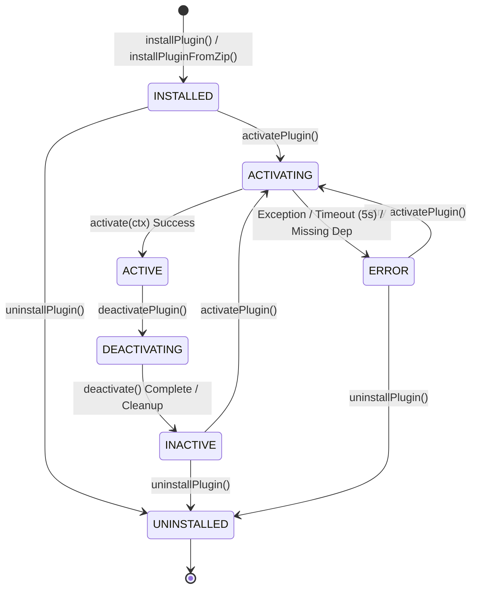

# 插件生命周期状态机与执行流程 (Plugin Lifecycle)

<!-- doc-version: sdk=3.7.0 -->

> **适用范围**：`@openlearn/plugin-sdk@3.7.0`

OpenLearn V2 插件系统使用严密的 7 状态确定性有限状态机（Deterministic Finite State Machine）管理插件从安装到卸载的全生命周期。本文档详细记录插件的状态转换图、校验规则、转换流程以及中间件机制。

---

## 1. 状态枚举 (`PluginState`)

插件在生命周期中必定处于 `packages/core/plugin-host/types.ts` 定义的以下 7 种状态之一：

| 状态名称 (Enum) | 对应字符串       | 类型             | 说明                                                            |
| :-------------- | :--------------- | :--------------- | :-------------------------------------------------------------- |
| `INSTALLED`     | `'installed'`    | 稳定态           | 插件包已被成功解压/保存至文件系统并在数据库中登记。             |
| `ACTIVATING`    | `'activating'`   | 瞬态 (Transient) | 正在执行依赖校验、上下文构建、权限授予及 `activate(ctx)` 回调。 |
| `ACTIVE`        | `'active'`       | 稳定态           | 插件成功激活，其命令与事件监听器处于工作状态。                  |
| `DEACTIVATING`  | `'deactivating'` | 瞬态 (Transient) | 正在执行 `deactivate()` 回调并强行回收相关注册资源。            |
| `INACTIVE`      | `'inactive'`     | 稳定态           | 插件已停用，资源已清理，但物理文件与数据库条目仍保留。          |
| `ERROR`         | `'error'`        | 稳定态           | 激活过程发生严重错误（如代码抛错、超时、依赖缺失）。            |
| `UNINSTALLED`   | `'uninstalled'`  | 终结态           | 插件条目已从数据库移除，相关表与物理文件已彻底销毁。            |

---

## 2. 状态转移图与合法转换矩阵

### 状态转换图 (State Diagram)


```mermaid
stateDiagram-v2
    [*] --> INSTALLED: installPlugin() / installPluginFromZip()

    INSTALLED --> ACTIVATING: activatePlugin()
    INACTIVE --> ACTIVATING: activatePlugin()
    ERROR --> ACTIVATING: retry activatePlugin()

    ACTIVATING --> ACTIVE: activate(ctx) Success
    ACTIVATING --> ERROR: Exception / Timeout (5s) / Missing Dep

    ACTIVE --> DEACTIVATING: deactivatePlugin()
    DEACTIVATING --> INACTIVE: deactivate() Complete / Cleanup

    INSTALLED --> UNINSTALLED: uninstallPlugin()
    INACTIVE --> UNINSTALLED: uninstallPlugin()
    ERROR --> UNINSTALLED: uninstallPlugin()

    UNINSTALLED --> [*]
```

### 合法转换矩阵 (`VALID_TRANSITIONS`)

实现在 `packages/core/plugin-host/index.ts`。任意未列在表中的状态转换均会被 `validatePluginStateTransition()` 拦截并抛出 `IllegalStateTransitionError`：

```typescript
const VALID_TRANSITIONS: Record<PluginState, PluginState[]> = {
  [PluginState.INSTALLED]: [PluginState.ACTIVATING, PluginState.UNINSTALLED],
  [PluginState.ACTIVATING]: [PluginState.ACTIVE, PluginState.ERROR],
  [PluginState.ACTIVE]: [PluginState.DEACTIVATING],
  [PluginState.DEACTIVATING]: [PluginState.INACTIVE],
  [PluginState.INACTIVE]: [PluginState.ACTIVATING, PluginState.UNINSTALLED],
  [PluginState.ERROR]: [PluginState.ACTIVATING, PluginState.UNINSTALLED],
  [PluginState.UNINSTALLED]: [],
};
```

---

## 3. 生命周期的核心阶段详解

### 3.1 安装阶段 (`installPlugin` / `installPluginFromZip`)

1. **源码或 ZIP 提取**：校验 ZIP 包目录结构及 `manifest.json`。
2. **Schema 运行时校验**：通过 `manifestSchema.parse()` 验证格式。
3. **唯一性检查**：调用 `ensureUniqueManifestId()`，若 `manifest.id` 已存在则终止。
4. **SemVer 静态检查**：预判 `manifest.requires` 中的平台服务与依赖库版本。
5. **物理部署**：将文件解压至 `plugins/<pluginId>/`，向数据库 `plugins` 表插入记录（状态设为 `'installed'`）。

### 3.2 激活阶段 (`activatePlugin`)

激活超时与执行行为依插件运行模式而定：

- **进程内模式 (Inline Mode)**：超时限制为 **5000 毫秒**（`packages/core/plugin-host/base.ts` 的 `ACTIVATION_TIMEOUT_MS`）；
- **Worker 隔离模式 (Worker Mode)**：初始等待窗口为 **60000 毫秒**（`packages/core/worker-runtime/worker-manager.ts` 的 `ACTIVATE_TIMEOUT_MS`，可用环境变量 `OPENLEARN_WORKER_ACTIVATE_TIMEOUT_MS` 覆盖，非法值回落默认 60s）。Worker 侧 `error` / `exit` 事件会在等待期内**立即 reject** 激活（`WorkerActivateError`），不等到超时才失败。

> ⚠️ **`ctx.reportProgress` 不是 `PluginContext` 的成员**。`packages/core/plugin-host/types.ts` 的 `PluginContext` 接口**没有** `reportProgress`；它只由 `worker-manager.ts` 在 Worker 引导脚本里**动态注入**到 worker 侧的 `ctx` 对象上（全仓唯一出现处是该引导脚本）。后果：
>
> - **Inline 模式**：`ctx.reportProgress` 为 `undefined`，直接调用会抛 `TypeError`；
> - **类型层面**：若 `activate(ctx: PluginContext)`，TypeScript 会因属性不存在而报错，需 `(ctx as any).reportProgress?.(...)` 之类的写法。
>
> 滑动续期窗口另由 `OPENLEARN_WORKER_ACTIVATE_PROGRESS_SLIDE_MS` 控制（默认 `Math.min(30_000, ACTIVATE_TIMEOUT_MS)`，小于 3000 的值被忽略）。主线程在收到 `activate-progress` 消息时以该窗口重新武装计时器（`armActivationTimer`）。**调优 Worker 激活超时只改 `OPENLEARN_WORKER_ACTIVATE_TIMEOUT_MS` 而不同步调整续期窗口，实际行为可能与预期不符。**

#### 激活流程的代码组织（P1 拆分）

`activatePluginExclusive` orchestrator 只做「reopen → heal → mode 分流 → 状态转换 → 分派」，两条 inline 路径各自独立成方法，共享守卫/管道/能力助手：

| 方法                                       | 职责                                                                                                                                                                                                      |
| :----------------------------------------- | :-------------------------------------------------------------------------------------------------------------------------------------------------------------------------------------------------------- |
| `activatePreloaded`                        | 内置（preloaded）插件：失败抛 `EsmActivationError`、成功副作用在中间件管道**之后**、声明进程归属（B-5）                                                                                                   |
| `activateFromDatabase`                     | 已安装插件：失败原样 rethrow、成功副作用在管道**之内**（`afterActivate` 之前）。**已知不对称**：不走 `declareProcessOwnership`，其 spawn 的任务无归属记录，`kill` 归属校验退化为不拦截（TODO 见方法注释） |
| `loadPluginModule`                         | file:// 优先 / data: URL 回放的模块加载与导出提取                                                                                                                                                         |
| `resolveActivationGuards`                  | 依赖 + 跨插件服务 + Token 版本守卫（两条路径共用）                                                                                                                                                        |
| `runActivatePipeline`                      | 洋葱管道 + 5s 超时；`onActivated` 钩子表达两条路径的副作用位置差异                                                                                                                                        |
| `grantCapabilities` / `revokeCapabilities` | 能力授予/撤销单一来源（此前散布 7 处，其中 3 处静默 swallow 造成漂移风险）                                                                                                                                |

两条 inline 路径的差异是**既有行为**，拆分时刻意保留（错误类型、副作用时序、归属声明）。统一它们属于行为变更，需单独评估。

### 3.2.1 运行期限额：激活超时不等于执行取消（R-1 局限）

5 秒激活超时、5 秒 HTTP 派发超时、5 分钟 SSE 生命周期都是 `Promise.race` 语义——**到点后宿主放弃等待并回收响应面，但插件已启动的同步/异步执行不会被取消**（JS 协作式调度，没有 preemption）。

实践含义：

- **激活超时后**：插件状态被置为 `ERROR` 且资源已 `disposeAll`，但 `activate()` 里的后续代码**仍在后台运行**。若它在超时后继续调用 `ctx.services.commandBus.registerHandler(...)`，这些注册会落在**已被标记关闭**的 tracker 上（`reopen` 在下次激活时才解除）——实际效果是被丢弃，但执行本身不停。**离线长任务请放进 `ctx.services.processManager` 的后台进程体系**，不要在 `activate` 内同步等待。
- **HTTP/SSE 派发超时后**：客户端收到 504（普通请求）或 `error` 事件后流被关闭（SSE），但 inline 插件的 handler 仍在跑完它剩下的逻辑。需要「可取消」语义的插件应选用 worker / process 模式（`terminate()` 可真正终结隔离原语内的执行），或在 handler 内自行实现取消检查。
- inline 模式的同步死循环（如 `while(true){}`）会卡住宿主编事件循环，任何超时机制都无法干预 —— 这正是 `executionMode: 'worker' | 'process'` 存在的理由。

流程如下：

1. **状态校验与转换**：`INSTALLED` / `INACTIVE` / `ERROR` $\rightarrow$ `ACTIVATING`。
2. **依赖检查**：
   - `checkPluginDependencies`: 检查 `manifest.pluginDependencies` 中的插件是否处于 `ACTIVE` 状态。
   - `checkCrossPluginServices`: 检查 `manifest.requires` 中的跨插件服务是否由某已激活插件的 `manifest.provides` 声明。
3. **安全上下文构建 (`buildContext`)**：
   - 实例化 `PluginContext`。
   - 对不满足 `optional` 版本依赖的服务自动设为 `null`。
4. **能力授权**：向 `ICapabilityServiceToken` 对应的 `ICapabilityService` 批量申请 `manifest.capabilitiesProposed` 声明的能力（实现类为 `CapabilityGuard`，见 `packages/core/capability/guard/`）。
5. **洋葱中间件前置管线 (`beforeActivate`)**：顺序执行已注册的生命周期中间件。
6. **执行 `activate(ctx)` 回调**：使用 `Promise.race` 包装超时定时器与错误监听。
7. **转换成功**：状态更改为 `ACTIVE`，更新 DB 记录。
8. **异常回滚 (Rollback)**：若激活失败或超时，状态强行转为 `ERROR`，调用 `resourceTracker.disposeAll(pluginId)` 释放半创建资源，并撤销已申请能力。Worker 模式下释放沙箱并不触发 Watchdog 重启循环。

### 3.3 停用阶段 (`deactivatePlugin`)

停用超时限制同样为 **5000 毫秒**（`packages/core/plugin-host/base.ts` 的 `DEACTIVATION_TIMEOUT_MS`）。流程如下：

1. **状态校验**：必须处于 `ACTIVE` 状态。状态转换为 `DEACTIVATING`。
2. **洋葱中间件前置管线 (`beforeDeactivate`)**。
3. **执行 `deactivate()` 回调**：若插件提供该可选导出，则触发执行。
4. **强行资源回收 (Forced Cleanup)**：无论 `deactivate()` 成功、抛错还是超时，`finally` 块均强制执行：
   - `resourceTracker.disposeAll(pluginId)`（注销命令 Handler、取消事件订阅、清理定时器）。
   - `capabilityService.revokeAll(actorId)`（撤销能力凭证）。
   - 注销热重载监听。
   - 状态更新为 `INACTIVE`，更新 DB 记录。

### 3.4 卸载阶段 (`uninstallPlugin`)

1. **安全停用**：若插件仍处于 `ACTIVE` 状态，自动先调用 `deactivatePlugin()`。
2. **状态转换**：`INACTIVE` / `ERROR` / `INSTALLED` $\rightarrow$ `UNINSTALLED`。
3. **数据销毁**：
   - 从 `plugins` 表与 `plugin_storage` 表中删除记录。
   - **自建表自动清理**：通过 `sqlite_master` 扫描并自动执行 `DROP TABLE IF EXISTS plugin_<pluginId>_<tableName>`。
   - 强行从磁盘移除 `plugins/<pluginId>/` 物理目录。

---

## 4. 生命周期中间件机制 (Middleware System)

`PluginHost` 提供了洋葱模型（Onion Model）中间件机制（实现在 `packages/core/plugin-host/middleware.ts`），允许开发者或系统监控扩展插件激活与停用的前后钩子：

### 支持的生命周期阶段 (`LifecyclePhase`)

- `beforeActivate`: 激活执行前
- `afterActivate`: 激活成功后
- `beforeDeactivate`: 停用执行前
- `afterDeactivate`: 停用清理后
- `beforeCommand`: 命令执行前
- `afterCommand`: 命令执行后

### 注册示例

```typescript
pluginHost.registerMiddleware('beforeActivate', async (ctx, next) => {
  console.log(`[Audit] Preparing to activate plugin: ${ctx.pluginId}`);
  const start = Date.now();
  await next(); // 执行后续中间件及插件 activate 函数
  console.log(`[Audit] Plugin ${ctx.pluginId} activation completed in ${Date.now() - start}ms`);
});
```
