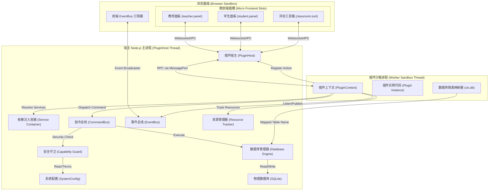
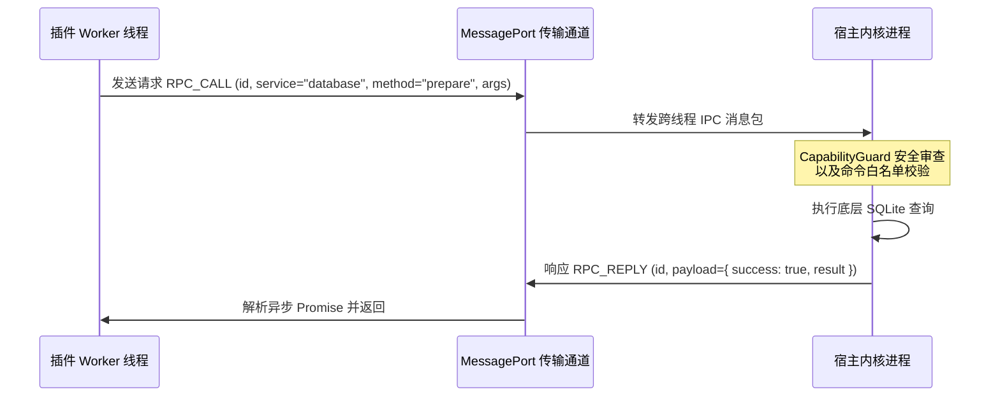
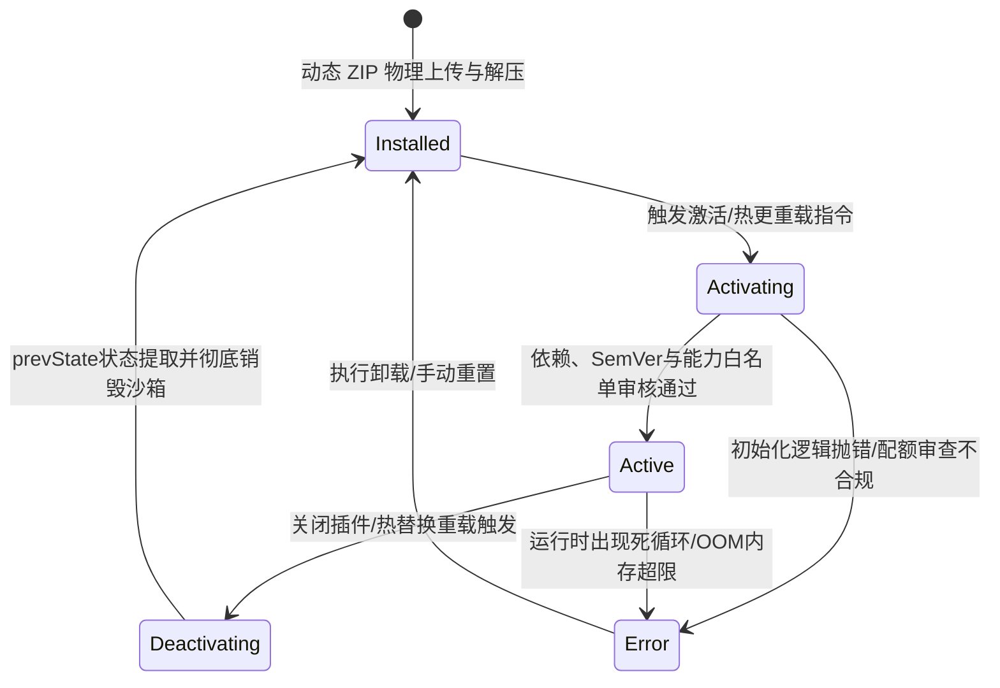

# OpenLearn Next V2 插件系统官方开发与架构设计参考手册 (v2.5)

---

# Part I: Getting Started (快速入门)

## 1.1 OpenLearn 插件开发概述 (Overview)

### 1.1.1 什么是 OpenLearn 插件
OpenLearn 插件是教育系统的热拔插核心组件。它们通过标准的生命周期钩子接入 OpenLearn Next V2 内核，动态扩展系统功能，例如白板组件、作业评分标准、自建测验逻辑等。所有的三方插件在默认情况下都执行在物理隔离的 V8 Worker 沙箱中，以保证主线程的高可用与安全性。

### 1.1.2 适用场景与技术选择
* **适合开发插件的场景 (When to Build a Plugin)**
  * **定制教具开发**：如特定学科的化学方程式输入板、互动物理实验模拟器。
  * **统计与分析小部件**：班级排行榜、点名册磁贴、个性化学习分析面板。
  * **三方平台对接**：对接特定学校的 LMS API 或作业同步系统。
  * **AI 工具扩展**：为 AI 助教/智能体注册特定的动作工具（Action）。
* **不适合开发插件的场景 (When NOT to Build a Plugin)**
  * 高频低延迟音视频数据流的实时转码与传输。
  * 全局网络路由重写、底层多用户安全鉴权框架等基础底座功能。
  * *原因*：这类功能应直接合并到内核中，以避免 Worker 进程间的跨线程 RPC 带来额外延迟。

### 1.1.3 插件与内置模块的区别
| 特征维度 | 插件 (Plugins) | 内置模块 (Core Modules) |
| :--- | :--- | :--- |
| **执行模式** | 沙箱隔离 Worker 线程 (默认) / 内联 | 主线程内联运行 |
| **内存限制** | 独享 V8 堆内存上限 (默认 128 MB，可配置) | 共享宿主进程内存上限 |
| **数据库访问** | 通过 `ctx.db` 进行前缀映射，隔离物理表空间 | 拥有完整数据库句柄，可操作所有表 |
| **系统 API** | 必须声明申请对应 Capability 并经过拦截器校验 | 无限制调用所有内核 API |
| **热更新** | 支持动态上传 ZIP 热插拔，无感热重载 | 需要重启整个主 Node 进程 |

---

## 1.2 五分钟构建 "Hello World" 插件 (Quick Start)

跟随本节指引，你将在五分钟内完成第一个可在沙箱 Worker 中启动的插件。

### 1.2.1 步骤 1：创建工程目录
在工作区创建一个空白文件夹：
```bash
mkdir -p ext-hello-world
cd ext-hello-world
```

### 1.2.2 步骤 2：编写清单文件 manifest.json
创建 `manifest.json`，声明插件的基础元数据与入口文件：
```json
{
  "id": "ext-hello-world",
  "name": "你好世界演示插件",
  "version": "1.0.0",
  "main": "index.js",
  "capabilitiesProposed": []
}
```

### 1.2.3 步骤 3：编写入口源码 index.ts
创建 `index.ts`，导出生命周期方法：
```typescript
import type { PluginContext } from '../../core/plugin-host/types.js';

export default {
  manifest: {
    id: "ext-hello-world",
    name: "你好世界演示插件",
    version: "1.0.0"
  },
  activate: async (ctx: PluginContext) => {
    console.log("[HelloWorld] 插件已成功在沙箱中激活！");
    console.log(`[HelloWorld] 运行时分配的唯一 UUID: ${ctx.pluginId}`);
  },
  deactivate: async () => {
    console.log("[HelloWorld] 插件正在停用并销毁 Worker 线程...");
  }
};
```

### 1.2.4 步骤 4：编译构建
使用 `esbuild` 将代码打包为单个 ESM 规范的 `index.js` 文件：
```bash
npx esbuild index.ts --bundle --format=esm --platform=node --outfile=index.js
```

### 1.2.5 步骤 5：打成 ZIP 包
将 `manifest.json` 与 `index.js` 压缩：
```bash
zip ext-hello-world.zip manifest.json index.js
```

### 1.2.6 步骤 6：上传与加载验证
通过 OpenLearn 的管理后台上传该 ZIP 插件。安装成功后，系统会自动解压并在 Worker 线程内启动此插件。你可以在系统日志中看到如下输出：
```text
[Worker stdout - HelloWorld] 插件已成功在沙箱中激活！
[Worker stdout - HelloWorld] 运行时唯一 UUID: 019f319b-xxxx-xxxx-xxxx-xxxxxxxxx
```

---

## 1.3 规范化工程目录结构 (Directory Anatomy)

标准的 OpenLearn 插件开发目录应符合以下规范，以便打包与集成系统能正常工作：

```text
ext-my-plugin/                 # 插件项目根目录
├── manifest.json              # [必须] 插件清单声明书，用来声明元数据、依赖和权限
├── index.ts                   # [必须] 插件在 TypeScript 环境下的源入口文件
├── package.json               # [动态] 如果有第三方 NPM 依赖，声明于此（宿主会自动隔离安装）
├── README.md                  # [推荐] 描述插件功能与 API 说明的文档
├── assets/                    # [可选] 存放静态资源文件（图标、音效、默认课件）
│   └── logo.png
├── locale/                    # [可选] 国际化本地化翻译文件
│   ├── zh-CN.json
│   └── en-US.json
└── __tests__/                 # [推荐] 自动化单元与集成测试目录
    └── integration.test.ts
```

* **`manifest.json`**: 声明安全边界和运行时依赖的关键文件。
* **`package.json`**: 宿主系统在解析依赖时，会在插件隔离目录中以此 package.json 执行安装，支持重定向与依赖物理隔离。

---

## 1.4 清单配置规范 (manifest.json Spec)

清单文件声明了插件所请求的所有安全能力。详细属性定义请参见 [4.1 清单参考手册 (Manifest Reference)](#41-清单参考手册-manifest-reference)。

---

## 1.5 构建并声明第一个 Action 与 Command

OpenLearn 采用**声明式动作（Action）**与**业务处理器（Command Handler）**的双轨设计。

```typescript
import type { PluginContext } from '../../core/plugin-host/types.js';

export default {
  manifest: { id: "ext-quick-action", name: "动作快速开始", version: "1.0.0" },
  activate: async (ctx: PluginContext) => {
    const actionRegistry = ctx.services.actionRegistry;
    const commandBus = ctx.services.commandBus;

    // 1. 向宿主注册可供 Planner/AI 编排的扩展 Action
    await actionRegistry.register({
      id: 'ext-say-hello',
      commandType: 'custom.say_hello',
      description: '向指定人发出问候，供AI或系统调用',
      capabilityRequired: 'plugin:read',
      inputSchema: {
        type: 'OBJECT',
        properties: {
          name: { type: 'STRING', description: '被问候者的姓名' }
        },
        required: ['name']
      }
    });

    // 2. 绑定对应的 Command Handler 处理运行逻辑
    await commandBus.registerHandler('custom.say_hello', {
      execute: async (command) => {
        const { name } = command.payload;
        return { message: `你好 ${name}，这是来自插件沙箱的问候！` };
      }
    });
  }
};
```

---

## 1.6 设计第一个插件隔离数据库表 (Database Setup)

插件在 `activate` 内声明并创建属于自己的隔离数据库空间。

```typescript
import type { PluginContext } from '../../core/plugin-host/types.js';
import { IDatabaseToken } from '../../core/di/interfaces.js';

export default {
  manifest: { id: "ext-quick-db", name: "隔离数据库演示", version: "1.0.0" },
  activate: async (ctx: PluginContext) => {
    // 1. 声明并建立 records 表结构
    await ctx.db.ensureTable('records', 'id TEXT PRIMARY KEY, title TEXT, num INTEGER');

    const db = await ctx.resolve<any>(IDatabaseToken);
    const tblName = ctx.db.table('records'); // 解析为包含 UUID 前缀的真实物理表名

    // 2. 写入数据
    await db.prepare(`INSERT INTO ${tblName} (id, title, num) VALUES (?, ?, ?)`).run('r1', '演示数据', 100);
  }
};
```

---

## 1.7 在白板中动态绘制和操作图形 (Whiteboard Integration)

利用指令总线向白板发送绘制命令。需要声明 `whiteboard:write` 权限。

```typescript
import type { PluginContext } from '../../core/plugin-host/types.js';

export default {
  manifest: { id: "ext-whiteboard-quick", name: "绘制演示", version: "1.0.0" },
  activate: async (ctx: PluginContext) => {
    const commandBus = ctx.services.commandBus;

    // 绘制一个红色圆形
    const result = await commandBus.execute({
      id: 'draw_' + Date.now(),
      type: 'whiteboard.draw',
      payload: {
        lessonId: 'current-lesson-id',
        type: 'circle',
        data: JSON.stringify({ x: 150, y: 150, radius: 50, fill: '#ef4444' })
      }
    } as any);
    console.log(`圆形绘制完毕。`);
  }
};
```

---

## 1.8 插件打包、安装与加载流测试 (Pack & Install Pipeline)

集成测试是验证插件完整激活与交互逻辑的最快方式。

```typescript
import { describe, it, expect } from 'vitest';
import { Kernel } from '../../core/kernel/index.js';

describe('HelloWorld Plugin E2E Test', () => {
  it('应当能够完成安装和激活', async () => {
    const kernel = new Kernel();
    await kernel.ready;

    const sourceCode = `
      export default {
        manifest: { id: "ext-test-plugin", name: "测试插件", version: "1.0.0", main: "index.js" },
        activate: async (ctx) => { console.log("Inline Activated"); }
      }
    `;

    const manifest = await kernel.pluginHost.installPlugin(sourceCode);
    expect(manifest.id).toBe('ext-test-plugin');

    await kernel.pluginHost.activatePlugin(manifest.pluginId);
    expect(kernel.pluginHost.getPluginState(manifest.pluginId)).toBe('active');
  });
});
```

---

# Part II: Developer Guide (开发指南)

## 2.1 进程隔离与沙箱执行模型 (Worker Sandbox Model)

### 2.1.1 设计思想与安全目标
为保证宿主进程不受不受信任或恶意第三方代码的侵害，宿主插件系统采用**物理沙箱与运行资源配额（Quotas & Limits）**双重防护机制。插件代码在独立的 Node.js Worker Threads 中运行，屏蔽了敏感系统模块（如 `child_process`、`fs` 直连等）。

### 2.1.2 全局系统架构图


---

## 2.2 宿主与 Worker RPC 通信协议 (IPC & RPC Protocol)

在沙箱环境（Worker 模式）下，插件代码不能直接操作宿主的共享服务。所有的 API 调用在 `PluginContext` 底层会被打包为结构化的异步 IPC 消息发送给主线程。



---

## 2.3 插件运行生命周期管理 (Plugin Lifecycle Management)

宿主内核对插件的整个生命周期进行极其严格的状态流转控制：



---

## 2.4 PluginContext 上下文结构 (PluginContext Design)

`PluginContext` 在沙箱激活时被实例化。它包含了当前插件隔离空间的安全签名。详细方法及属性请参阅 [4.2 插件上下文参考手册 (PluginContext Reference)](#42-插件上下文参考手册-plugincontext-reference)。

---

## 2.5 依赖注入机制与核心服务寻路 (Dependency Injection)

系统底层依托轻量级依赖注入容器管理核心组件之间的耦合。
* **按需解析**：插件需要消费特定服务（如 `IEventBus` 等）时，应调用 `await ctx.resolve(Token)`。
* **访问控制**：注入容器在被 resolve 时，会检查调用方插件的 Capability。例如未声明 `whiteboard:write` 的插件去 resolve 白板接口，将被容器抛出 `DependencyResolutionError` 阻断。详细 Token 定义请参阅 [4.11 依赖注入 Token 参考手册 (DI Tokens Reference)](#411-依赖注入-token-参考手册-di-tokens-reference)。

---

## 2.6 指令总线与动作定义注册 (CommandBus & ActionRegistry)

### 2.6.1 动作描述注册 (ActionRegistry)
动作注册向系统提供插件提供的接口“规格书”（Schema）。AI 智能体在需要做动作规划（Plan）时，会在系统动作库里全文匹配 Action 的 description 及 inputSchema 以决定是否调用。

### 2.6.2 指令总线发送 (CommandBus)
所有的具体业务逻辑应该封装成特定的 Command 派发。宿主主线程通过统一的拦截器对 Command 执行人进行身份审计，并实现操作流的撤销/恢复以及教师端的审批同步拦截。

---

## 2.7 事件发布与订阅流设计 (EventBus Architecture)

事件总线用于双端（主进程与各沙箱 Worker）异步事件的非阻塞广播。
* **防止内存泄露**：系统会在卸载或热更新插件时，调用 `ResourceTracker` 强制卸载该插件名下注册的所有监听器，避免未解除闭包引用导致的宿主内存泄漏（Leak）。

---

## 2.8 能力授权与安全策略控制 (Capabilities & Security Guards)

`CapabilityGuard` 是核心安全大闸：
* **审批放行网关**：对于高风险的敏感操作（如登记分数），非管理员角色的请求会被挂起，等待教师或系统管理员手动审批。
* **管理员免审机制**：如果触发指令的 `actorId` 被判定为管理员（`isAdmin`），指令将直接跳过人工审批流自动放行。

---

## 2.9 隔离物理数据库与迁移接口 (Isolated DB Engine)

插件在沙箱中无法直连 SQLite。所有的数据库读写必须通过由系统重映射物理名称的表来进行。
* **隔离映射**：例如插件声明操作表 `scores`，底层物理表名会重构为 `plugin_<uuid_with_underscores>_scores`。
* **结构演进**：使用 `ctx.db.migrate` 在激活周期声明 DDL 的演进。这比在激活钩子中手写 `PRAGMA table_info` 具有极佳的健壮性与幂等执行保障。

---

## 2.10 前端 UI 扩展与微前端插槽 (Micro-frontend Slots)

微前端（MFE）框架提供给插件在浏览器端注入自定义交互面板的能力。
* **布局插槽**：`teacher.panel`（教师侧操作卡）、`classroom.tool`（浮动快捷工具箱）、`student.panel`（学生侧展示卡）。
* **跨端交互**：前端页面通过微前端上下文发布事件通知，后端沙箱通过监听 EventBus 来执行相应计算，并在计算完成后向前端派发状态。

---

## 2.11 宿主共享模块与 NPM 依赖重定向 (Shared NPM Modules)

为了避免每个 ZIP 插件都重复打包体积庞大的第三方包，系统支持依赖隔离动态寻路。
* **重定向解析**：沙箱底层拦截 require 命令，通过 Node 的 `module.createRequire` 重定向到当前插件本级 node_modules 目录寻址，确保三方库版本互不干扰且保证沙箱隔离纯净。详细可引用的共享模块请参阅 [4.12 共享模块参考手册 (Shared Modules Reference)](#412-共享模块参考手册-shared-modules-reference)。

---

## 2.12 资源管理器与垃圾回收控制 (Resource Tracking & GC)

为了维护长周期课堂的系统稳定性，宿主启动了 `ResourceTracker`。
* 当插件发生停用、热更新替换时，`ResourceTracker` 会自动接管销毁流，顺次执行清理以彻底注销沙箱 Worker 进程，保证无多余的宿主句柄挂起。

---

# Part III: Cookbook (教案与实战)

## 3.1 经典 "Hello World" (基础入门)
* **场景说明**：快速配置插件，展示基础的 `activate` 和 `deactivate` 生命周期，以及基础日志输出。
* **目录结构**：
  ```text
  ext-hello-world/
  ├── manifest.json
  └── index.ts
  ```
* **清单声明 manifest.json**：
  ```json
  {
    "id": "ext-hello-world",
    "name": "Hello World 示例",
    "version": "1.0.0",
    "main": "index.js",
    "capabilitiesProposed": []
  }
  ```
* **主程序 index.ts**：
  ```typescript
  import type { PluginContext } from '../../core/plugin-host/types.js';

  export default {
    manifest: { id: "ext-hello-world", name: "Hello World 示例", version: "1.0.0" },
    activate: async (ctx: PluginContext) => {
      console.log(`[HelloWorld] 插件成功装载。分配的唯一运行ID是: ${ctx.pluginId}`);
    },
    deactivate: async () => {
      console.log("[HelloWorld] 插件正在安全关闭，Worker沙箱即将销毁。");
    }
  };
  ```

---

## 3.2 注入自定义导航菜单 (Menu Extension)
* **场景说明**：在系统的侧边栏或主导航中，为教师或学生动态注入一个自定义菜单项，点击时跳转到插件专属页面。
* **目录结构**：
  ```text
  ext-menu-extension/
  ├── manifest.json
  ├── index.ts
  └── frontend.js
  ```
* **清单声明 manifest.json**：
  ```json
  {
    "id": "ext-menu-extension",
    "name": "导航菜单注入插件",
    "version": "1.0.0",
    "main": "index.js",
    "capabilitiesProposed": ["ui:menu"]
  }
  ```
* **主程序 index.ts**：
  ```typescript
  import type { PluginContext } from '../../core/plugin-host/types.js';

  export default {
    manifest: { id: "ext-menu-extension", name: "导航菜单注入插件", version: "1.0.0" },
    activate: async (ctx: PluginContext) => {
      // 注册用于触发菜单点击后调用的命令
      await ctx.services.commandBus.registerHandler('menu.custom_click', {
        execute: async (command) => {
          return { success: true, message: "已处理菜单点击事件" };
        }
      });
    }
  };
  ```
* **前端脚本 frontend.js (微前端环境运行)**：
  ```javascript
  export default {
    activate: async (frontendCtx) => {
      frontendCtx.registerMenu({
        id: 'ext-custom-menu-item',
        label: '互动大盘',
        icon: 'lucide-react:PieChart',
        roles: ['teacher'],
        onClick: () => {
          frontendCtx.dispatchEvent('menu.custom_click', { time: Date.now() });
          alert('正在载入插件互动大盘面板...');
        }
      });
    }
  };
  ```

---

## 3.3 扩展白板浮动工具栏 (Toolbar Extension)
* **场景说明**：在课堂互动白板的浮动工具栏中注入一个名为“骰子”的互动按钮，点击后触发全局广播事件。
* **目录结构**：
  ```text
  ext-toolbar-dice/
  ├── manifest.json
  ├── index.ts
  └── frontend.js
  ```
* **清单声明 manifest.json**：
  ```json
  {
    "id": "ext-toolbar-dice",
    "name": "白板骰子工具",
    "version": "1.0.0",
    "main": "index.js",
    "capabilitiesProposed": ["whiteboard:write"]
  }
  ```
* **主程序 index.ts**：
  ```typescript
  import type { PluginContext } from '../../core/plugin-host/types.js';

  export default {
    manifest: { id: "ext-toolbar-dice", name: "白板骰子工具", version: "1.0.0" },
    activate: async (ctx: PluginContext) => {
      await ctx.services.commandBus.registerHandler('dice.roll', {
        execute: async (command) => {
          const points = Math.floor(Math.random() * 6) + 1;
          // 全局广播摇骰子结果
          await ctx.services.eventBus.publish({
            type: 'dice:rolled',
            payload: { points, roller: command.actorId }
          });
          return { points };
        }
      });
    }
  };
  ```
* **前端脚本 frontend.js**：
  ```javascript
  export default {
    activate: async (frontendCtx) => {
      frontendCtx.registerToolbarButton({
        slot: 'classroom.tool',
        id: 'ext-dice-btn',
        title: '摇骰子',
        icon: 'dice-five',
        onClick: async () => {
          const res = await frontendCtx.invokeCommand('dice.roll');
          alert(`你摇到了: ${res.points} 点！`);
        }
      });
    }
  };
  ```

---

## 3.4 为 AI 助教扩展业务能力 (AI Tool / Action)
* **场景说明**：注册一个 `Action`，允许 AI 助教在大纲生成或互动答疑中，直接调用插件的“查询历史得分”能力。
* **目录结构**：
  ```text
  ext-ai-grader/
  ├── manifest.json
  └── index.ts
  ```
* **清单声明 manifest.json**：
  ```json
  {
    "id": "ext-ai-grader",
    "name": "AI 助教提分插件",
    "version": "1.0.0",
    "main": "index.js",
    "capabilitiesProposed": ["plugin:read"]
  }
  ```
* **主程序 index.ts**：
  ```typescript
  import type { PluginContext } from '../../core/plugin-host/types.js';

  export default {
    manifest: { id: "ext-ai-grader", name: "AI 助教提分插件", version: "1.0.0" },
    activate: async (ctx: PluginContext) => {
      // 注册 Action
      await ctx.services.actionRegistry.register({
        id: 'ext-get-student-rank',
        commandType: 'grades.query_rank',
        description: '用于查询某个学生在班级里的期末平时分排名和平均得分',
        capabilityRequired: 'plugin:read',
        inputSchema: {
          type: 'OBJECT',
          properties: {
            studentId: { type: 'STRING', description: '学生的学号 UUID' },
            classId: { type: 'STRING', description: '班级唯一标识 ID' }
          },
          required: ['studentId', 'classId']
        }
      });

      // 绑定 Command 处理器
      await ctx.services.commandBus.registerHandler('grades.query_rank', {
        execute: async (command) => {
          const { studentId, classId } = command.payload;
          return {
            studentId,
            classId,
            rank: 3,
            averageScore: 92.5
          };
        }
      });
    }
  };
  ```

---

## 3.5 复杂 Excel 数据导出 (Excel Export)
* **场景说明**：读取插件内表的分数数据，转换为标准的 Excel 二进制流，并写入到 VFS 可下载路径，生成最终下载地址。
* **目录结构**：
  ```text
  ext-excel-exporter/
  ├── manifest.json
  ├── package.json
  └── index.ts
  ```
* **清单声明 manifest.json**：
  ```json
  {
    "id": "ext-excel-exporter",
    "name": "平时分 Excel 导出工具",
    "version": "1.0.0",
    "main": "index.js",
    "capabilitiesProposed": ["vfs:write"]
  }
  ```
* **依赖声明 package.json**：
  ```json
  {
    "dependencies": {
      "xlsx": "^0.18.5"
    }
  }
  ```
* **主程序 index.ts**：
  ```typescript
  import type { PluginContext } from '../../core/plugin-host/types.js';
  import { IDatabaseToken } from '../../core/di/interfaces.js';

  export default {
    manifest: { id: "ext-excel-exporter", name: "平时分 Excel 导出工具", version: "1.0.0" },
    activate: async (ctx: PluginContext) => {
      await ctx.db.ensureTable('scores', 'student_id TEXT, score REAL');

      await ctx.services.commandBus.registerHandler('excel.export_scores', {
        execute: async (command) => {
          const xlsx = ctx.require('xlsx');
          const db = await ctx.resolve<any>(IDatabaseToken);
          const tbl = ctx.db.table('scores');

          const rows = db.prepare(`SELECT student_id, score FROM ${tbl}`).all();

          // 制作 Excel
          const worksheet = xlsx.utils.json_to_sheet(rows);
          const workbook = xlsx.utils.book_new();
          xlsx.utils.book_append_sheet(workbook, worksheet, "Scores");

          // 输出 Buffer
          const buf = xlsx.write(workbook, { type: 'buffer', bookType: 'xlsx' });

          // 写入共享 VFS 存储
          const downloadFileName = `scores_${Date.now()}.xlsx`;
          await ctx.services.commandBus.execute({
            type: 'vfs.write_file',
            payload: {
              path: `/downloads/${downloadFileName}`,
              content: buf
            }
          } as any);

          return { downloadUrl: `/files/downloads/${downloadFileName}` };
        }
      });
    }
  };
  ```

---

## 3.6 班级作业文件上传与隔离转存 (File Upload)
* **场景说明**：接收前端上传的 Multipart 文件块，通过 VFS 命令物理转存到宿主的隔离存储中。
* **目录结构**：
  ```text
  ext-file-uploader/
  ├── manifest.json
  └── index.ts
  ```
* **清单声明 manifest.json**：
  ```json
  {
    "id": "ext-file-uploader",
    "name": "随堂作业上传适配器",
    "version": "1.0.0",
    "main": "index.js",
    "capabilitiesProposed": ["vfs:write"]
  }
  ```
* **主程序 index.ts**：
  ```typescript
  import type { PluginContext } from '../../core/plugin-host/types.js';

  export default {
    manifest: { id: "ext-file-uploader", name: "随堂作业上传适配器", version: "1.0.0" },
    activate: async (ctx: PluginContext) => {
      await ctx.services.commandBus.registerHandler('file.upload_assignment', {
        execute: async (command) => {
          const { filename, fileContentBase64, studentId } = command.payload;
          const buffer = Buffer.from(fileContentBase64, 'base64');

          // 保存至专属隔离的虚拟路径
          const destPath = `/assignments/${studentId}/${filename}`;
          await ctx.services.commandBus.execute({
            type: 'vfs.write_file',
            payload: {
              path: destPath,
              content: buffer
            }
          } as any);

          return { success: true, savedPath: destPath };
        }
      });
    }
  };
  ```

---

## 3.7 插件自建物理数据库的多版本演进 (Database Migration)
* **场景说明**：多版本升级时，在 `activate` 钩子中幂等升级数据结构，在 `v2` 增加 `remark` 字段。
* **目录结构**：
  ```text
  ext-db-migration/
  ├── manifest.json
  └── index.ts
  ```
* **清单声明 manifest.json**：
  ```json
  {
    "id": "ext-db-migration",
    "name": "数据库热迁移演练",
    "version": "2.0.0",
    "main": "index.js",
    "capabilitiesProposed": ["db:schema"]
  }
  ```
* **主程序 index.ts**：
  ```typescript
  import type { PluginContext } from '../../core/plugin-host/types.js';

  export default {
    manifest: { id: "ext-db-migration", name: "数据库热迁移演练", version: "2.0.0" },
    activate: async (ctx: PluginContext) => {
      // 1. 先确保 v1 基础表结构存在
      await ctx.db.ensureTable('configs', 'id TEXT PRIMARY KEY, value TEXT');

      // 2. 执行 v2 迁移逻辑 (仅运行一次，由底层状态表 plugin_migrations 追踪)
      await ctx.db.migrate(2, async (db) => {
        const tbl = ctx.db.table('configs');
        await db.prepare(`ALTER TABLE ${tbl} ADD COLUMN remark TEXT DEFAULT NULL`).run();
      });
    }
  };
  ```

---

## 3.8 高性能沙箱本地缓存与过期失效 (Caching)
* **场景说明**：在插件沙箱 Worker 中，利用 Key-Value `IStorageService` 建立带有时间戳的临时查询缓存。
* **目录结构**：
  ```text
  ext-cache-service/
  ├── manifest.json
  └── index.ts
  ```
* **清单声明 manifest.json**：
  ```json
  {
    "id": "ext-cache-service",
    "name": "智能本地查询缓存",
    "version": "1.0.0",
    "main": "index.js",
    "capabilitiesProposed": ["plugin:read"]
  }
  ```
* **主程序 index.ts**：
  ```typescript
  import type { PluginContext } from '../../core/plugin-host/types.js';

  export default {
    manifest: { id: "ext-cache-service", name: "智能本地查询缓存", version: "1.0.0" },
    activate: async (ctx: PluginContext) => {
      const storage = ctx.services.storage;

      await ctx.services.commandBus.registerHandler('cache.get_or_fetch', {
        execute: async (command) => {
          const { key, ttlMs } = command.payload;
          const cached = await storage.get(key) as { data: any, expiresAt: number } | null;

          if (cached && cached.expiresAt > Date.now()) {
            return { data: cached.data, fromCache: true };
          }

          // 模拟从外部或重度计算获取
          const data = { time: new Date().toISOString(), val: Math.random() };
          await storage.set(key, {
            data,
            expiresAt: Date.now() + ttlMs
          });

          return { data, fromCache: false };
        }
      });
    }
  };
  ```

---

## 3.9 安全审计下的沙箱外部 HTTP 网络访问 (HTTP Request)
* **场景说明**：利用主应用的 HTTP 能力查询外部天气 API，必须在 manifest 中申报 `http:outbound` 权限。
* **目录结构**：
  ```text
  ext-weather-reporter/
  ├── manifest.json
  └── index.ts
  ```
* **清单声明 manifest.json**：
  ```json
  {
    "id": "ext-weather-reporter",
    "name": "随堂天气助手",
    "version": "1.0.0",
    "main": "index.js",
    "capabilitiesProposed": ["http:outbound"]
  }
  ```
* **主程序 index.ts**：
  ```typescript
  import type { PluginContext } from '../../core/plugin-host/types.js';

  export default {
    manifest: { id: "ext-weather-reporter", name: "随堂天气助手", version: "1.0.0" },
    activate: async (ctx: PluginContext) => {
      await ctx.services.commandBus.registerHandler('weather.query', {
        execute: async (command) => {
          const { city } = command.payload;

          // 调用系统受控的 http 发送指令，避免在沙箱直接拉取原生 socket 库而绕过安全审计
          const response = await ctx.services.commandBus.execute({
            type: 'http.fetch',
            payload: {
              url: `https://api.weatherapi.com/v1/current.json?key=mockkey&q=${encodeURIComponent(city)}`,
              method: 'GET'
            }
          } as any) as { body: string; status: number };

          if (response.status !== 200) {
            throw new Error(`HTTP 请求失败。状态码: ${response.status}`);
          }

          const rawData = JSON.parse(response.body);
          return { temperature: rawData.current?.temp_c || 25, condition: rawData.current?.condition?.text || "Clear" };
        }
      });
    }
  };
  ```

---

## 3.10 插件与插件之间的横向调用 (Plugin Communication)
* **场景说明**：插件 A 通过依赖注入解析拿到服务，也可以调用由插件 B 导出的 API 逻辑。
* **目录结构**：
  ```text
  ext-plugin-consumer/
  ├── manifest.json
  └── index.ts
  ```
* **清单声明 manifest.json**：
  ```json
  {
    "id": "ext-plugin-consumer",
    "name": "消费外部插件服务的插件",
    "version": "1.0.0",
    "main": "index.js",
    "requires": [
      "@openlearn/core:ISemesterGradeService"
    ],
    "capabilitiesProposed": ["plugin:read"]
  }
  ```
* **主程序 index.ts**：
  ```typescript
  import type { PluginContext } from '../../core/plugin-host/types.js';
  import { ISemesterGradeServiceToken } from '../../core/di/interfaces.js';

  export default {
    manifest: { id: "ext-plugin-consumer", name: "消费外部插件服务的插件", version: "1.0.0" },
    activate: async (ctx: PluginContext) => {
      await ctx.services.commandBus.registerHandler('consumer.sync_grade', {
        execute: async (command) => {
          const { lessonId, studentId, grade } = command.payload;
          
          // 动态从容器解析第三方插件提供的服务
          const gradeService = await ctx.resolve(ISemesterGradeServiceToken);
          await gradeService.saveSemesterGrade(lessonId, studentId, grade);

          return { success: true };
        }
      });
    }
  };
  ```

---

## 3.11 跨沙箱事件分发与广播通信 (Event Broadcast)
* **场景说明**：在教师端触发评分变更后，使用 EventBus 跨 Worker 线程广播事件，以便通知其他运行中的计算插件。
* **目录结构**：
  ```text
  ext-event-broadcaster/
  ├── manifest.json
  └── index.ts
  ```
* **清单声明 manifest.json**：
  ```json
  {
    "id": "ext-event-broadcaster",
    "name": "分数变更事件广播源",
    "version": "1.0.0",
    "main": "index.js",
    "capabilitiesProposed": ["event:publish", "event:subscribe"]
  }
  ```
* **主程序 index.ts**：
  ```typescript
  import type { PluginContext } from '../../core/plugin-host/types.js';

  export default {
    manifest: { id: "ext-event-broadcaster", name: "分数变更事件广播源", version: "1.0.0" },
    activate: async (ctx: PluginContext) => {
      const eventBus = ctx.services.eventBus;

      // 订阅特定的系统事件
      await eventBus.subscribe('scores:updated', async (event) => {
        console.log(`[EventCollector] 接收到跨沙箱分数更新事件: ${JSON.stringify(event.payload)}`);
      });

      // 提供指令触发事件广播
      await ctx.services.commandBus.registerHandler('scores.modify', {
        execute: async (command) => {
          const { studentId, newScore } = command.payload;

          // 物理发布事件至宿主总线
          await eventBus.publish({
            type: 'scores:updated',
            payload: { studentId, newScore, timestamp: Date.now() }
          });

          return { success: true };
        }
      });
    }
  };
  ```

---

## 3.12 结构化日志收集与过滤 (Logging)
* **场景说明**：将带有关联 Trace ID 的日志上传至宿主的专用日志记录库中。
* **目录结构**：
  ```text
  ext-structured-logger/
  ├── manifest.json
  └── index.ts
  ```
* **清单声明 manifest.json**：
  ```json
  {
    "id": "ext-structured-logger",
    "name": "结构化日志演示",
    "version": "1.0.0",
    "main": "index.js",
    "capabilitiesProposed": ["log:write"]
  }
  ```
* **主程序 index.ts**：
  ```typescript
  import type { PluginContext } from '../../core/plugin-host/types.js';

  export default {
    manifest: { id: "ext-structured-logger", name: "结构化日志演示", version: "1.0.0" },
    activate: async (ctx: PluginContext) => {
      await ctx.services.commandBus.registerHandler('logger.log_biz', {
        execute: async (command) => {
          const { actionName, operatorId, traceId } = command.payload;

          // 使用系统集成的日志库记录标准结构化内容
          await ctx.services.commandBus.execute({
            type: 'system.log',
            payload: {
              level: 'INFO',
              pluginId: ctx.pluginId,
              traceId,
              message: `Operator ${operatorId} triggered ${actionName}`,
              meta: JSON.stringify({ timestamp: Date.now() })
            }
          } as any);

          return { success: true };
        }
      });
    }
  };
  ```

---

## 3.13 长周期非阻塞后台守护进程 (Background Task)
* **场景说明**：注册一个定时后台心跳进程，每 30 秒执行一次数据库垃圾清理，不阻塞沙箱主业务响应。
* **目录结构**：
  ```text
  ext-bg-daemon/
  ├── manifest.json
  └── index.ts
  ```
* **清单声明 manifest.json**：
  ```json
  {
    "id": "ext-bg-daemon",
    "name": "数据库定时整理器",
    "version": "1.0.0",
    "main": "index.js",
    "capabilitiesProposed": ["process:interval"]
  }
  ```
* **主程序 index.ts**：
  ```typescript
  import type { PluginContext } from '../../core/plugin-host/types.js';
  import { IDatabaseToken } from '../../core/di/interfaces.js';

  export default {
    manifest: { id: "ext-bg-daemon", name: "数据库定时整理器", version: "1.0.0" },
    activate: async (ctx: PluginContext) => {
      const pm = ctx.services.processManager;

      // 注册长周期后台 Interval 任务 (以防阻塞 V8 主调用流)
      const processId = await pm.registerInterval(
        'db_vacuum_daemon',
        30000, // 30s 周期
        async (log) => {
          log("启动定期物理表空间清理...");
          try {
            const db = await ctx.resolve<any>(IDatabaseToken);
            const tbl = ctx.db.table('configs');
            // 清理过期心跳
            const result = db.prepare(`DELETE FROM ${tbl} WHERE id = 'heartbeat'`).run();
            log(`清理完成。已移除条数: ${result.changes}`);
          } catch (err: any) {
            log(`任务异常终止: ${err.message}`);
          }
        }
      );

      console.log(`[Daemon] 成功注册 Interval 进程，ID: ${processId}`);
    }
  };
  ```

---

## 3.14 微前端架构下的教师专属控制面板 (Teacher Panel)
* **场景说明**：向教师主控制台渲染一个“测验实况仪表盘”，实时收集当前答题进度。
* **目录结构**：
  ```text
  ext-teacher-panel/
  ├── manifest.json
  ├── index.ts
  └── frontend.js
  ```
* **清单声明 manifest.json**：
  ```json
  {
    "id": "ext-teacher-panel",
    "name": "测验大盘教师端",
    "version": "1.0.0",
    "main": "index.js",
    "capabilitiesProposed": ["ui:panel"]
  }
  ```
* **主程序 index.ts**：
  ```typescript
  import type { PluginContext } from '../../core/plugin-host/types.js';

  export default {
    manifest: { id: "ext-teacher-panel", name: "测验大盘教师端", version: "1.0.0" },
    activate: async (ctx: PluginContext) => {
      await ctx.services.commandBus.registerHandler('panel.get_grades_stats', {
        execute: async (command) => {
          return {
            totalSubmitted: 32,
            averageScore: 84.5,
            passRate: 0.96
          };
        }
      });
    }
  };
  ```
* **前端脚本 frontend.js**：
  ```javascript
  export default {
    activate: async (frontendCtx) => {
      frontendCtx.registerPanel({
        slot: 'teacher.panel',
        id: 'ext-teacher-grades-dashboard',
        title: '测验平时分统计',
        render: async (domNode) => {
          const stats = await frontendCtx.invokeCommand('panel.get_grades_stats');
          domNode.innerHTML = `
            <div style="padding: 16px; background: #fafafa; border-radius: 8px;">
              <h4>提交人数: ${stats.totalSubmitted} / 班级总数</h4>
              <p>班级平均分: <strong style="color:#2563eb">${stats.averageScore}</strong></p>
              <p>及格率: ${(stats.passRate * 100).toFixed(0)}%</p>
            </div>
          `;
        }
      });
    }
  };
  ```

---

## 3.15 学生互动端答题小部件 (Student Panel)
* **场景说明**：在学生端主工作区展示一个“快速选择题”卡片，提交答案后写入后端隔离库。
* **目录结构**：
  ```text
  ext-student-quiz/
  ├── manifest.json
  ├── index.ts
  └── frontend.js
  ```
* **清单声明 manifest.json**：
  ```json
  {
    "id": "ext-student-quiz",
    "name": "学生快速选择题小部件",
    "version": "1.0.0",
    "main": "index.js",
    "capabilitiesProposed": ["ui:panel"]
  }
  ```
* **主程序 index.ts**：
  ```typescript
  import type { PluginContext } from '../../core/plugin-host/types.js';
  import { IDatabaseToken } from '../../core/di/interfaces.js';

  export default {
    manifest: { id: "ext-student-quiz", name: "学生快速选择题小部件", version: "1.0.0" },
    activate: async (ctx: PluginContext) => {
      await ctx.db.ensureTable('answers', 'student_id TEXT PRIMARY KEY, option_selected TEXT');

      await ctx.services.commandBus.registerHandler('quiz.submit_answer', {
        execute: async (command) => {
          const { option } = command.payload;
          const studentId = command.actorId;
          const db = await ctx.resolve<any>(IDatabaseToken);
          const tbl = ctx.db.table('answers');

          db.prepare(`INSERT OR REPLACE INTO ${tbl} (student_id, option_selected) VALUES (?, ?)`).run(studentId, option);
          return { success: true };
        }
      });
    }
  };
  ```
* **前端脚本 frontend.js**：
  ```javascript
  export default {
    activate: async (frontendCtx) => {
      frontendCtx.registerPanel({
        slot: 'student.panel',
        id: 'ext-student-choice-card',
        title: '随堂互动选择题',
        render: async (domNode) => {
          domNode.innerHTML = `
            <div style="padding: 12px; border: 1px solid #e5e7eb; border-radius: 6px;">
              <p>问题：Node.js 沙箱中以下哪项操作是被禁止的？</p>
              <button id="optA" style="margin-right:8px; padding:4px 8px;">A. 引用 fs 模块</button>
              <button id="optB" style="padding:4px 8px;">B. 解析 Token</button>
            </div>
          `;
          domNode.querySelector('#optA').addEventListener('click', async () => {
            await frontendCtx.invokeCommand('quiz.submit_answer', { option: 'A' });
            alert('回答提交成功！');
          });
          domNode.querySelector('#optB').addEventListener('click', async () => {
            await frontendCtx.invokeCommand('quiz.submit_answer', { option: 'B' });
            alert('回答提交成功！');
          });
        }
      });
    }
  };
  ```

---

## 3.16 清单配置下插件的动态参数获取 (Plugin Settings)
* **场景说明**：在管理后台输入特定配额参数，插件在运行时按需读取当前插件实体的 SystemConfig 级配置。
* **目录结构**：
  ```text
  ext-dynamic-settings/
  ├── manifest.json
  └── index.ts
  ```
* **清单声明 manifest.json**：
  ```json
  {
    "id": "ext-dynamic-settings",
    "name": "动态设置获取示例",
    "version": "1.0.0",
    "main": "index.js",
    "capabilitiesProposed": ["config:read"]
  }
  ```
* **主程序 index.ts**：
  ```typescript
  import type { PluginContext } from '../../core/plugin-host/types.js';

  export default {
    manifest: { id: "ext-dynamic-settings", name: "动态设置获取示例", version: "1.0.0" },
    activate: async (ctx: PluginContext) => {
      await ctx.services.commandBus.registerHandler('settings.get_threshold', {
        execute: async (command) => {
          // 通过配置总线读取当前插件的后台全局设置
          const settings = await ctx.services.commandBus.execute({
            type: 'system.get_plugin_settings',
            payload: { pluginId: ctx.pluginId }
          } as any) as { defaultLimit: number };

          return {
            maxLimit: settings?.defaultLimit || 100
          };
        }
      });
    }
  };
  ```

---

# Part IV: Reference (API 参考手册)

## 4.1 清单参考手册 (Manifest Reference)

所有的 OpenLearn 插件包必须在其根目录内声明 `manifest.json` 文件。清单文件遵循严格的 Zod Schema 规则进行校验（可参见 [manifest-schema.ts](file:///home/wuxf/Develop/openlearnv2/packages/core/esm-loader/manifest-schema.ts)）。

### 字段规格表 (Manifest Fields Spec)
| 键名 | 规范类型 | 必填 | 默认值 | 说明与约束规则 |
| :--- | :--- | :--- | :--- | :--- |
| **`id`** | String | 是 | - | 插件的全局唯一命名空间。第三方插件必须以 `ext-` 开头（如 `"ext-classroom-timer"`）。 |
| **`name`** | String | 是 | - | 用户界面上展示的插件易读名称。长度不能少于 1 个字符。 |
| **`version`** | String | 是 | - | 严格符合 SemVer 2.0.0 规范的版本号（如 `"1.0.2"`）。 |
| **`main`** | String | 是 | - | 插件运行的主入口源文件相对路径（如 `"dist/bundle.js"`）。旧版本曾使用 `entry`，在 v2.4 强制规范为 `main`。 |
| **`requires`** | String[] | 否 | `[]` | 插件激活前强依赖的内核服务 Token 列表。条目支持 `@scope:IServiceName@^version` 的格式（如 `"@openlearn/core:ICommandBusService@^1.0.0"`）。 |
| **`optional`** | String[] | 否 | `[]` | 插件运行时可选注入的内核服务。格式与 `requires` 完全一致。 |
| **`capabilitiesProposed`** | String[] | 否 | `[]` | 插件拟向宿主系统申请授权的特权能力（如 `["whiteboard:write"]`）。 |
| **`engines`** | Object | 否 | - | 平台版本约束。包含 `openlearn` 字段（如 `">=2.5.0"`），在安装时校验。若当前宿主版本低于要求，插件将拒绝激活并抛出 `SemverMismatchError`。*(v2.5 新增)* |
| **`pluginDependencies`** | String[] | 否 | - | 本插件依赖的其他插件 ID 列表。在激活时校验依赖是否已安装。宿主会按拓扑排序顺序依次激活插件。*(v2.5 新增)* |
| **`provides`** | String[] | 否 | - | 本插件拟通过 `ctx.provide()` 注册到 DI 容器的 Token 名称列表。未在此声明的 Token 不允许注册。*(v2.5 新增)* |
| **`configuration`** | Object | 否 | - | 插件可配置项的 JSON Schema 声明。包含 `properties` 字典，每项支持 `type`（`string`/`number`/`boolean`/`integer`）、`default`、`description`、`enum` , `minimum`/`maximum` 约束。*(v2.5 新增)* |
| **`contributes`** | Object | 否 | - | 声明式 UI 贡献点注册表。支持 5 种插槽类型：`classroom.tool`、`teacher.tab`、`teacher.dashboard.widget`、`student.view`、`student.lesson.tool`。详见 [4.16 贡献点访问器参考手册](#416-贡献点访问器参考手册-contributionaccessor-reference)。*(v2.5 新增)* |

---

## 4.2 插件上下文参考手册 (PluginContext Reference)

#### Summary
`PluginContext` 是插件在沙箱 Worker 中激活时接收的专用运行期上下文对象。包含 7 个预注入服务字典、唯一 ID、沙箱数据库控制器、结构化日志器、配置服务、声明式贡献点访问器、服务提供能力和主应用共享模块载入能力。

#### Syntax
```typescript
interface PluginContext {
  services: {
    commandBus: ICommandBusService;
    eventBus: IEventBusService;
    actionRegistry: IActionRegistryService;
    capability: ICapabilityService;
    processManager: IProcessService;
    storage: IStorageService;
    ai: IAIService;
  };
  pluginId: string;
  manifest: Manifest;
  resolve<T>(token: Token<T>): Promise<T>;
  provide(tokenName: string, instance: unknown): Promise<void>;  // v2.5 新增
  db: PluginDatabaseAPI;
  log: IPluginLogger;                                            // v2.5 新增
  config: IConfigService;                                        // v2.5 新增
  contributions: ContributionAccessor;                           // v2.5 新增
  require(moduleName: string): any;
}
```

#### Parameters
* **`ctx`**: 由 `PluginHost` 的 `ContextBuilder` 动态实例化并传递给 `activate` 钩子的上下文实例。

#### 新增属性详解 *(v2.5)*

* **`provide(tokenName, instance)`**: 允许插件将自身提供的服务注册到 DI 容器中，供其他插件通过 `ctx.resolve()` 消费。需要在 `manifest.json` 的 `provides` 字段中声明拟注册的 Token 名称。
* **`log: IPluginLogger`**: 一级结构化日志 API，替代旧的 `commandBus.execute({ type: 'system.log' })` 模式。自动注入 `pluginId` 和时间戳。详见 [4.7 日志工具参考手册 (Logger Reference)](#47-日志工具参考手册-logger-reference)。
* **`config: IConfigService`**: 类型安全的配置读写服务。配置值基于 `manifest.json` 的 `configuration` 字段声明的 JSON Schema 进行校验。详见 [4.15 配置服务参考手册 (ConfigService Reference)](#415-配置服务参考手册-configservice-reference)。
* **`contributions: ContributionAccessor`**: 只读视图，用于在运行时内省插件在清单中声明的贡献点（UI 插槽注册项）。详见 [4.16 贡献点访问器参考手册 (ContributionAccessor Reference)](#416-贡献点访问器参考手册-contributionaccessor-reference)。

#### Return Value
返回 `PluginContext` 属性包装，服务成员及 API 均已被宿主执行防篡改冻结（`Object.freeze`）。

#### Exceptions
* 无。作为初始化钩子的参数无条件传入。

#### Required Capability
* 无。

#### Lifecycle
* **`Creation`**: 在插件转换为 `activating` 状态时，由宿主的 `buildContext` 创建。
* **`Retention`**: 插件在整个 `active` 生命周期中维持对它的持有。
* **`Destruction`**: 状态转为 `deactivating` 后彻底被内存销毁。

#### Thread Safety
* 线程安全。每个插件的 Worker 沙箱独享一个不可变的上下文实例。

#### Since
* v2.0.0 引入；v2.4.0 增加了 `db.migrate` 及 `require` 白名单保护；v2.5.0 增加了 `log`、`provide`、`config`、`contributions` 属性。

#### Deprecated
* 无。

#### Related APIs
* `ICommandBusService`, `IEventBusService`, `PluginDatabaseAPI`, `IPluginLogger`, `IConfigService`, `ContributionAccessor`

#### Example
```typescript
export default {
  activate: async (ctx: PluginContext) => {
    const myId = ctx.pluginId;
    ctx.log.info(`插件已激活`, { pluginId: myId });

    // 使用配置服务读取设置
    const maxRetries = ctx.config.get<number>('maxRetries');

    // 查看已声明的贡献点
    const slots = ctx.contributions.list();
    ctx.log.debug(`已注册 ${slots.length} 个贡献插槽`);

    // 注册插件提供的服务（需要在 manifest.provides 中声明）
    await ctx.provide('my-custom-service', { hello: () => 'world' });
  }
}
```

#### Best Practices
* 绝不在全局变量中长期缓存 `PluginContext` 的局部接口指针，除非它们是插件生命周期方法内的局部闭包引用。
* 在调用 `ctx.resolve` 时，始终使用 TypeScript 类型断言指定预期的接口，以防止类型滑向 `any`。
* 优先使用 `ctx.log` 进行结构化日志记录，而不是 `console.log` 或旧的 `system.log` Command 模式。

#### Common Mistakes
* 误以为 `ctx.pluginId` 就是 `manifest.json` 中的 `id`。实际上，`pluginId` 是运行时由内核分配的 36 位唯一 UUID（例如 `019f319b-3fe8-7399-a97c-6ae1bf954f81`），用于确保同一插件装载多个实例时不发生命名空间冲突。
* 调用 `ctx.provide()` 注册服务  ，但未在 `manifest.json` 的 `provides` 字段中声明对应的 Token 名称，将导致注册被拒绝。

---

## 4.3 命令总线参考手册 (CommandBus Reference)

#### Summary
`ICommandBusService` 提供了一组核心的逻辑路由，负责在 Worker 和主线程之间分发、审查及执行动作指令。

#### Syntax
```typescript
export interface ICommandBusService {
  execute<T extends PlatformCommand>(command: T): Promise<unknown>;
  registerHandler(commandType: string, handler: CommandHandler): Promise<void>;
  unregisterHandler(commandType: string): Promise<void>;
  createCommand<T>(type: string, payload: T, actorId: string, metadata?: CommandMetadata): Promise<PlatformCommand<T>>;
  setInterceptor(interceptor: (command: PlatformCommand) => Promise<void>): Promise<void>;
}
```

#### Parameters
* **`command`**: 实现 `PlatformCommand` 契约的结构化数据载荷，包含 ID、命令类型、参数和签名。
* **`commandType`**: 动作指令的全局名称（如 `'whiteboard.draw'`）。
* **`handler`**: 提供 `execute(command)` 的指令执行处理器。

#### Return Value
* `execute` 返回一个 `Promise<unknown>`，包装具体处理器产出的数据包。
* 注册与注销方法无返回值。

#### Exceptions
* `CapabilityDeniedError`: 调用此 Command 时，调用方插件未能提供所需的安全能力证书。
* `CommandExecutionError`: 目标处理器在执行逻辑时内部抛出未捕获的错误。

#### Required Capability
* `plugin:read` (基础调用权限)。
* 对于特定高危或特权指令，须在清单中分别声明具体的操作能力（例如 `whiteboard:write`）。

#### Lifecycle
* 在宿主准备就绪时完成服务注册。插件可在 `activate` 时调用 `registerHandler`，而在 `deactivate` 时由 `ResourceTracker` 强制注销以防止内存泄漏。

#### Thread Safety
* 线程安全。

#### Since
* v1.0.0

#### Deprecated
* 无。

#### Related APIs
* `IActionRegistryService`

#### Example
```typescript
const result = await ctx.services.commandBus.execute({
  id: 'cmd_' + Date.now(),
  type: 'vfs.read_file',
  payload: { path: '/config.json' }
} as any);
```

#### Best Practices
* 尽早通过 `registerHandler` 绑定您的 Command，防止在 AI Planner 等高阶业务决策时发生找不到 Command Handler 的错谬。
* 永远把 Command 的参数规格限定在可序列化的 JSON 对象内，不要包含函数引用或复杂的 Node.js 原生对象指针。

#### Common Mistakes
* 在 Worker 线程中注册了一个 Handler，但试图从该 Handler 的返回值内直接返回一个类实例或带有非序列化属性的对象。这会导致 RPC 传输底层的 MessagePort 序列化机制抛出错误。

---

## 4.4 动作注册表参考手册 (ActionRegistry Reference)

#### Summary
`IActionRegistryService` 提供了系统对可编排 Action（也就是 AI Agent 在大纲推理、课件编排和作业打分过程中能直接识别调用的动作）进行注册、查询和退出的能力。

#### Syntax
```typescript
export interface IActionRegistryService {
  register(descriptor: ActionDescriptor): Promise<void>;
  unregister(id: string): Promise<void>;
  getAllActions(): Promise<ActionDescriptor[]>;
  getAgentTools(): Promise<unknown[]>;
  getActionByToolName(toolName: string): Promise<ActionDescriptor | undefined>;
  getActionByCommandType(commandType: string): Promise<ActionDescriptor | undefined>;
}
```

#### Parameters
* **`descriptor`**: 提供描述的 `ActionDescriptor` 结构，其中包含 Zod/JSON-Schema 表示的 `inputSchema` 和安全策略。

#### Return Value
* 无直接返回值，除查询方法外均为异步的 Promise 完成回调。

#### Exceptions
* `ActionValidationError`: 注册时 schema 定义不符合 Google GenAI API 的函数申明标准。

#### Required Capability
* `plugin:read` 权限。

#### Lifecycle
* 随宿主进程终始。插件生命周期结束时，`ResourceTracker` 将清空该插件注册的对应 Action 引用。

#### Thread Safety
* 线程安全。

#### Since
* v2.0.0

#### Deprecated
* 无。

#### Related APIs
* `ICommandBusService`

#### Example
```typescript
await ctx.services.actionRegistry.register({
  id: 'ext-calculate-sum',
  commandType: 'math.sum',
  description: '求取两个数字的物理和',
  capabilityRequired: 'plugin:read',
  inputSchema: {
    type: 'OBJECT',
    properties: {
      a: { type: 'NUMBER' },
      b: { type: 'NUMBER' }
    },
    required: ['a', 'b']
  }
});
```

#### Best Practices
* AI 的 Planner 完全依赖 `ActionDescriptor` 的 `description` 语义来识别要调用的工具。描述应当使用通俗易懂的学术或教育用词，且列清入参意义。

#### Common Mistakes
* 为 `inputSchema` 写入了不支持的数据类型。本框架的输入规格强匹配 Google GenAI 规范，仅能识别 `'STRING' | 'NUMBER' | 'INTEGER' | 'BOOLEAN' | 'ARRAY' | 'OBJECT'` 这几种格式，写入其他类型会造成 AI 系统解析异常。

---

## 4.5 事件总线参考手册 (EventBus Reference)

#### Summary
`IEventBusService` 提供了跨 Worker 沙箱和宿主进程的双向异步发布与订阅管理机制。

#### Syntax
```typescript
export interface IEventBusService {
  publish(event: PlatformEvent): Promise<void>;
  subscribe(eventType: string, subscriber: EventSubscriber): Promise<void>;
  unsubscribe(eventType: string, subscriber: EventSubscriber): Promise<void>;
}
```

#### Parameters
* **`event`**: 提供统一格式的 `PlatformEvent` 对象（含事件名 `type` 和参数 `payload`）。
* **`eventType`**: 监听的事件类型标识符。支持通配符 `*` 监听全部事件。
* **`subscriber`**: 提供异步监听逻辑的回调处理函数。

#### Return Value
* 无。异步 Promise 流程以指示在总线中的事件发布成功或监听器配置成功。

#### Exceptions
* 无。失败将直接反映在 Promise 捕获的错误事件上。

#### Required Capability
* 无，核心低风险的异步广播对所有沙箱插件可用。

#### Thread Safety
* 线程安全。

#### Since
* v1.0.0

#### Deprecated
* 无。

#### Related APIs
* `ResourceTracker`

#### Example
```typescript
await ctx.services.eventBus.subscribe('whiteboard:changed', async (event) => {
  console.log(`白板被更新: ${event.payload.elements.length}`);
});
```

#### Best Practices
* 为您的自定义事件名加上统一的冒号前缀命名空间（例如 `grades:synced`，而不是全局笼统的 `updated`），从而避免跟核心内核模块的底层广播引起事件命名重名。

#### Common Mistakes
* 忘记在 `deactivate` 钩子中解除订阅。虽然宿主的 `ResourceTracker` 具备兜底强制解除注册的能力，但为遵循微服务治理原则，推荐手工进行清理操作。

---

## 4.6 物理数据库映射参考手册 (Database Reference)

#### Summary
`PluginDatabaseAPI`（位于 `ctx.db`）提供了插件对隔离数据库的操作接口，在表名前缀、迁移管理和卸载销毁阶段进行全流程控制。

#### Syntax
```typescript
export interface PluginDatabaseAPI {
  ensureTable(tableName: string, schema: string): Promise<void>;
  table(tableName: string): string;
  dropAllTables(): Promise<void>;
  migrate(targetVersion: number, upgradeFn: (db: any) => Promise<void> | void): Promise<void>;
}
```

#### Parameters
* **`tableName`**: 插件在本地逻辑中操作的表名（如 `"scores"`）。
* **`schema`**: 声明表字段的 SQLite DDL 语句（如 `"id TEXT PRIMARY KEY, score REAL"`）。
* **`targetVersion`**: 迁移的目标版本号（1-indexed）。

#### Return Value
* `table` 方法返回经过 UUID 混淆保护后的真实物理物理表名字符串。

#### Exceptions
* `DatabaseMigrationError`: 数据库结构升级失败时抛出。

#### Required Capability
* `plugin:read`。

#### Lifecycle
* 表的创建和迁移在 `activate` 阶段发生；当插件从系统卸载（Uninstall）时，`PluginHost` 会强制对该插件对应的全部物理表执行 `DROP TABLE` 以收回物理空间。

#### Thread Safety
* 线程安全。

#### Since
* v2.3.0

#### Deprecated
* 无。

#### Related APIs
* `IDatabaseToken`

#### Example
```typescript
await ctx.db.ensureTable('students', 'id TEXT, name TEXT');
const realTableName = ctx.db.table('students');
```

#### Best Practices
* 始终使用 `ctx.db.table('tableName')` 返回的名字来拼接物理 SQLite SQL 语句，避免直接在 SQL 里写死带有 UUID 的硬编码表名。
* 使用 `ctx.db.migrate` 代替在代码内自己写 `CREATE TABLE IF NOT EXISTS` 的升级校验，这能为长生命周期的产品提供幂等安全保障。

#### Common Mistakes
* 试图对宿主的公共表格或属于其他插件的隔离物理表进行直接写入。任何非 `plugin_{pluginId}_` 开头的物理表操作均会被数据库内核防线拦截并拒绝访问。

---

## 4.7 日志工具参考手册 (Logger Reference)

#### Summary
`IPluginLogger`（位于 `ctx.log`）是 v2.5 新增的一级结构化日志接口，替代了旧的通过 `commandBus.execute({ type: 'system.log' })` 进行日志记录的模式。日志自动注入 `pluginId` 和时间戳，以统一的格式往系统的物理日志存储和管理控制台输出跟踪日志。

#### Syntax
```typescript
export interface IPluginLogger {
  debug(message: string, meta?: Record<string, unknown>): void;
  info(message: string, meta?: Record<string, unknown>): void;
  warn(message: string, meta?: Record<string, unknown>): void;
  error(message: string, meta?: Record<string, unknown>): void;
}
```

#### Parameters
* **`message`**: 日志消息正文。
* **`meta`**: 可选的结构化元数据键值对，用于附加上下文信息（如 `traceId` 等）。

#### Return Value
* `void`。日志写入是同步的非阻塞操作。

#### Required Capability
* 无特权限制，所有沙箱中执行的代码均能通过此接口向宿主输出控制台信息。

#### Since
* v2.5.0（`ctx.log` 一级 API）；v2.1.0（旧 `system.log` Command 模式）。

#### Related APIs
* `ICommandBusService`（旧模式兼容）

#### Example
```typescript
// 推荐方式 (v2.5+): 使用 ctx.log 一级 API
ctx.log.info('插件已成功激活', { traceId: 'trace-001' });
ctx.log.debug('调试信息', { key: 'value' });
ctx.log.warn('配额即将用尽', { usedMb: 120, limitMb: 128 });
ctx.log.error('处理失败', { error: err.message });
```

<details>
<summary>旧模式（仍兼容但不推荐）</summary>

```typescript
// 旧方式: 通过 CommandBus 发送 system.log 命令
await ctx.services.commandBus.execute({
  type: 'system.log',
  payload: { level: 'INFO', pluginId: ctx.pluginId, message: '测试结构化日志输出' }
} as any);
```

</details>

#### Best Practices
* 优先使用 `ctx.log` 一级 API 代替旧的 `system.log` Command 模式，以获得更好的性能和类型安全。
* 在逻辑调用深处主动在 `meta` 中附加 `traceId`，这能让你在主日志大盘中一键筛选出本次运行的所有调用流。

#### Common Mistakes
* 频繁地在循环中发送大容量调试数据包，这会导致 Worker-to-Host RPC 的通道拥堵，从而导致主系统被日志垃圾淹没。

---

## 4.8 安全守卫参考手册 (Capability Reference)

#### Summary
`ICapabilityService` 提供了系统查询和管理插件角色能力白名单的能力。

#### Syntax
```typescript
export interface ICapabilityService {
  grant(actorId: string, cap: string): Promise<void>;
  revokeAll(actorId: string): Promise<void>;
  check(actorId: string, requiredCap: string): Promise<boolean>;
}
```

#### Parameters
* **`actorId`**: 需要查询的调用方物理 ID（例如学生 UUID、教师 UUID 或插件运行 ID）。
* **`cap`**: 功能权限字符（如 `"whiteboard:write"`）。

#### Return Value
* `check` 返回 `Promise<boolean>` 以标示是否通过检查。

#### Exceptions
* `SecurityRevokeError`

#### Required Capability
* 仅管理员账号或内核级特权插件有权限执行 `grant` 和 `revokeAll` 方法。

#### Since
* v2.0.0

#### Example
```typescript
const allowed = await ctx.services.capability.check(ctx.pluginId, 'vfs:write');
```

---

## 4.9 生命周期管理参考手册 (Lifecycle Reference)

#### Summary
生命周期控制了插件从安装包物理上传、验证、依赖装载、激活到卸载的每一个状态。

#### Lifecycle Hooks
```typescript
export interface LifecycleHooks {
  activate: (ctx: PluginContext, prevState?: unknown) => Promise<void>;
  deactivate: () => Promise<unknown>;
}
```

#### Parameters
* **`prevState`**: 热替换升级时，由旧版 Worker 线程在其 `deactivate` 中回传的状态序列，用于做平滑升级。

#### Since
* v1.0.0

#### Example
```typescript
export default {
  activate: async (ctx, prevState) => {
    console.log("插件已激活");
  },
  deactivate: async () => {
    return { data: "保存的未落盘脏缓存数据" };
  }
}
```

---

## 4.10 资源管理器参考手册 (ResourceTracker Reference)

#### Summary
`ResourceTracker` 是宿主线程用于监控、分配和在插件销毁时自动拦截回收其注册之定时器、事件监听器和子线程等宿主句柄的生命周期管理器。

#### Syntax
```typescript
export class ResourceTracker {
  track(pluginId: string, disposable: Disposable): void;
  disposeAll(pluginId: string): void;
  snapshot(pluginId: string): Disposable[];
  reap(pluginId: string, disposables: Disposable[]): void;
}
```

#### Parameters
* **`disposable`**: 任何实现了 `dispose()` 方法的清理包装器。

#### Return Value
* 无直接返回值。

#### Thread Safety
* 仅可在 Node.js 主线程中操作，不可从 Worker 沙箱中直接调用。

#### Since
* v2.2.0

#### Example
```typescript
// 宿主内核中：
this.resourceTracker.track(pluginId, {
  dispose: () => commandBus.unregisterHandler(commandType)
});
```

---

## 4.11 依赖注入 Token 参考手册 (DI Tokens Reference)

在 `ctx.resolve(Token)` 动态检索服务时，必须提供在 `@openlearn/core` 包下导出的 DI Token。

| Token 变量名 | Token 物理标识符字符串 | 所对应的服务契约接口 |
| :--- | :--- | :--- |
| **`ICommandBusServiceToken`** | `@openlearn/core:ICommandBusService` | `ICommandBusService` |
| **`IEventBusServiceToken`** | `@openlearn/core:IEventBusService` | `IEventBusService` |
| **`IActionRegistryServiceToken`** | `@openlearn/core:IActionRegistryService` | `IActionRegistryService` |
| **`ICapabilityServiceToken`** | `@openlearn/core:ICapabilityService` | `ICapabilityService` |
| **`IProcessServiceToken`** | `@openlearn/core:IProcessService` | `IProcessService` |
| **`IStorageServiceToken`** | `@openlearn/core:IStorageService` | `IStorageService` |
| **`IAIServiceToken`** | `@openlearn/core:IAIService` | `IAIService` |
| **`IDatabaseToken`** | `@openlearn/core:IDatabase` | `better-sqlite3.Database` |
| **`IPluginHostToken`** | `@openlearn/core:IPluginHost` | `PluginHost` |
| **`ISemesterGradeServiceToken`** | `@openlearn/core:ISemesterGradeService` | `ISemesterGradeService` |

---

## 4.12 共享模块参考手册 (Shared Modules Reference)

为了缩减 ZIP 插件发布包的体积，宿主预先装载并向插件 Worker 沙箱按需共享了如下包。这些包无需打包进插件 ZIP 的 bundle 中，只需要在沙箱内通过 `ctx.require(name)` 引入。

* **`xlsx`**: 电子表格生成库。
* **`recharts`**: 数据分析图表生成组件。
* **`react-markdown`**: Markdown 原生渲染器。
* **`jspdf`**: PDF 文件物理制作套件。
* **`jspdf-autotable`**: PDF 表格渲染插件。
* **`uuid`**: 随机 ID 生成器。
* **`lucide-react`**: 系统内置 Icon 集。

---

## 4.13 配置选项参考手册 (Configuration Reference)

系统的配置策略被固化在内核 `/config/plugin.ts` 配置文件中。以下为影响插件生命周期及性能的关键系统配置属性：

* **`plugin.sandbox.memoryLimit`** *(Default: `128`)*:
  每个 Worker 物理沙箱能申请的最大 V8 堆内存容量（单位：MB）。超过此限制将自动触发沙箱进程重启。
* **`plugin.sandbox.timeoutMs`** *(Default: `10000`)*:
  单个 Command 或是 Hook 同步处理逻辑的最大阻塞超时（单位：毫秒）。超时后，主线程将强制终止并置该插件为故障（`error`）状态。
* **`plugin.vfs.maxCapacityBytes`** *(Default: `52428800`)*:
  单插件在 VFS 的虚拟磁盘使用配额空间（默认 `50 MB`）。超过此值会拦截文件的写入。

---

## 4.14 错误码参考手册 (Error Codes Reference)

详细的系统及 RPC 通信错误码描述及修复策略，请参阅 [5.6 统一错误码参考 (Error Reference)](#56-统一错误码参考-error-reference)。

---

# Part V: Advanced Topics (高级主题)

## 5.1 安全防御与越权访问控制
沙箱底层对 Node.js 的 `require` 进行了重写。任何使用 C++ Addons 或是使用 native bindings 的三方模块无法在沙箱中加载，以极大限度地防止黑客绕过 Node 安全机制访问系统物理文件或是内存映像的行为。

## 5.2 性能设计与硬性资源配额限制
* **配额限制表**：
  * **沙箱 V8 最大堆**：128 MB (可以通过 `plugin.sandbox.memoryLimit` 调整)
  * **执行单处理器阻塞**：10 秒
  * **VFS 空间单插件最大配额**：50 MB
  * **隔离 SQLite 单物理表数据最大行数限制**：10,000 行

---

## 5.3 状态继承与热重载无感升级机制 (prevState)
在执行版本平滑过度时，旧插件实例的 `deactivate()` 所返回的对象将被作为 `prevState` 参数传入新版实例的 `activate()` 构造器中，从而保证长会话课堂运行时数据无痛过载。

```typescript
export default {
  activate: async (ctx, prevState) => {
    // 1. 新实例继承prevState中的存量数据，以防热更导致课堂数据丢失
    this.localState = prevState?.voteCache || {};
  },
  deactivate: async () => {
    // 2. 停用时导出当前状态，移交给新实例
    return {
      voteCache: this.localState
    };
  }
};
```

---

## 5.4 设计决策 (Design Decisions)

### 5.4.1 RFC-001: 为什么采用 Worker Threads 沙箱而不是虚拟机 VM 模块
* **背景**：传统的 VM 模块（如 Node `vm` 库）只能进行最基础的脚本隔离，无法限制底层的 CPU 抢占或拦截大体积的堆分配，恶意插件代码容易用死循环或大对象直接将宿主主线程拖崩溃。
* **决策**：引入 Node 物理 Worker Threads，分配独立的 V8 虚拟机内存上限。一旦发生 OOM，仅终止该子线程，确保系统的高容错性。

### 5.4.2 RFC-002: 为什么使用声明式 CommandBus 机制
* **背景**：插件如果直接挂载方法到全局，会造成调用链跟踪极度困难，系统无法统计性能延迟或对操作流进行事务还原。
* **决策**：所有对内核数据的写操作抽象为 Command，通过拦截器可透明执行撤销/恢复、同步广播与教师审核审批放行网关。

### 5.4.3 RFC-003: 为什么设计 ResourceTracker 机制
* **背景**：Node.js 中的 `addEventListener` 和 `setInterval` 在沙箱上下文销毁后，由于底层闭包引用依然挂载在主应用上，会导致物理内存溢出。
* **决策**：实现垃圾收集的 `ResourceTracker`，追踪所有产生的 Disposable 并在卸载时强力清理。

---

## 5.5 版本策略与 API 生命周期 (Versioning)

### 5.5.1 API 状态生命周期表
* **`Experimental`**:
  实验性接口。可能在未提前通知的情况下，在小版本号更新时发生破坏性改变。
* **`Stable`**:
  稳定版接口。在主版本号升级前，保证签名向下兼容。
* **`Deprecated`**:
  过时接口。会在当前主版本中提供兼容警告，并在下一个次要/主要版本中彻底废弃。
* **`Removed`**:
  已移除接口。不再向后提供向后兼容。

---

## 5.6 统一错误码参考 (Error Reference)

| 错误代码 | 错误说明 | 产生原因 | 修复与解决方案示例 |
| :--- | :--- | :--- | :--- |
| **`PLUGIN_001`** | `PluginActivationTimeout` | 插件 `activate` 阻塞时间超过了系统所设置的 10 秒硬超时限制。 | 优化激活代码；将长周期的耗时数据拉取工作移入 `activate` 完成后的异步子线程或 Command 请求中。 |
| **`PLUGIN_002`** | `PluginMemoryLimitExceeded` | 插件沙箱在内存中占用的堆空间超过了默认的 128 MB。 | 检查内存泄漏；避免在大循环中大量载入全表 SQLite 数据；利用物理分页查询。 |
| **`PLUGIN_003`** | `SemverMismatchError` | 插件强依赖的 Token 版本或宿主平台版本（基于 `engines` 约束）与当前宿主提供的实际版本不匹配。 | 升级宿主内核系统，或使用兼容当前宿主版本的插件版本。 |
| **`PLUGIN_004`** | `HotReloadError` | 开发模式下热重载新实例激活失败，可能由于新版代码语法错误或 `prevState` 兼容问题。 | 检查热更新代码语法与初始化逻辑，排查状态交接结构。 |
| **`DB_001`** | `DatabaseTableAccessDenied` | 插件试图对未申请隔离映射的物理表格，或者是对主应用的物理数据库进行直接 SQL 操作。 | 永远使用 `ctx.db.table('name')` 获取隔离混淆后的表名。 |
| **`CAPABILITY_001`** | `CapabilityGuardInterception` | 调用特权服务接口时，因清单的 `capabilitiesProposed` 缺少对应权限申明而遭拦截。 | 在 `manifest.json` 中配置并补充拟使用的特权标志（如 `"whiteboard:write"`）。 |
| **`RPC_001`** | `MessagePortConnectionLoss` | 沙箱子进程与主进程 RPC 通信的 IPC MessagePort 发生断线或意外终止。 | 检查子进程是否因 OOM 被内核强杀，并确认心跳连接健康。 |

---

## 5.7 完整术语表 (Glossary)

* **Plugin (插件)**:
  通过标准生命周期钩子，对 OpenLearn 系统的教学和协作能力进行动态延展的第三方压缩代码组件包。
* **PluginHost (插件宿主)**:
  运行在 Node.js 主线程中，用于调度沙箱、验证清单配置并组装 PluginContext 的核心引擎模块。
* **Sandbox (物理沙箱)**:
  利用 Node.js Worker Threads 构建的、具有内存配额管控和原生系统库屏蔽功能的安全运行子线程空间。
* **Capability (安全能力)**:
  由宿主安全守卫（`CapabilityGuard`）监管的接口访问特权清单，限制第三方代码越权。
* **Action (AI 动作)**:
  由插件通过注册表导出的，具有 JSON-Schema 格式输入限制并可供 AI Planner 直接识别编排的工具。
* **ResourceTracker (资源管理器)**:
  用于跟踪并强制在插件销毁时顺次注销其未解除之闭包指针的垃圾回收机制。

---

## 5.8 附录 Checklist (Appendix)

### 5.8.1 开发人员 Checklist
* [ ] 物理插件 ID 是否以 `ext-` 规范开头？
* [ ] 清单文件中的 `main` 是否指向了编译后的物理 JavaScript 打包文件？
* [ ] 所有的数据库操作表名是否均通过了 `ctx.db.table` 动态映射包装？

### 5.8.2 安全性检查 Checklist
* [ ] 是否在代码中直接使用了 Node 的原生 `fs` 或 `net` 模块？（此类操作将被沙箱直接阻断）。
* [ ] 申请的特权 `capabilitiesProposed` 是否做到了最小权限原则？

### 5.8.3 插件性能检查 Checklist
* [ ] 所有的长列表或历史数据查询，是否做了分页（Limit / Offset）控制？
* [ ] 定时器或事件广播的监听，是否已在 `deactivate` 中进行了主动释放？

---

## 5.9 常见问题解答 FAQ (50+ Questions)

1. **为什么在沙箱中调用 fs 模块会抛出 `Cannot find module`？**
   *宿主在沙箱中强力屏蔽了 fs、child_process 等敏感内置文件模块，阻止外部代码提升本地权限。*
2. **什么是 prevState？什么场景使用？**
   *prevState 是热重载升级时，由旧版 Worker 在停用生命周期前通过 deactivate() 导出的序列化状态。适合用于跨版本热替换时无感升级。*
3. **数据库表映射 ctx.db.table() 报 “Undefined” 错误？**
   *确保调用此方法前，该表已通过 `ensureTable()` 完成了结构定义。*
4. **如何将导出的 Excel 文件输出给学生端下载？**
   *向清单申请 `vfs:write` 权限。利用依赖 `xlsx` 构建出 binary 串后，使用内置指令 `vfs.write_file` 写入宿主的 `/downloads/` 目录，并向学生端下发对应的下载绝对路径。*
5. **在沙箱内可以对 global 挂载全局属性吗？**
   *内联插件可以，但在默认的 Worker 隔离模式下，挂载在 global 上的变量属于沙箱子线程，无法与主进程及其他插件线程共享。*
6. **为什么非管理员用户触发的 AI 计划建议会进入待审批队列？**
   *教学计划变更（如更改课程大纲）属于高风险动作。宿主对非管理员调用会进入挂起审查流，仅有 `isAdmin` 被判定为真的管理员账号才能跳过审批自动放行。*
7. **堆内存超限后的自动容灾策略是什么？**
   *当 Worker 堆分配超过 128 MB 后，V8 会触发 OOM 并直接终止线程。`WorkerRegistry` 捕获此事件后会将该插件置为 `error` 状态并广播 system.error 日志。*
8. **什么是 Hard Purge 回收机制？**
   *当控制台卸载插件时，内核默认将属于该插件 UUID 的所有物理隔离数据表依次执行 `DROP TABLE` 销毁，防止硬盘文件碎片化。*
9. **AI 助教在推理大纲时为什么无法发现我的插件动作？**
   *Planner 选择 Action 依赖于 Action 注册时的 description。请检查描述语义是否足够清晰与聚焦。*
10. **如何获取当前激活的所有插件的详细列表？**
    *调用内置指令 `plugin.list` 或是通过宿主的 `/api/plugins` HTTP 端口读取。*

---

## 4.15 配置服务参考手册 (ConfigService Reference)

#### Summary
`IConfigService`（位于 `ctx.config`）提供了类型安全的插件运行时配置参数读写与变更通知监听。

#### Syntax
```typescript
export interface IConfigService {
  get<T = unknown>(key: string): T;
  getAll(): Record<string, unknown>;
  set(key: string, value: unknown): Promise<void>;
  onChange(callback: (key: string, newValue: unknown, oldValue: unknown) => void): () => void;
}
```

#### Parameters
* **`key`**: 配置项的唯一键名，必须是 `manifest.json` 中 `configuration.properties` 声明的键。
* **`callback`**: 监听配置值改变的回调函数，返回注销监听器的函数（dispose）。

#### Return Value
* `get` 返回经类型转换和 schema 校验后的配置值。
* `getAll` 返回当前插件全部配置项的 Key-Value 映射字典。
* `onChange` 返回注销监听器的闭包函数。

#### Since
* v3.0.0 (在 v3.1.0 引入基于配置模式的自动生成配置 UI)

---

## 4.16 贡献点访问器参考手册 (ContributionAccessor Reference)

#### Summary
`ContributionAccessor`（位于 `ctx.contributions`）允许插件在运行时只读性地内省其在 `manifest.json` 中 `contributes` 段声明的所有声明式 UI 扩展点。

#### Syntax
```typescript
export interface ContributionAccessor {
  list(): ContributionSummary[];
}

export interface ContributionSummary {
  slot: string;
  count: number;
  items: Array<{ id: string; label: string }>;
}
```

#### Return Value
* 返回当前插件已向系统注册并生效的各个布局插槽（Slot）的扩展汇总列表。

#### Since
* v3.0.0

---

## 5.10 插件生命周期中间件系统 (Middleware System)

#### 5.10.1 设计思想与架构
PluginHost 内置了洋葱模型中间件管道（Koa-like Onion Model），支持在插件生命周期的 6 个关键切面（Phases）注入横切关注点（如：日志安全审查、资源限额监测、性能时延度量）：
* `beforeActivate` / `afterActivate`
* `beforeDeactivate` / `afterDeactivate`
* `beforeCommand` / `afterCommand`

#### 5.10.2 中间件上下文与类型声明
```typescript
export interface MiddlewareContext {
  readonly pluginId: string;
  readonly manifest: Manifest;
  readonly phase: LifecyclePhase;
  readonly timestamp: number;
}

export type Middleware = (
  ctx: MiddlewareContext,
  next: () => Promise<void>
) => Promise<void>;
```

#### 5.10.3 注册与执行拦截
主程序中可调用 `pluginHost.registerMiddleware(phase, middleware)` 将中间件注入相应切面。如果中间件在 `next()` 被执行前抛出异常或未调用 `next()`，生命周期/指令链将被挂起或拒绝。

---

## 5.11 开发模式下的代码热重载 (Hot Reload)

#### 5.11.1 触发机制
在 `NODE_ENV=development` 环境下，PluginHost 会启动基于 Chokidar 的 `FileWatcher` 文件变化监视控制器。当检测到 `plugins/` 目录下的源文件包被重新编译写入时，自动触发原子级的**热替换重载（Atomic Hot Reload）**。

#### 5.11.2 原子级无缝交接逻辑
为了在更新过程中保持在线课堂的用户业务连续性，热重载采用 **先激活新实例，再停用旧实例 (New-Before-Old)** 的策略：
1. **构建与预加载**：编译并加载新版插件的 Worker Sandbox 实例。
2. **提取状态**：在停用旧实例前，触发其 `deactivate()` 并捕获返回值作为 `prevState`。
3. **状态注入与激活**：将 `prevState` 注入到新实例的 `activate(ctx, prevState)` 钩子中运行，完成业务状态 of 无缝交接。
4. **清理注销**：注销旧版实例底层的全部拦截器、事件监听器和物理 Worker 句柄，以彻底释放宿主内存。
5. **事件广播**：热重载完成后，系统向 EventBus 广播 `plugin.reloaded` 事件。

---

## 5.12 常见排错与故障排查 (Troubleshooting & Common Pitfalls)

### 5.12.1 Worker 沙箱模式下 `@openlearn/plugin-sdk` 无法解析
* **问题现象**  
  插件在 `WORKER` 模式下激活时触发错误：
  `WorkerActivateError: [WorkerRuntime] Plugin "..." activation failed in Worker: Failed to resolve module specifier "@openlearn/plugin-sdk" from "data:text/javascript;base64,..."`
* **故障根源**  
  在默认工作线程中加载插件源码时，由于使用 base64 编码的 `data:` URL 作为 ESM 模块加载媒介，Node.js 在该虚拟上下文中缺少物理根目录，因而无法利用标准 node_modules 解析链来匹配 `@openlearn/plugin-sdk` 或其它宿主共享包。
* **解决与架构升级**  
  宿主内核已在 `worker-manager.ts` 中升级了加载通道。对凡是从 ZIP 解压到本地或存放在物理目录（由 `workerData.pluginDir` 传入）的插件，一律采用 `file://` 协议的绝对路径直接 import `index.js`，而非走 base64 内存载入。此改进使得插件模块可以完全遵循 Node.js 标准的层级模块解析规范。
* **最佳实践建议**  
  第三方库在编译时建议配置构建工具（如 `esbuild`）进行全内联打包，仅保留像 `@openlearn/*` 等 Token 接口为 External。

### 5.12.2 前端贡献点面板注册不生效/不显示
* **问题现象**  
  编写了 `frontend.js` 并在 `frontendCtx.registerPanel` 中挂载了组件，但主应用（教师或学生界面）对应的卡片/标签页中完全不显示。
* **排查点一：注册 ID 与 contributes 声明 ID 必须严格匹配**  
  确保在 `manifest.json` 的 `contributes` 数组里声明的 ID 和运行时 `frontendCtx.registerPanel` 传递的 `id` 字段值完全一致。
  * *正确示例*：
    `manifest.json`: `"teacher.dashboard.widget": [{ "id": "homework-teacher-widget", ... }]`  
    `frontend.js`: `frontendCtx.registerPanel({ slot: 'teacher.dashboard.widget', id: 'homework-teacher-widget', ... })`
* **排查点二：挂载插槽是否已在主界面实例化**  
  要让面板真正挂载，前端组件树必须包含对应的 `<ExtensionPointRenderer slot="xxx" />` 声明。目前，主应用已在教师主仪表盘（Banner 下方）集成 `teacher.dashboard.widget`，在学生主仪表盘（列表底部）集成 `student.view`。

### 5.12.3 后台服务器重启后，已激活的第三方插件被重置为未激活
* **问题现象**  
  用户在后台上传并开启了某款插件，但后台 Node.js 进程重启后，该插件无法自动恢复运行，或者后台控制台打印 `IllegalStateTransitionError`。
* **故障根源**  
  1. 插件宿主在还原阶段进行拓扑依赖排序时，输出结果为 manifest 中的字符串 ID，而在最终定位 DB 行数据时却直接用该 ID 去比对物理 UUID 主键，导致逻辑判断落空。
  2. 宿主在遍历还原数据库中处于 `active` 状态的插件时，包含了由内核底层早已在 Wave 1/2 中预加载完毕的系统插件（如 `plugin-management` 等），造成二次激活并诱发状态机冲突。
* **设计升级与修复**  
  1. `restoreActivePlugins` 方法在查找阶段通过 `resolvePluginUuid(id)` 将排序后的 Manifest ID 预先映射为 UUID 主键。
  2. 增加了 `runtimeState` 的过滤检测：若当前插件在内存中的运行时状态已为 `PluginState.ACTIVE`，则自动静默跳过，避免重复激活。
  3. 在 [packages/core/kernel/index.ts](file:///home/wuxf/Develop/openlearnv2/packages/core/kernel/index.ts) 的系统引导流程最后加入该恢复钩子，实现了服务器断电/重启后所有第三方插件按需自动、平滑复活。


---
